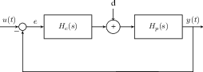

# Feedback Control

In feedback control, we have some physical system $$H_p(s)$$ called a
plant which we would like to control using a system of our choice
$$H_c(s)$$ in order to follow some reference signal $$r(t)$$.

Notice how the output signal is subtracted from a reference signal, and
we use the difference (a.k.a the error) to determine what input we pass
into the plant. Looking at the overall transfer function of the system,
we see that

$$\begin{aligned}     Y(s) &= (R(s)-Y(s))H_c(s)H_p(s)\\     (1+H_c(s)H_p(s))Y(s) &= H_c(s)H_p(s)R(s)\\     H(s) = \frac{Y(s)}{R(s)} &= \frac{H_c(s)H_p(s)}{1+H_c(s)H_p(s)}\end{aligned}$$

Depending on what control we use for $$H_c(s)$$, we can shape this
transfer function to be what we want.

## Types of Control

### Constant Gain Control

When $$H_c(s) = K_0$$, this is known as constant gain control.

$$H(s) = \frac{K_0H_p(s)}{1+K_0H_p(s)}$$

The poles of this system are clearly when $$1+K_0H_p(s)=0$$.

### Lead Control

Lead controllers are of the form

$$H_c(s) = K_0\frac{s-\beta}{s-\alpha}$$

Their poles are when

$$1 + K_0\frac{s-\beta}{s-\alpha}H_p(s) = 0$$

### Integral Control

Integral controller are of the form

$$H_c(s) = \frac{K_0}{s}$$

Their poles are when

$$1 + \frac{K_0}{s}H_p(s) = 0$$

## Root Locus Analysis

For all forms of control, we need to choose a constant which places our
poles where we want. Root Locus Analysis is the technique which helps us
determine how our poles will move as $$K_0\rightarrow \infty$$. Assuming
we only have a single gain to choose, we the poles of the new transfer
function will be the roots of

$$1 + K_0H(s)$$

where $$H(s)$$ is some transfer function that results in the denominator
(For example, in constant gain control, $$H(s) = H_p(s)$$ but for lead
control, $$H_s = \frac{s-\beta}{s-\alpha}H_p(s)$$).



### Definition 39

The root locus is the set of all points $$s_0\in \mathbb{C}$$ such that $$\exists K_0>0$$ such that $$1+K_0H(s)=0$$.



This definition implies that $$H(s_0)=\frac{1}{K_0}$$ for some $$K_0$$,
meaning the root locus is all points such that $$\angle H(s_0)=-180$$˚.
The first step of RLA is to factor the numerator and denominator of
$$H(s)$$

$$H(s) = \frac{\prod_{i=0}^{m}{(s-\beta_i)}}{\prod_{i=0}^{n}{(s-\alpha_i)}}$$

As $$k\rightarrow 0, H(s_0)=-\frac{1}{K_0}\rightarrow \infty$$, so the
root locus begins at the poles. As
$$k\rightarrow \infty, H(s_0)=-\frac{1}{K_0}\rightarrow 0$$, so the root
locus will end at the open loop zeros. However, if $$m < n$$, (i.e there
are more poles than 0's), not all of the poles can converge to a zero.
Instead $$n-m$$ branches will approach $$\infty$$ witth asymptotes at

$$\frac{\sum_i^n\alpha_i-\sum_i^m\beta_i}{n-m}$$

and angles of

$$\frac{180 + (i-1)*360}{n-m}$$

The final rule of RLA is that parts of the real line left of an odd
number of real poles and zeros are on the root locus. RLA tells us that
we have to be careful when choosing our gain $$K_0$$ because we could by
mistake cause instability. In particular, high gain will cause
instability if

-   $$H(s)$$ has zeros in the right half of the plane

-   if $$n-m \ge 3$$, then the asympototes will cross the imaginary
    axis.

## Feedback Controller Design

When we design systems to use in feedback control, there are certain
properties we want besides just basic ones like stability. Because
signals can be thought of as a series of step signals, when analyzing
these properties, we will assume $$r(t)=u(t)$$

### Steady State Tracking Accuracy



### Definition 40

A system has steady state tracking accurracy if the different between the reference and the output signals
tends to 0 as $$t\rightarrow \infty$$

$$ e_{ss} := \lim_{t\rightarrow\infty}{e(t)}=0 $$



A useful theorem which can help us evaluate this limit is the final
value theorem.



### Theorem 17

\\lim\_{t\\rightarrow\\infty}{e(t)} = \\lim\_{s\\rightarrow0}{sE(s)}
$$$$
As long as a limit exists and $$e(t)=0$$ for $$t<0$$



Looking at the relationship between $$E(s)$$ and $$R(s)$$, we see that

$$\frac{E(s)}{R(s)} = \frac{1}{1+H_c(s)H_p(s)} \implies E(s) = \frac{\frac{1}{s}}{1+H_c(s)H_p(s)}$$

Thus

$$e_{ss}=\lim_{s\rightarrow0}{\frac{1}{1+H_c(s)H_p(s)}}$$

Thus as long as $$H_c(s)H_p(s)$$ has at least one pole at $$s=0$$, then
$$e_{ss}=0$$. Notice that integral control gives us a pole at $$s_0$$,
so it is guaranteed that an integral controller will be steady-state
accurate.

### Disturbance Rejection

Sometimes the output of our controller can be disturbed before it goes
into the plant. Ideally, our system should be robust to these
disturbances.

$$\begin{aligned}     Y(s) &= H_p(s)\left[H_c(s)(R_s-Y_s)+D(s)\right]\\     Y(s) &= \frac{H_c(s)H_p(s)}{1+H_c(s)H_p(s)}R(s) + \frac{H_p(s)}{1+H_c(s)H_p(s)}D(s)\end{aligned}$$

The system will reject disturbances if the
$$\frac{H_p(s)}{1+H_c(s)H_p(s)}D(s)$$ is close to $$0$$ in the steady
state. Assuming that $$d(t) = u(t)$$, we see that

$$\delta_{ss} = \lim_{s\rightarrow0}{s\frac{H_p(s)}{1+H_c(s)H_p(s)}\frac{1}{s}}=\lim_{s\rightarrow0}{\frac{H_p(s)}{1+H_c(s)H_p(s)}}$$

Thus as long as $$H_c$$ has a pole at $$0$$, then the system will reject
disturbances. Notice that integral control guarantees disturbance
rejection as well.

### Noise Insensitivity

In real systems, our measurement of the output $$y(t)$$ is not always
100% accurate. One way to model this is to add a noise term to the
output. Looking at the relationship between the noise and the output
signal, we see

$$H(s) = \frac{-H_c(s)H_p(s)}{1+H_c(s)H_p(s)}$$

In order to reject this noise, we want this term to be close to 0, so
ideally $$H_c(s)H_p(s) << 1$$ as $$s\rightarrow 0$$. However, this
conflicts with our desire for $$H_c(s)H_p(s)$$ to have a pole at 0 to
guarantee steady state tracking. Thus it is difficult to make a
controler that is both accurate and robust to noise. However, because
noise is usually a high frequency signal and the reference is a low
frequency signal, we can mitigate this by choosing $$H_c(s)H_p(s)$$ to
be a low-pass filter.

