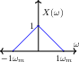
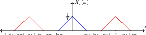
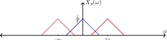

# Sampling

## Continuous Time

Sampling a continuous-time signal means representing it as a sequence of
points measured at regular intervals $$T$$. Notice that if we were to
take a signal $$x(t)$$ and multiply it by an impulse train, then we
would get a series of impulses equal to $$x(t)$$ at the sampling points
and $$0$$ everywhere else. We can call this signal $$x_p(t)$$.

$$p(t) = \sum_{k=-\infty}^{\infty}{\delta(t-kT)}$$

$$x_p(t) = x(t)p(t) = \sum_{k=-\infty}^{\infty}{x(t)\delta(t-kT)}$$

In the Fourier Domain,

$$\begin{aligned}     X_p(\omega) &= \frac{1}{2\pi}X(\omega)*P(\omega)\\     P(\omega) &= \frac{2\pi}{T}\sum_{k=-\infty}^{\infty}{\delta(\omega-k\omega_0)}\\     \therefore X_p(\omega) &= \frac{1}{2\pi}\int_{-\infty}^{\infty}{X(\theta)P(\omega-\theta)d\theta} = \frac{1}{T}\sum_{k=-\infty}^{\infty}{X(\omega-k\omega_0)}\end{aligned}$$

What this tells us is that the Fourier Transform of our sampled signal
is a series of copies of $$X(\omega)$$, each centered at $$k\omega_0$$
where $$\omega_0 = \frac{2\pi}{T}$$ For example, lets say that our
original signal has the following Fourier Transform. Notice the signal
is band-limited by $$\omega_M$$.

There are two major cases: if $$\omega_0 > 2\omega_m$$ and
$$\omega_0 < 2\omega_M$$.\
**Case One:** $$\omega_s > 2\omega_m$$

When $$\omega_s > 2\omega_M$$, the shifted copies of the original
$$X(\omega)$$ (shown in blue) do not overlap with each other or which
the original copy. If we wanted to recover the original signal, we could
simply apply a low pass filter to isolate the unshifted copy of
$$X(\omega)$$ and then take the inverse Fourier Transform.\
**Case Two:** $$\omega_s < 2\omega_m$$

Notice how in this case, the shifted copies overlap with the original
$$X(\omega)$$. This means in our sampled signal, the higher frequency
information is bleeding in with the lower frequency information. This
phenomenon is known as aliasing. When aliasing occurs, we cannot simply
apply a low pass filter to isolate the unshifted copy of $$X(\omega)$$.

When $$\omega_0 = 2\omega_M$$, then our ability to reconstruct the
original signal depends on the shape of its Fourier Transform. As long
as $$X_p(k\omega_m)$$ are equal to $$X(\omega_m)$$ and $$X(-\omega_m$$),
then we can apply an LPF because we can isolate the original
$$X(\omega)$$ and take its inverse Fourier Transform.

Remember that an ideal low pass filter is a square wave in the frequency
domain and a sinc in the time domain. Thus if we allow

$$X_r(\omega) = X_p(\omega)\cdot \begin{cases}     T & \text{if } |\omega| < \frac{\omega_s}{2}\\     0 & \text{else }   \end{cases}$$

then our reconstructed signal will be

$$x_r(t) = x_p(t)*\text{sinc}\left(\frac{t}{T}\right) = \sum_{n=-\infty}^{\infty}{X(nT)\text{sinc}\left(\frac{t-nT}{T}\right)}.$$

This is why we call reconstructing a signal from its samples \"sinc
interpolation.\" This leads us to formulate the Nyquist Theorem.



### Theorem 18

    Suppose a continuous signal $$x$$ is bandlimited and we sample it at a rate of $$\omega_s > 2\omega_M$$, then the signal $$x_r(t)$$ reconstructed by sinc interpolation is exactly $$x(t)$$



## Discrete Time

Sampling in discrete time is very much the same as sampling in
continuous time. Using a sampling period of $$N$$ we construct a new
signal by taking an impulse train and multiplying elementwise with the
original signal.

$$\begin{aligned}     p[n]=\sum_{n=-\infty}^{\infty}{\delta[n-kN]}\\     x_p[n] = x[n]p[n] = \sum_{n=-\infty}^{\infty}{x[kN]\delta[n-kN]}\\     X_p(\omega) = \frac{1}{N}\sum_{k=0}^{N-1}{X(\omega-k\omega_s)}\end{aligned}$$

Our indices only go from $$k$$ to $$N-1$$ in the Fourier Domain because
we can only shift a particular number of times before we start to get
repeated copies. This is the impulse train sampled signal. It has 0's at
the unsampled locations. If we want to, we could simply remove those
zeros and get a downsampled signal

$$x_p[n] = x[Nn]$$

Like in continuous time, the reconstructed signal is recovered via sinc
interpolation.

$$x_r[n] = \sum_{k=-\infty}^{\infty}{x_p[n]\text{sinc}\left(\frac{n-kN}{N}\right)}$$

The Nyquist Theorem in DT will tell us when this works.



### Theorem 19

    reconstructed by sinc interpolation is exactly $$x[n]$$



Thus as long as the Nyquist Theorem holds, we can take a downsampled
signal and upsample it (i.e reconstruct the missing pieces) by expanding
$$y$$ by a factor of $$N$$ and putting $$0's$$ for padding, and then
applying sinc-interpolation to it.

## Sampling as a System

Notice that we have two ways of representing our sample signal. We can
either write it as a discrete time signal $$x_d[n] = x(nT)$$ or we can
write it as an impulse train
$$x_p(t)=\sum_{-\infty}^{\infty}{x(nT)\delta(t-nT)}$$. Based on their
Fourier Transforms,

$$\begin{aligned}     X_d(\Omega)=\sum_{n=-\infty}^{\infty}{x(nT)e^{-j\Omega n}}\\     X_p(\omega)=\sum_{n=-\infty}^{\infty}{x(nT)e^{-j\omega nT}}\end{aligned}$$

Thus if we let $$\Omega=\omega T$$, then we see that these two
representations of a signal have the same Fourier Transforms and thus
contain the same information. This means that for some continuous
signals, convert them to discrete time via sampling, use a computer to
apply an LTI system, and convert the result back to a CT output.

We must be careful though because as long as the DT system we apply is
LTI, the overall CT system will be linear too, but it will not
necessarily be time invariant because sampling inherently depends on the
signal's timing.

$$\begin{aligned}     Y_d(\Omega) &= H_d(\Omega)X_d(\Omega) = H_d(\Omega)X_p\left(\frac{\Omega}{T}\right)\\     Y_p(\omega) &= Y_d(\omega T) = H_d(\omega T)X_p(\omega)\\     Y(\omega) &= \left\{         \begin{array}{cc}             T & |\omega| < \frac{\omega_s}{2}\\             0 & |\omega| \ge \frac{\omega_s}{2}         \end{array}         \right\} \cdot Y_p(\omega) = \left\{             \begin{array}{cc}                 TH_d(\omega T)X_p(\omega) & |\omega| < \frac{\omega_s}{2}\\                 0 & |\omega| \ge \frac{\omega_s}{2}             \end{array}             \right\}\end{aligned}$$

Assuming that the Nyquist theorem holds,

$$\begin{aligned}     X_p(\omega) &= \frac{1}{T}X(\omega)\\     \therefore Y(\omega) &= \left\{         \begin{array}{cc}             H_d(\omega T)X(\omega) & |\omega| < \frac{\omega_s}{2}\\             0 & |\omega| \ge \frac{\omega_s}{2}         \end{array}     \right\}\\         \therefore H_{system} &= \left\{\begin{array}{cc}             H_d(\omega T) & |\omega| < \frac{\omega_s}{2}\\             0 & |\omega| \ge \frac{\omega_s}{2}         \end{array}         \right\}\end{aligned}$$

This shows us that as long as the Nyquist theorem holds, we can process
continuous signals with a disrete time LTI system and still have the
result be LTI.

