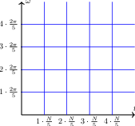
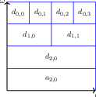

# Spectral Analysis

In real-world DSP systems, we are often converting a continuous time
signal into a discrete one via sampling (as shown in figure 2). Because
input is constantly streaming in, we can't process all of it at once,
especially for real-time applications. That is why we instead process
blocks of length $$L$$ at a time. This is accomplished by multiplying
our sampled signal by a window function $$w[n]$$.

All window functions are real, even, and finite. This means they have
real and symmetric DTFTs. The most simply window is a box window (a
$$\text{sinc}$$ in the frequency domain). When the signal is multiplied
by a window, it amounts to a periodic convolution in the frequency
domain.



### Definition 6

  A periodic convolution of the two spectra $$X(e^{j\Omega})$$ and $$W(e^{j\Omega})$$ is given by
  

$$     V(e^{j\Omega})=\frac{1}{2\pi}\int_{\langle 2\pi \rangle}X(e^{j\Omega})W(e^{j(\Omega-\omega)})d\omega   $$



This periodic convolution means our choice of window function has an
impact on our ability to resolve frequencies in the frequency domain.

1.  If $$W(e^{j\Omega})$$ has a wide "main lobe" at the DC frequencies,
    then the spectrum of $$V(e^{j\Omega})$$ will be blurred

2.  If $$W(e^{j\Omega})$$ has large "side lobes" at non DC frequencies,
    then **spectral leakage** occurs because larger frequencies start
    bleeding into lower ones.

Another factor which impacts our ability to resolve frequencies in
frequency domain is the length of the window. Because an L point DFT
samples the DTFT at L points, taking a larger window will resolve the
DTFT better. If we don't want to increase the window length (because
doing so would increase the latency of our system), we can zero pad
after windowing because zero padding has no impact on the DFT besides
sampling the DTFT at more finely spaced samples.

## Short Time Fourier Transform (STFT)

By looking at the DFT of a signal $$x[n]$$, we only get the frequency
information across the entire duration of the signal. Likewise, just by
looking at $$x[n]$$, we get no frequency information and only temporal
information. The STFT is a tool to see both at once.



### Definition 7

  The short-time fourier transform localizes frequencies in time by creating a spectrogram, an image which shows what frequencies are occuring at what time.
  

$$     X[n, \omega) = \sum_{m=-\infty}^{\infty}x[n+m]w[m]e^{j\omega m}   $$

  The result is discrete on the temporal axis and continuous on the frequency axis. Computing the STFT requires a window function $$w[n]$$.



Essentially, we slide a window function around $$x[n]$$ and compute the
DTFT at every time point.

## Discrete STFT



### Definition 8

  The Discrete STFT is the discrete version of the STFT
  

$$     X[r, k] = \sum_{m=0}^{L-1}x[rR+m]w[m]W_N^{km}   $$

  Our window is of length $$L$$, $$R$$ is how much we shift the window around, and $$N \ge L$$is the DFT length we are taking.



Just like before, we take our window and slide it around the signal,
computing DFTs at every time point. If $$N > L$$, then we are
essentially computing a zero-padded DFT. The DSTFT produces a
spectrogram which we can display digitally.



### Definition 9

  The inverse DSTFT is given by
  

$$     x[rR+m]w_L[m] = \frac{1}{N}\sum_{k=0}^{N-1}X[n, k]W_N^{-km}   $$



As long as the window is never 0 and the windows don't overlap,

$$x[n] = \frac{x[n-rL]}{w_L[n-rL]}.$$

## Time-Frequency Uncertainty

When we compute the spectrogram of a signal, we can think of each
coefficient as \"tiling\" the time-frequency plane. If we consider the
normal N point DFT, each DFT coefficient is supported by N points in the
time domain. Since the DFT samples the DTFT, it divides the range of
$$[0, 2\pi]$$ into $$N$$ segments of width $$\frac{2\pi}{N}$$. Each
coefficient represents a section of this space, leading to a tiling
looking like figure 3 (for a 5 point DFT).

Thinking about the DSTFT, each coefficient is computed using $$L$$
points of the original signal. Each coefficient still represents
intervals of $$\frac{2\pi}{N}$$ in the frequency axis, so it will lead
to a tiling which looks like figure 4.

What these tilings show us is that because we have discretized time and
frequency, there is some uncertainty regarding which times and
frequencies each coefficient represents.

We can formalize this idea by considering a general transform. All
transforms are really an inner product with a set of basis functions

$$T_x(\gamma) = \langle x(t), \phi_\gamma(t) \rangle=\int_{-\infty}^{\infty}x(t)\phi_\gamma^\star(t)dt.$$

For each $$\gamma$$, $$T_x(\gamma)$$ is the projection of the signal
onto the basis vector $$\phi_\gamma(t)$$. We can use Parseval's
relationship to see that

$$\begin{aligned}   T_x(\gamma) &= \langle x(t), \phi_\gamma(t) \rangle =\int_{-\infty}^{\infty}x(t)\phi_\gamma^\star(t)dt \\   &= \frac{1}{2\pi}\int_{-\infty}^{\infty}X(j\Omega)\Phi_\gamma^\star(j\Omega)d\Omega \\   &= \langle X(j\Omega), \frac{1}{2\pi}\Phi_\lambda(j\Omega)\rangle.\end{aligned}$$

This means that we can think of our transform not only as a projection
of the signal onto a new basis, but also as a projection of the spectrum
of our signal onto the spectrum of our basis function. Remember that
projection essentially asks \"How much of a signal can be explained by
the basis\". We can formalize this by looking at the signal in a
statistical sense and treat it as a probability distribution.

$$\begin{aligned}   m_t &= \int_{-\infty}^{\infty}t|\psi(t)|^2dt &\qquad m_\Omega &= \int_{-\infty}^{\infty}\Omega\frac{1}{2\pi}|\Psi(j\Omega)|^2d\Omega\\   \sigma_t^2 &= \int_{-\infty}^{\infty}(t-m_t)^2|\psi(t)|^2dt &\qquad \sigma^2_\Omega &= \int_{-\infty}^{\infty}(\Omega-m_\Omega)^2\frac{1}{2\pi}|\Psi(j\Omega)|^2d\Omega\\\end{aligned}$$

$$m_t$$ and $$m_\Omega$$ are the means of the signal and the spectrum.
$$\sigma_t^2$$ and $$\sigma_\Omega^2$$ are the variances. Together, they
localize where our signal \"lives\" in the time-frequency spectrum. The
uncertainty principle says

$$\sigma_t\sigma_w \ge \frac{1}{2}.$$

This means there is nothing we can do to get completely accurate time
resolution and frequency resolution, and any decisions we make will lead
to a tradeoff between them.

## Wavelets

While the STFT gives us a better picture of a signal than a full-length
DFT, one of its shortcomings is that each coefficient is supported by
the same amount of time and frequency. Low frequencies don't change as
much as high frequencies do, so a lower frequency needs to be resolved
with more time support whereas a fast signal would requires less time
support to resolve properly.



### Definition 10

  The Wavelet transform finds coefficients which tile the time-frequency spectrum with different time and frequency supports using a mother and father wavelet.
  

$$     Wf(u, s) = \int_{-\infty}^{\infty}f(t)\frac{1}{\sqrt{s}}\Psi^\star\left(\frac{t-u}{s}\right)dt   $$



The Wavelet transform essentially makes all of the boxes in figure 4
different sizes.



### Definition 11

  The mother wavlet is a scaled bandpass filter $$\Psi(t)$$ used for the kernel of the wavelet transform. It must have the following properties:
  

$$     \int_{-\infty}^{\infty}|\Psi(t)|^2dt=1 \ uad \int_{-\infty}^{\infty}\Psi(t)dt = 0   $$



We need an infinite number of functins to fully represent all
frequencies properly, but at a certain level, we don't care about our
ability to resolve them better, so we stop scaling and use a low
frequency function $$\Phi(t)$$ to \"plug\" the remaining bandwidth.



### Definition 12

  The father wavelet is a low frequency function $$\Phi(t)$$used to \`\`plug\'\' the remaining bandwidth not covered by the mother wavelet.



### Discrete Wavelet Transform

In discrete time, the wavelet transform becomes

$$d_{s,u}=\sum_{n=0}^{N-1}x[n]\Psi_{s,u}[n] \qquad a_{s,u}=\sum_{n=0}^{N-1}x[n]\Phi_{s,u}[n]$$

The $$d$$ coefficients are the detailed coefficients and are computed
using the mother wavelet. The capture higher frequency information. The
$$a$$ coefficients are the approximate coefficients computed using the
father wavelet. They represent lower frequency information. The time
frequency tiling for the DWT looks like figure 5.

Notice how each wavelet coefficient is supported by a different amount
of time and frequency. We can choose different mother and father
wavelets to describe our signals depending on how we want to tile the
time-frequency plane.

