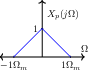
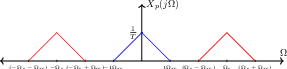
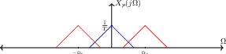
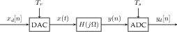
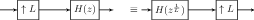
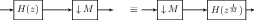
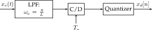
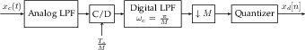

# Sampling

## Ideal Sampling

In order to work with continuous signals using a computer, we need to
sample them. This means recording the value at particular points of
time. During uniform sampling, we take samples at an even sampling
period $$T_s$$ so $$x[n]=x_c(nT)$$ (where $$x_c$$ is our continuous
signal). This is done by passing the signal through an Analog-To-Digital
converter. From there we can do discrete time processing and reconstruct
our signal by passing it through a Digital-to-Analog converter with
reconstruction period $$T_r$$.

We mathematically model sampling as multiplication by an impulse train.
Notice that if we were to take a signal $$x(t)$$ and multiply it by an
impulse train, then we would get a series of impulses equal to $$x(t)$$
at the sampling points and $$0$$ everywhere else. We can call this
signal $$x_p(t)$$.

$$p(t) = \sum_{k=-\infty}^{\infty}{\delta(t-kT)}$$

$$x_p(t) = x(t)p(t) = \sum_{k=-\infty}^{\infty}{x(t)\delta(t-kT)}$$

In the Fourier Domain,

$$\begin{aligned}     X_p(j\Omega) &= \frac{1}{2\pi}X(j\Omega)*P(j\Omega)\\     P(j\Omega) &= \frac{2\pi}{T}\sum_{k=-\infty}^{\infty}{\delta(\Omega-k\Omega_s)}\\     \therefore X_p(j\Omega) &= \frac{1}{2\pi}\int_{-\infty}^{\infty}{X(j\theta)P(j(\Omega-\theta))d\theta} = \frac{1}{T}\sum_{k=-\infty}^{\infty}{X(j(\Omega-k\Omega_s)}\end{aligned}$$

What this tells us is that the Fourier Transform of our sampled signal
is a series of copies of $$X(j\Omega)$$, each centered at $$k\Omega_s$$
where $$\Omega_s = \frac{2\pi}{T}$$. This is a good model because we can
equivalently write the CTFT of the impulse train sampled signal as

$$\begin{aligned}   X_p(j\Omega) &= \int_{-\infty}^{\infty}\sum_{k=-\infty}^{\infty}{x(t)\delta(t-kT)} \sum_{k=-\infty}^{\infty}x(kT)e^{-jkT\Omega}.\end{aligned}$$

Notice that this is just the DTFT of $$x[n]=x(nT)$$ if we set
$$\omega = \Omega T$$.

$$X(e^{j\omega}) = \sum_{n=-\infty}^{\infty}x(nT)e^{-j\omega n}=X_p(j\Omega)|_{\Omega=\frac{\omega}{T}}=\frac{1}{T}\sum_{k=-\infty}^{\infty}{X\left(\frac{\omega}{T}-k\frac{2\pi}{T_s}\right)}$$

This means that the DTFT of our signal is just a bunch of shifted
copies, and the frequency axis is scaled so
$$\Omega_s \rightarrow 2\pi$$.

### Nyquist Theorem

To analyze this further, we will stay in continuous time. Lets say that
our original signal has the following Fourier Transform. Notice the
signal is band-limited by $$\Omega_M$$.

There are two major cases: if $$\Omega_s > 2\Omega_m$$ and
$$\Omega_s < 2\Omega_m$$.

**Case One:** $$\Omega_s > 2\Omega_m$$.

As shown in figure 8, the shifted copies of the original $$X(j\Omega)$$
(shown in blue) do not overlap with each other or with the original
copy. If we wanted to recover the original signal, we could simply apply
a low pass filter to isolate the unshifted copy of $$X(j\Omega)$$ and
then take the inverse Fourier Transform.

**Case Two:** $$\Omega_s < 2\Omega_m$$

Notice how in figure 9, the shifted copies overlap with the original
$$X(\omega)$$. This means in our sampled signal, the higher frequency
information is bleeding in with the lower frequency information. This
phenomenon is known as aliasing. When aliasing occurs, we cannot simply
apply a low pass filter to isolate the unshifted copy of $$X(\omega)$$.

When $$\Omega_s = 2\Omega_M$$, then our ability to reconstruct the
original signal depends on the shape of its Fourier Transform. As long
as $$X_p(jk\Omega_m)$$ are equal to $$X(j\Omega_m)$$ and
$$X(-j\Omega_m$$), then we can apply an LPF because we can isolate the
original $$X(j\Omega)$$ and take its inverse Fourier Transform.\
\
Remember that an ideal low pass filter is a square wave in the frequency
domain and a $$\text{sinc}$$ in the time domain. Thus if we allow

$$X_r(j\Omega) = X_p(j\Omega)\cdot \left\{             \begin{array}{cc}                 T & |\Omega| < \frac{\Omega_s}{2}\\                 0 & \text{ else }             \end{array}         \right\}$$

then our reconstructed signal will be

$$x_r(t) = x_p(t)*\text{sinc}\left(\frac{t}{T}\right) = \sum_{n=-\infty}^{\infty}{X(nT)\text{sinc}\left(\frac{t-nT}{T}\right)}.$$

This is why we call reconstructing a signal from its samples "sinc
interpolation." This leads us to formulate the Nyquist Theorem.



### Theorem 4 (Nyquist Theorem) {#theorem-4}

Suppose a continuous signal $$x$$ is bandlimited and we sample it at a rate of $$\Omega_s > 2\Omega_m$$, then the signal $$x_r(t)$$ reconstructed by sinc interpolation is exactly $$x(t)$$



### Discrete Time Processing of a Continuous Time Signal

As long as the DT system we apply is LTI, the overall CT system will be
linear too, but it will not necessarily be time invariant because
sampling inherently depends on the signal’s timing. If we want to find
the overall CT transfer function ($$\omega = \Omega T$$) of a system
like that depicted in figure 6.

$$\begin{aligned}     Y_d(e^{j\omega}) &= H_d(e^{j\omega})X_d(e^{j\omega}) = H_d(e^{j\omega})X_p\left(\frac{\omega}{T}\right)\\     Y_p(j\Omega) &= Y_d(e^{j\Omega T}) = H_d(e^{j\Omega T})X_p(j\Omega)\\     Y(j\Omega) &= \left\{         \begin{array}{cc}             T & |\Omega| < \frac{\Omega_s}{2}\\             0 & |\Omega| \ge \frac{\Omega_s}{2}         \end{array}         \right\} \cdot Y_p(j\Omega) = \left\{             \begin{array}{cc}                 TH_d(e^{j\Omega T})X_p(j\Omega) & |\Omega| < \frac{\Omega_s}{2}\\                 0 & |\Omega| \ge \frac{\Omega_s}{2}             \end{array}             \right\}\end{aligned}$$

Assuming that the Nyquist criteria is met holds,

$$\begin{aligned}     X_p(j\Omega) &= \frac{1}{T}X(j\Omega)\\     \therefore Y(j\Omega) &= \left\{         \begin{array}{cc}             H_d(e^{j\Omega T})X(j\omega) & |\Omega| < \frac{\Omega_s}{2}\\             0 & |\Omega| \ge \frac{\Omega_s}{2}         \end{array}     \right\}\\         \therefore H_{system} &= \left\{\begin{array}{cc}             H_d(e^{j\omega T}) & |\Omega| < \frac{\Omega_s}{2}\\             0 & |\Omega| \ge \frac{\Omega_s}{2}         \end{array}         \right\}\end{aligned}$$

This shows us that as long as the Nyquist theorem holds, we can process
continuous signals with a disrete time LTI system and still have the
result be LTI.

### Continuous Time Processing of Discrete Time Signals

While not useful in practice, it can be useful to model a discrete time
transfer function in terms of Continuous Time processing (e.g a half
sample delay).

Similar to the analysis of DT processing of a CT signal, we can write
the discrete transfer function in terms of the continuous function. Our
continuous signal will be bandlimited after reconstruction.

$$X(j\Omega) = \begin{cases}     T X_d(e^{j\omega})|_{\omega=\Omega T} & |\Omega| \le \frac{\Omega_s}{2}\\     0   \end{cases}$$

This means our reconstructed signal $$Y(j\Omega)=H_(j\Omega)X(j\Omega)$$
is also bandlimited, so we can say that

$$Y_d(e^{j\Omega})=H(j\Omega)|_{\Omega=\frac{\omega}{T}}X(e^{j\omega})$$

### Downsampling

When we downsample a signal by a factor of $$M$$, we create a new signal
$$y[n]=x[nM]$$ by taking every $$Mth$$ sample. What this means
conceptually is that we are reconstructing the continuous signal and
then sampling it at a slower rate $$MT$$ where $$T$$ was the original
sampling rate. If $$x_c$$ is the original continuous time signal and
$$x_d$$ is the sampled signal, then the downsampled signal $$y[n]$$ will
be

$$y[n]=x[nM]=x_c(nMT)\implies Y(e^{j\omega}) =\frac{1}{MT}\sum_{k=-\infty}^{\infty}X_c\left(\frac{\omega}{NT}-k\frac{2\pi}{NT}\right).$$

If we re-index and let $$k=Mp+m$$ for $$m\in [0, N-1],p\in \mathbb{Z}$$

$$Y(e^{j\omega})=\frac{1}{M}\sum_{m=0}^{M-1}X_d(e^{j\frac{\omega-2\pi m}{M}}).$$

What this means is to obtain the new DTFT, we need to scale the
frequency axis so $$\frac{\pi}{M}\rightarrow \pi$$. To prevent aliasing
when this happens, we include an LPF before the downsample step.

### Upsampling

When we upsample a signal by a factor of L, we are interpolating between
samples. Conceptually, this means we are reconstructing the original
continuous time signal and resampling it at a faster rate than before.
First we place zeros in between samples, effectively expanding our
signal.

$$x_e[n] = \begin{cases}     x\left[\frac{n}{L}\right] & n=0, \pm L, \pm 2L,...\\     0   \end{cases}$$

$$X_e(e^{j\omega})=\sum_{-\infty}^{\infty}x_e[n]e^{-j\omega n}=\sum_{m=-\infty}^{\infty}x[m]e^{-j\omega mL} = X\left(e^{j\omega L}\right)$$

Then we interpolate by convolving with a $$\text{sinc}$$.

$$y[n] = x_e[n]*\text{sinc}\left(\frac{n}{L}\right) = \sum_{n=-\infty}^{\infty}{x[k]\text{sinc}\left(\frac{n-kL}{L}\right)}$$

In the frequency domain, this looks like compressing the frequency axis
so $$\pi \rightarrow \frac{\pi}{L}$$ and then taking a low pass filter.

The gain of L is used to scale the spectrum so it is identical to if we
had sampled the continuous signal at a rate of $$\frac{T}{L}$$.

## Multi-Rate Signal Processing

In order to resample a signal to a rate $$T'=\frac{MT}{L}$$ where T is
the original sampling rate, we can do this by upsampling then
downsampling our signal.

Notice that we only need one LPF to take care of both anti-aliasing and
interpolation.

### Exchanging Filter Order During Resampling

Notice that resampling with a very small change wastes a lot of
computation. For example, resampling with $$T'=1.01T$$ would upsample by
100 and then throw away most of those samples when we downsample. Thus
it would be useful to exchange the order of operations when resampling
to save computation.

During upsampling, we convolve our filter with a bunch of zeros caused
by the expansion. Convolution with 0’s is a unnecessary, so instead we
could convolve with a compressed version of the filter. Notice the
results will be the same as long as $$H(z^{\frac{1}{L}})$$ is a rational
function,

During downsampling, we do a convolution and then throw away most of our
results. It would be much more efficient to instead compute only the
quantities we need. This is accomplished by downsmapling first and then
convolving. Just like before, the results are only going to be the same
if $$H(z^{\frac{1}{M}})$$ is a rational function.

### Polyphase Decomposition

The problem with interchanging filters is that it is not always
possible. Most filters are not compressible. However, we can get around
this issue and still get the efficiency gains of interchanging filter
orders by taking a polyphase decomposition of our filters. First notice
that $$h[n]$$ can be written as a sum of compressible filters.

$$h[n] = \sum_{k=0}^{M-1}h_k[n-k]$$

This means if we let $$e_k[n] = h_k[nM]$$, we can utilize the linearity
of convolution to build a bank of filters.

Now each of our filters is compressible, so we can switch the order of
downsampling and filtering while maintaining the same output.

Now for any filter, we can compute only what we need, so the result is
correct and efficently obtained.

## Practical Sampling (ADC)

Unfortunately, ideal analog to digital conversion is not possible for a
variety of reasons. The first is that not all signals are bandlimited
(or there may be noise outside of the bandwidth). Moreover, computers
only have finite precision, so we cannot represent the full range of
values that a continuous signal might take on with a finite number of
bits per sample. The solution to the first issue is to include a
“anti-aliasing” filter before the sampler. The solution to the second
issue is to quantize.

However, sharp analog filters are difficult to implement in practice. To
deal with this, we could make the anti-aliasing filter wider, but this
would add noise and interference. If we keep the cutoff frequency the
same, then we could alter part of the signal because our filter is not
ideal. A better solution is to do the processing in Discrete Time
because we have more control. We also sample higher than the Nyquist
Rate and then downsample it to the required rate.

### Quantization

If we have a dynamic range of $$X_m$$ (i.e $$2X_m$$ is the length of the
range of values we can represent), then our step between quantized
values is $$\Delta=\frac{X_m}{2^B}$$, assuming we are representing our
data as 2’s complement numbers with $$B$$ bits. We model the error
caused by quantization as additive noise. Our quantized signal
$$\hat{x}[n]$$ is decribed by

$$\hat{x}[n] = x[n] + e[n] \qquad \frac{-\Delta}{2}\le e[n] \le \frac{\Delta}{2}$$

We do this under the following assumptions:

1.  $$e[n]$$ is produced by a stationary random process

2.  $$e[n]$$ is not correlated with $$x[n]$$

3.  $$e[n]$$ is white noise ($$e[n]$$ is not correlated with $$e[m]$$)

4.  $$e[n]\sim U\left[\frac{-\Delta}{2},\frac{\Delta}{2}\right]$$

For rapidly changing signals with small $$\Delta$$, this assumptions
hold, and they are useful in modeling quantization error. Since
$$\Delta = 2^{-B}X_m$$

$$\sigma^2_e=\frac{\Delta^2}{12}=\frac{2^{-2B}X_m^2}{12}$$

This means our Signal to Noise Ratio for quantization is

$$SNR_Q=10\log\left(\frac{\sigma_x^2}{\sigma_e^2}\right)=6.02B+10.8-20\log\left(\frac{X_m}{\sigma_s}\right)$$

What this tells us is that every new bit we add gives us 6dB in
improvement. It also tells us that we need to adapt the range of
quantization to the RMS amplitude of the signal. This means there is a
tradeoff between clipping and quantization noise. When we oversampling
our signal, we can further limit the effects of quantization noise
because this noise will be spread out over more frequencies and the LPF
will eliminate noise outside the signal bandwidth. This makes
$$\frac{\sigma_e^2}{M}$$ the new noise variance (if we oversample by
$$M$$). Thus we can modify the $$SNR_Q$$ equation

$$SNR_Q=6.02B+10.8-20\log\left(\frac{X_m}{\sigma_s}\right) + 10\log M.$$

This shows that doubling $$M$$ yields a 3dB improvement (equivalent to
0.5 more bits).

## Practical Reconstruction (DAC)

In the ideal case, we reconstruct signals by converting them to impulses
and then convolving with a sinc. However, impulses are require lots of
power to generate, and sincs are infinitely long, so it is impractical
to design an analog system to do this. Instead, we use an interpolation
like Zero-Order-Hold to pulses and then filter with a reconstruction
filter.

$$X_r(j\Omega) = H_r(j\Omega)\overbrace{Te^{-j\Omega\frac{T}{2}}\text{sinc}\left(\frac{\Omega}{\Omega_s}\right)}^{\text{Zero Order Hold}}\overbrace{\frac{1}{T}\sum_{k=-\infty}^{\infty}X(j(\Omega-k\Omega_s))}^{\text{Sampled Signal}}$$

We design $$H_r(j\Omega)$$ such that $$H_r(j\omega)H_0(j\omega)$$ is
approximately an LPF.

