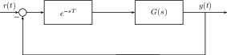

# Modeling Systems

Systems are most easily modeled using systems of linear constant
coefficient differential equations. They can be represented either as a
set of state-space equations or as a transfer function in the Laplace
domain.

## Electrical and Mechanical Systems

### Eletrical Systems

In electrical systems, there are three basic components: resistors,
capacitors, and inductors. See table 1 for their Laplace domain
relationships. At an electrical node, $$\sum V = 0$$ by Kirchoff's
Voltage Law, and at an electrical junction,
$$\sum I_{in} = \sum I_{out}$$ by Kirchoff's Current Law.

### Mechanical Systems

In mechanical systems, there are also three basic components: dampers,
springs, and masses. There are also rotational counterparts. See table 1
for their Laplace domain relationships. At a massless node, $$\sum F=0$$
by Newton's 2nd law. Because we consider dampers and springs are
massless, the force at two ends of a damper or spring must be equal. In
rotational systems, we can also have a gear train. Rotational impedances
are reflected through gear trains by multiplying by
$$\left(\frac{N^2_{dest}}{N^2_{source}}\right)$$.

### Electro-Mechanical Equivalence

It turns out that electrical and mechanical systems are analogous to
each other. In other words, given an electrical system, we can convert
it into a mechanical system and vice versa. Capacitors act like springs
as energy storage, resistors act like dampers which dissipate energy,
and inductors act like inertial masses which resist movement. These are
clear from their force/voltage differential equations (in the Laplace
domain) in table 1. Under these analogies, forces are like voltages,
currents are like velocities, and charge is like position.

## Linearization

Because non-linear systems often have dynamics which are complicated to
analyze, a standard trick to make them simpler is to linearize them.



### Definition 5

  Linearization is when a nonlinear system $$f(\mathbf{x})$$ is approximated by the first two terms of its Taylor series about a particular operating point.
  

$$     f(\mathbf{x}_0 + \delta \mathbf{x}) \approx f(\mathbf{x}_0) + \nabla_x|_{\mathbf{x}_0+\delta\mathbf{x}}\delta\mathbf{x}   $$



Using definition 5, we can see that around our operating point, we have

$$f(\mathbf{x}) - f(\mathbf{x}_0) = \delta f(\mathbf{x}) \approx \nabla_x|_{\mathbf{x}_0+\delta\mathbf{x}} \delta\mathbf{x}   \qquad (1)$$

equation 1 will hold so long as $$\delta\mathbf{x}$$ is small enough to
be within the linear regime (i.e where the Taylor Series expansion is a
good approximation). If $$f$$ is a multi-variable equation, then
equation 1 becomes

$$\delta f(\mathbf{x}, \mathbf{u}, \dots) \approx \nabla_x|_{\mathbf{x}_0+\delta\mathbf{x}} \mathbf{\delta x} + \nabla_u|_{\mathbf{u}_0+\delta\mathbf{u}} \mathbf{\delta u} + \cdots$$

## State-Space Equations



### Definition 6

System variables are variables which depend on either the input or the system\'s internal state.





### Definition 7

  The state variables of a system are the smallest set of linear independent system variables that can uniquely determine all the other system variables for all $$t > 0$$.



One can think of the state variables $$\mathbf{x}$$ as capturing the
internal dynamics of the system. The dynamics are described by matrices
$$A$$ (the state-evolution matrix) and $$B$$ (the input matrix)

$$\frac{d^{}\mathbf{x}}{dt^{}} = A\mathbf{x} + B\mathbf{u}$$

where $$\mathbf{u}$$ is the input to the system. Sometimes the states
are not directly observable, but instead the sensor in figure 2 only
provides a linear combination of the states determined by the output
matrix $$C$$ and the feedforward matrix $$D$$. Together, equation 2 and
equation 3 are the state-space equations of the system.

$$\begin{aligned}   \frac{d^{}\mathbf{x}}{dt^{}} &= A\mathbf{x} + B\mathbf{u} \qquad (2)\\   \mathbf{y} &= C\mathbf{x} + D \mathbf{u} \qquad (3)\end{aligned}$$

We can easily go from State-Space Equations to a transfer function via
the Unilateral Laplace transform. After taking the Laplace Transform of
both sides of equation 2, equation 3,

$$\begin{aligned}   s\mathbf{X}(s) - \mathbf{x}(0^-) &= A\mathbf{X}(s) + B\mathbf{U}(s)\\   &\implies \mathbf{X}(s) = (sI-A)^{-1}B\mathbf{U}(s) + \mathbf{x}(0^{-})\\   \mathbf{Y}(s) &= C\mathbf{X}(s) + D\mathbf{U}(s)\\   &\implies \mathbf{Y}(s) = (C\left( sI-A \right)^{-1}B+D)\mathbf{U}(s) + C(sI-A)^{-1}\mathbf{x}(0^-).\end{aligned}$$

If the system is Single-Input, Single-Output (SISO) and the initial
condition is $$\mathbf{x}(0^-) = \boldsymbol{0}$$, then

$$H(s) = \frac{Y(s)}{U(s)} = C(sI-A)^{-1}B+D.   \qquad (4)$$

equation 4 makes it very clear that the poles of the system are the same
as the eigenvalues of the $$A$$ matrix.

### Phase Variable Form

We can also derive state space equations from their transfer functions.
First, we assume that the transfer function comes from the LCCDE

$$\sum_{k=0}^N a_k \frac{d^{k}y}{dt^{k}} = \sum_{k=0}^{N} b_k \frac{d^{k}u}{dt^{k}},$$

meaning our transfer function will be of the form

$$H(s) = \frac{Y(s)}{U(s)} = \frac{\sum_{k=0}^N b_k s^k}{\sum_{k=0}^{N}a_k s^k} = \frac{\sum_{k=0}^{N} \frac{b_k}{a_N}s^k}{s^N + \sum_{k=0}^{N-1} \frac{a_k}{a_N}s^k}.$$

It is possible that $$\exists M < N$$ such that
$$\forall k \geq M, b_k=0$$. In other words, the numerator can have
fewer terms than the denominator. We now introduce an intermediary
variable $$X$$ so

$$\frac{Y(s)}{U(s)} = \frac{Y(s)}{X(s)}\frac{X(s)}{U(s)}.$$

Using this intermediary variable, we can now let

$$Y(s) = \sum_{k=0}^{N} \frac{b_k}{a_N} s^k X(s) \qquad X(s) = \frac{U(s)}{s^N + \sum_{k=0}^{N-1}\frac{a_k}{a_N}s^k}.$$

Converting this back to the time-domain,

$$y(t) = \sum_{k=0}^{N} \frac{b_k}{a_N} \frac{d^{k}x}{dt^{k}} \qquad  \frac{d^{N}x}{dt^{N}} = u(t) - \sum_{k=0}^{N-1} \frac{a_k}{a_N} \frac{d^{k}x}{dt^{k}}.$$

We can now choose our state-variables to be the derivatives
$$x, \frac{d^{}x}{dt^{}}, \cdots, \frac{d^{N-1}x}{dt^{N-1}}$$, giving us
the state-evolution equation

$$\frac{d}{dt} \begin{bmatrix} x\\\frac{d^{}x}{dt^{}}\\ \vdots \\ \frac{d^{N-2}x}{dt^{N-2}} \\\frac{d^{N-1}x}{dt^{N-1}} \end{bmatrix} =    \begin{bmatrix}     0 & 1 & 0 & 0 & \ldots\\     0 & 0 & 1 & 0 & \ldots\\     0 & 0 & \ddots & \ddots & \ddots\\     0 & 0 & \ldots & 0 & 1\\     -\frac{a_0}{a_N} & -\frac{a_1}{a_N} & \ldots & -\frac{a_{N-2}}{a_N} & -\frac{a_{N-1}}{a_N}   \end{bmatrix}   \begin{bmatrix} x\\\frac{d^{}x}{dt^{}}\\ \vdots \\ \frac{d^{N-2}x}{dt^{N-2}} \\\frac{d^{N-1}x}{dt^{N-1}} \end{bmatrix}    + \begin{bmatrix} 0 \\ 0 \\ \vdots \\ 0 \\ 1 \end{bmatrix} u(t).   \qquad (5)$$

Applying the state-variables to $$y(t)$$,

$$\begin{aligned}   y(t) &= \frac{b_N}{a_N}\left( u(t) - \sum_{k=0}^{N-1}\frac{a_k}{a_N} \frac{d^{k}x}{dt^{k}} \right) + \sum_{k=0}^{N-1} \frac{b_k}{a_N} \frac{d^{k}x}{dt^{k}}\\   y(t) &= \frac{b_N}{a_N}u(t) + \sum_{k=0}^{N-1} \left(\frac{b_k}{a_N} - \frac{b_Na_k}{a_N^2}\right) \frac{d^{k}x}{dt^{k}}\\   y(t) &= \frac{1}{a_N}\begin{bmatrix} b_0 - \frac{b_Na_0}{a_N} & b_1 - \frac{b_Na_1}{a_N} & \ldots & b_{N-1} - \frac{b_Na_{N-1}}{a_N} \end{bmatrix} \mathbf{x} + \frac{b_N}{a_N}u(t).     \qquad (6)\end{aligned}$$

Together, equation 5, equation 6 are known as **Phase Variable Form**.
Notice that the characteristic polynomial of the $$A$$ matrix when it is
in phase variable form is

$$\Delta(s) = s^n + \sum_{i=0}^{N-1}\frac{a_i}{a_N}s^i.$$

When we do control in State-Space Control, this makes it easier to place
the system poles where we want them to be.

### Time Domain Solution

For transfer functions, the time domain solution for a particular input
is given by $$\mathcal{L}^{-1}\left\{ H(s) U(s) \right\}$$. How do we do
the same for state-space equations? equation 2 is a inhomogenous,
first-order vector ordinary differential equation. If it was a scalar
homogenous ODE, then we know the solution would be $$x(t)=x(0)e^{at}$$,
so for our vector case, let us first define

$$e^{At} = \sum_{k=0}^{\infty} \frac{1}{k!} A^k$$

using the Taylor Series expansion. With this definition, we can solve
equation 2 using integrating factors. If we let $$e^{-At}$$ be our
integrating factor, then multiplying it to both sides of equation 2
gives

$$e^{-At}\frac{d^{}\mathbf{x}}{dt^{}} = e^{-At}A\mathbf{x} + e^{-At}B\mathbf{u}.$$

Notice that

$$\frac{d}{dt}\left[ e^{-At}\mathbf{x} \right] = e^{-At}\frac{d^{}\mathbf{x}}{dt^{}} - A e^{-At}\mathbf{x}.$$

Combining these two equations, we see that

$$\frac{d}{dt}\left[ e^{-At}\mathbf{x} \right] = e^{-At}B\mathbf{u}.$$

Integrating both sides from 0 to $$t$$,

$$\begin{aligned}   e^{-At}\mathbf{x}(t) - \mathbf{x}(0) = \int_{0}^{t}e^{-A\tau}B\mathbf{u}(\tau)d\tau\\   \therefore \mathbf{x}(t) = e^{At}\mathbf{x}(0) + \int_{0}^{t}e^{A(t-\tau)}B\mathbf{u}(\tau)d\tau   \qquad (7)\end{aligned}$$

Notice that equation 7 is broken into two pieces.



### Definition 8

  The zero-input response is how the system will behave when no input is supplied.
  

$$     \mathbf{x}(t) = e^{At}\mathbf{x}(0)   $$





### Definition 9

  The zero-state response is how the system response to an input when its initial state is $$\mathbf{x}(0) = \boldsymbol{0}$$. It is the convolution of the input with $$e^{At}B\mathbf{u}(t)u(t)$$ where $$u(t)$$ is the unit step.
  

$$     \mathbf{x}(t) = \int_{0}^{t}e^{A(t-\tau)}B\mathbf{u}(\tau)d\tau   $$



### Controllability



### Definition 10

  A system is controllable if for any initial state $$\mathbf{x}_0$$, we can reach a new state $$\mathbf{x}_f$$ in finite time with no constraints on the input $$\mathbf{u}$$.



Let us assume that we have a controllable system and we want to reach
the state $$\mathbf{0}$$ from $$\mathbf{x}_0$$, and we reach it at time
$$t_f$$. Then using equation 7,

$$-\mathbf{x}_0 = \int_0^{t_f} e^{-A\tau}B\mathbf{u}(\tau)d\tau.$$

By the Cayley-Hamilton Theorem (see Cayley-Hamilton),

$$\begin{aligned}   -\mathbf{x}_0 = \sum_{j=0}^{n-1}A^jB\int_0^{t_f}\alpha_j(\tau)\mathbf{u}(\tau)d\tau\\   \therefore \begin{bmatrix} B & AB & A^2 B & \ldots & A^{n-1}B \end{bmatrix}   \begin{bmatrix} c_0 \\ c_1 \\ \vdots \\ c_{n-1} \end{bmatrix}\\   \text{where } c_i = \int_0^{t_f} \alpha_j(\tau)u(\tau)d\tau.\end{aligned}$$



### Definition 11

  The controllability matrix is
  

$$     \mathcal{C} = \begin{bmatrix} B & AB & A^2 B & \ldots & A^{n-1}B \end{bmatrix}.   $$



Notice that if $$\mathcal{C}$$ is invertible, then we can find the
$$\mathbf{c}$$ which will recover $$-\mathbf{x}_0$$, but if it is not
invertible, then we may not be able to do this.



### Theorem 1

  If $$\mathcal{C}$$is invertible, then the system is controllable.



### Observability



### Definition 12

  A system is observable if for any initial state $$\mathbf{x}_0$$, we can determine $$\mathbf{x}_0$$ from $$u(t)$$ and $$y(t)$$over a finite time interval.





### Definition 13

  The observability matrix is
  

$$     \mathcal{O} = \begin{bmatrix} C \\ CA \\ \\ \vdots \\ CA^{n-1} \end{bmatrix}.   $$



A theorem analogous to theorem 1 exists for observability.



### Theorem 2

  If $$\mathcal{O}$$is invertible, then the system is observable.



## Time Delays

Sometimes systems have a time-delay in them. This is equivalent to
placing a system before the plant with impulse response $$\delta(t-T)$$
since $$x(t)*\delta(t-T) = x(t-T)$$. In the Laplace domain, this is the
same as the transfer function $$e^{-sT}$$ as shown in figure 3.

