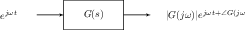
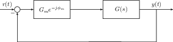

# System Performance



### Definition 14

  The step response of a system is how a system $$H(s)$$ responds to a step input.
  

$$     y(t) = \mathcal{L}^{-1}\left\{ \frac{H(s)}{s} \right\}   $$

  



## First Order Systems



### Definition 15

  A first order system is one with the transfer function of the form
  

$$     H(s) = \frac{s+\alpha}{s+\beta}.   $$

  



After applying partial fraction decomposition to them, their step
response is of the form

$$Au(t) + Be^{-\beta t}u(t).$$

Thus, the larger $$\beta$$ is (i.e the deeper in the left half plane it
is), the faster the system will "settle".

## Second Order Systems



### Definition 16

  Second order systems are those with the transfer function in the form
  

$$     H(s) = \frac{\omega_n^2}{s^2+2\zeta\omega_ns+\omega_n^2}.   $$

  $$\omega_n$$ is known as the natural frequency, and $$\zeta$$ is known as the damping factor.
  



Notice that the poles of the second order system are

$$s = \frac{-2\zeta\omega_n \pm \sqrt{4\zeta^2\omega^2_n-4\omega^2_n}}{2} = -\zeta\omega_n \pm \omega_n\sqrt{\zeta^2 - 1}.$$

There are four cases of interest based on $$\zeta$$.

1.  **Undamped**

    When $$\zeta=0$$, the poles are $$s = \pm \omega_n j$$. Because they
    are purely imaginary, the step response will be purely oscillatory.

    $$Y(s) = \frac{1}{s}\frac{\omega_n^2}{s^2+\omega_n^2} \leftrightarrow y(t) = u(t) - \cos(\omega_n t)u(t)$$

2.  **Underdamped**

    When $$\zeta\in(0, 1)$$, the poles are
    $$s = -\zeta\omega_n\pm j\omega_n\sqrt{1-\zeta^2}$$. They are
    complex and in the left-half plane, so the step response will be a
    exponentially decaying sinusoid. We define the damped frequency
    $$\omega_d = \omega_n\sqrt{1-\zeta^2}$$ so that the poles become
    $$s=-\zeta\omega_n \pm \omega_dj$$. Notice that
    $$\omega_d < \omega_n$$. If we compute the time-response of the
    system,

    $$y(t) = \left[ 1 - \frac{e^{-\zeta\omega_nt}}{\sqrt{1-\zeta^2}}\cos\left(\omega_d t - \arctan\left( \frac{\zeta}{\sqrt{1-\zeta^2}} \right)\right)\right]u(t)$$

3.  **Critically Damped**

    When $$\zeta=1$$, both poles are at $$s=-\omega_n$$. The poles are
    both real, so the time-response will respond without any overshoot.

4.  **Overdamped**

    When $$\zeta>1$$, the poles are
    $$-\zeta\omega_n\pm \omega_n\sqrt{\zeta^2-1}$$. Both of these will
    be real, so the time-response will look similar to a first-order
    system where it is slow and primarily governed by the slowest pole.

### The Underdamped Case

If we analyze the underdamped case further, we can first look at its
derivative.

$$\begin{aligned}   sY(s) &= \frac{\omega_n^2}{s^2+2\zeta\omega_ns+\omega_n^2} = \frac{\omega_n^2}{\omega_d} \frac{\omega_d}{(s+\zeta\omega_n)^2+\omega_d^2}\\   \therefore \frac{d^{}y}{dt^{}} &= \frac{\omega_n^2}{\omega_d}e^{-\zeta\omega_nt}\sin(\omega_d t)u(t)   \qquad (8)\end{aligned}$$



### Definition 17

  The Time to Peak ($$T_p$$) of a system is how long it takes to reach is largest value in the step response.
  



Using equation 8, we see that the derivative is first equal to 0 when
$$t = \frac{\pi}{\omega_d}$$.

$$\therefore T_p = \frac{\pi}{\omega_d}$$



### Definition 18

  The Percent Overshoot ($$\% O.S$$) of a system is by how much it will overshoot the step response.
  



The percent overshoot occurs at $$t = \frac{\pi}{\omega_d}$$, so

$$\% O.S = e^{-\zeta\omega_n \frac{\pi}{\omega_d}} = e^{\frac{-\zeta\pi}{\sqrt{1-\zeta^2}}}.$$



### Definition 19

  The Settling Time ($$T_s$$) of a system is how long it takes for the system to start oscillating within 2\\% of its final value.
  



$$\begin{aligned}   |y(T_s) - 1| < 0.02 \implies \frac{e^{-\zeta\omega_nT_s}}{\sqrt{1-\zeta^2}} = 0.02\\   \therefore T_s = -\frac{1}{\zeta\omega_n} \ln(0.02 \sqrt{1-\zeta^2})\end{aligned}$$

Since our poles are complex, we can represent them in their polar form.

$$\begin{aligned}   r = \omega_d^2 + \zeta^2 + \omega_n^2 = \omega_n^2(1-\zeta^2)+\zeta^2\omega_n^2 = \omega_n^2\\   \cos(\pi-\theta) = \frac{-\zeta\omega_n}{\omega_n} = -\zeta\\\end{aligned}$$

What this tells us is that if we search along the vector at angle
$$\pi-\theta$$, we get a constant $$\zeta$$.

### Additional Poles and Zeros of a Second Order System

Suppose we added an additional pole to the second order system so its
transfer function was instead

$$H(s) = \frac{bc}{(s+c)(s^2+2as+b)}.$$

Then its step response will be

$$\begin{aligned}   Y(s) &= \frac{1}{s}+\frac{D}{s+c}+\frac{Bs+C}{s^2+as+b}\\   B &= \frac{c(a-c)}{c^2+b-ca}\quad C = \frac{c(a^2-ac-b)}{c^2+b-ca} \quad D = \frac{-b}{c^2-ac+b}.\end{aligned}$$

Notice that

$$\lim_{c\to\infty} D = 0 \quad \lim_{c\to\infty} B = -1 \lim_{c\to\infty} C = -a.$$

In other words, as the additional pole moves to infinity, the system
acts more and more like a second-order. As a rule of thumb, if
$$Re\{c\}\geq5Re\{a\}$$, then the system will approximate a second order
system. Because of this property, we can often decompose complex systems
into a series of first and second order systems.

If we instead add an additional zero to the second order system so its
transfer function looks like

$$H(s) = \frac{s+a}{s^2+2\zeta\omega_n+\omega_n^2}$$

and its step response will look like

$$sY(s) + aY(s).$$

Thus if $$a$$ is small, then the effect of the zero is similar to
introducing a derivative into the system, whereas if $$a$$ is large,
then the impact of the zero is primarily to scale the step response. One
useful property about zeros is that if a zero occurs close enough to a
pole, then they will "cancel" each other out and that pole will have a
much smaller effect on the step response.

## Stability

Recall equation 7 which told us the time-domain solution to state-space
equations was

$$\mathbf{x}(t) = e^{At}\mathbf{x}(0) + \int_{0}^{t}e^{A(t-\tau)}B\mathbf{u}(\tau)d\tau.$$



### Definition 20

  A system is bounded-input, bounded output(BIBO) stable if $$\exists K_u, K_x < \infty$$ such that $$|\mathbf{u}(t)| < K_{u} \implies |\mathbf{x}(t)| < K_x$$.
  



Following from definition 20, equation 7, this means that

$$\lim_{t\to\infty}\mathbf{x}(t) = \boldsymbol{0}.$$

If instead $$\lim_{t\to\infty}\mathbf{x}(t) = \infty$$, then the system
is unstable.



### Theorem 3

  If all poles are in the left half plane and the number of zeros is less than or equal to the number of poles, then the system is BIBO stable.
  





### Definition 21

  A system is called marginally stable if the zero-input response does not converge to $$\boldsymbol{0}$$.
  





### Theorem 4

  A system is marginally stable if there is exactly one pole at $$s=0$$ or a pair of poles at $$s=\pm j\omega_0$$.
  



In all other cases, the system will be unstable.

## Steady State Error

Consider the unity feedback loop depicted in figure 4 where we put a
system $$G(s)$$ in unity feedback to control it.

We want to understand what its steady state error will be in response to
different inputs.



### Theorem 5

  The final value theorem says that for a function whose unilateral laplace transform has all poles in the left half plane,
  

$$     \lim_{t\to\infty}x(t) = \lim_{s\to0} sX(s).   $$

  



Using this fact, we see that for the unity feedback system,

$$E(s) = \frac{R(s)}{1+G(s)}.$$

Using these, we can define the static error constants.



### Definition 22

  The position constant determines how well a system can track a unit step.
  

$$     K_p = \lim_{s\to0}G(s)     \qquad (9)   $$

  

$$     \lim_{t\to\infty} e(t) = \lim_{s\to0} s \frac{1}{s} \frac{1}{1+G(s)} = \frac{1}{1+K_p}   $$

  





### Definition 23

  The velocity constant determines how well a system can track a ramp.
  

$$     K_v = \lim_{s\to0}sG(s)     \qquad (10)   $$

  

$$     \lim_{t\to\infty} e(t) = \lim_{s\to0} s \frac{1}{s^2} \frac{1}{1+G(s)} = \frac{1}{K_v}   $$

  





### Definition 24

  The acceleration constant determines how well a system can track a parabola.
  

$$     K_a = \lim_{s\to0}s^2G(s)     \qquad (11)   $$

  

$$     \lim_{t\to\infty} e(t) = \lim_{s\to0} s \frac{1}{s^3} \frac{1}{1+G(s)} = \frac{1}{K_a}   $$

  



Notice that large static error constants mean a smaller error. Another
observation we can make is that if a system has $$n$$ poles at $$s=0$$,
it can perfectly track an input whose laplace transform is
$$\frac{1}{s^{n-k}}$$ for $$k\in[0, n-1]$$. We give $$n$$ a formal name.



### Definition 25

  The system type is the number of poles at 0.
  



This also brings another observation.



### Definition 26

  The internal model principle is that if the system in the feedback loop has a model of the input we want to track, then it can track it exactly.
  



If instead we have a state-space system, then assuming the system is
stable,

$$\lim_{t\to\infty}\frac{d^{}\mathbf{x}}{dt^{}} = \boldsymbol{0} \implies \lim_{t\to\infty}\mathbf{x} = \mathbf{x}_{ss}.$$

Applying this to the state space equations for a step input,

$$\frac{d^{}\mathbf{x}}{dt^{}} = \boldsymbol{0} = A\mathbf{x}_{ss} + B\cdot I \implies \mathbf{x}_{ss} = -A^{-1}B   \qquad (12)$$

Looking at the error between the reference and the output in the 1D
input case,

$$\mathbf{e}(t) = \mathbf{r}(t) - \mathbf{y}(t) = 1 - C\mathbf{x}_{ss} = 1 + CA^{-1}B.$$

## Margins

If we take a complex exponential and pass it into a causal LTI system
with impulse response $$g(t)$$, then

$$y(t) = e^{j\omega t} * g(t) = \int_{-\infty}^{\infty}g(\tau)e^{j\omega(t-\tau)}d\tau = e^{j\omega t} \int_{0}^{\infty}g(\tau)e^{-j\omega \tau}d\tau.$$

This shows us that $$e^{j\omega t}$$ is an eigenfunction of the system.



### Definition 27

  The frequency response of the system determines how it scales pure frequencies. It is equivalent to the Laplace transform evaluated on the imaginary axis.
  

$$     G(j\omega) = \int_0^{\infty}g(\tau)e^{-j\omega\tau}d\tau     \qquad (13)   $$

  



Suppose we put a linear system $$G(s)$$ in negative feedback. We know
that if $$\angle G(j\omega) = (2k+1)\pi$$ for some $$k\in\mathbb{Z}$$,
then the output of the plant will be $$-|G(j\omega)|e^{j\omega t}$$. If
$$|G(j\omega)| \geq 1$$, then this will feed back into the error term
where it will be multiplied by $$|G(j\omega)|$$ repeatedly, and this
will cause the system to be unstable because $$|G(j\omega)|\geq1$$ and
thus will not decay.



### Definition 28

  The gain margin $$G_m$$ is the change in the open loop gain required to make the closed loop system unstable.
  





### Definition 29

  The phase margin $$\phi_m$$ is the change in the open loop phase required to make the closed loop system unstable.
  



We can imagine the gain and phase margin like placing a "virtual box"
before the plant as shown in figure 6.

The characteristic polynomial of the closed loop transfer function is

$$1 + G_me^{-j\phi_m}G(s) = 0.$$

At the gain margin frequency $$\omega_{gm}$$,

$$|G_m||G(j\omega_{gm})| = 1 \implies |G_m| = \frac{1}{|G(j\omega_{gm})|}.$$

where the gain margin frequency is $$\angle G(j\omega_m) = (2k+1)\pi$$
for $$k\in\mathbb{Z}$$. Likewise, at the phase margin frequency
$$\omega_{pm}$$,

$$1 + G_me^{-j\omega_m}G(j\omega_{pm}) = 0 \implies -\phi_m + \angle G(j\omega_{pm}) = (2k+1)\pi.$$

where the phase margin frequency is $$|G(j\omega_{pm})| = 1$$.

Notice that if there is a time delay of $$T$$ in the system, the phase
margin will remain unchanged since the magnitude response will be the
same, but the gain margin will change because the new phase will be

$$\angle G(j\omega) - \omega T.$$

