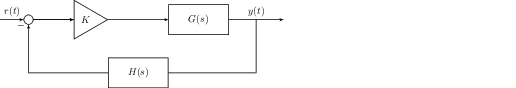

# Design Tools

## Root Locus

Suppose we choose to control the plant by scaling our error signal by
$$K$$ and then put the controller on the feedback path like in figure 7.
It would be helpful for us to understand how the closed loop poles of
the feedback system change as $$K$$ is varied over the range
$$[0, \infty)$$. First, suppose

$$G(s) = \frac{N_G}{D_G} \qquad H(s) = \frac{N_H}{D_H}.$$

Then the transfer function of the overall system is

$$\frac{Y(s)}{R(s)} = \frac{kG(s)}{1+kG(s)H(s)} = \frac{KN_GD_H}{D_GD_H+KN_GN_H}.$$

The closed loop poles are the roots of the denominator polynomial
(called the characteristic polynomial).

$$\Delta(s) = D_GD_H+KN_GN_H = 1 + K\frac{N_GN_H}{D_GD_H} = 0   \qquad (14)$$

Clearly, no matter what $$K$$ is, the poles must satisfy two criteria.

$$\left|k\frac{N_GN_H}{D_GD_H}\right| = 1 \qquad \angle K\frac{N_GN_H}{D_GD_H} = (2r+1)\pi,\quad r\in\mathbb{Z}   \qquad (15)$$



### Definition 30

  The root locus is the set of all $$s\in\mathbb{C}$$ such that $$\exists K$$ where $$\Delta(s) = 0$$.



All points on the root locus must satisfy equation 15.

### Root Locus Rules

First, notice that the roots of $$\Delta(s)$$ are the closed loop poles
of the system.



### Theorem 6

  The number of branches in the root locus is equal to the number of closed loop poles where a branch is the path traveled by a single pole as $$K$$is varied.



Next, because we are dealing with real systems, complex poles must have
a corresponding conjugate pole.



### Theorem 7

The root locus is symmetric about the real axis.



Going back to equation 15, we can alternatively express the angle
criteria as

$$\angle K \frac{\prod_{i=1}^m (s-z_i)}{\prod_{i=1}^n (s-p_i)} = \sum_{i=1}^m \angle (s-z_i) - \sum_{i=1}^n \angle (s-p_i)$$

where $$z_i$$ are open loop zeros and $$p_i$$ are open loop poles. If we
restrict ourselves to the real axis, then given a closed loop pole
$$s$$, each $$z_i > s$$ will contribute $$-180$$˚and each $$p_i > s$$
will contribute $$180$$˚while the $$z_i, p_i < s$$ will contribute
$$0$$˚.



### Theorem 8

The real axis segments of the root locus are to the left of an odd number of open loop poles and zeros.



When $$K$$ is small, then the poles look like the open loop poles. As
$$K$$ grows very large, then the poles look like the open loop zeros.



### Theorem 9

The root locus begins at the open loop poles and ends at the open loop zeros



If there are more poles ($$n$$) then zeros ($$m$$), then not all of the
poles will end up at a zero in the limit. This means that $$n-m$$ poles
must branch off to infinity.

$$\lim_{|s|\to\infty} kH(s)G(s) \approx \lim_{|s|\to\infty}k\frac{s^m}{s^n} = (2l+1)\pi \implies s^{n-m} = re^{j\theta(n-m)} \implies \theta = \frac{(2l+1)\pi}{n-m}$$



### Theorem 10

  In the limit, poles will asymptotically approach
  

$$     \theta = \frac{-(2l+1)\pi}{n-m},   $$

  and the real axis intercept of these asymptotes is
  

$$     \sigma = \frac{\sum_{i=1}^m p_i - \sum_{i=1}^n z_i}{n-m}.   $$



If there is a gap between real-axis segments, in order to end at an open
loop zero, poles must sometimes break away from the real axis and then
re-enter.



### Theorem 11

  The break-in and break-away points satisfy the equation
  

$$     \sum_{i=1}^n \frac{1}{\sigma + p_i} = \sum_{i=1}^m \frac{1}{\sigma+z_i}.   $$



Since the angles can travel asymptotically, they sometimes cross the
imaginary axis.



### Theorem 12

  The root locus intersects the imaginary axis at points where 

$$     \sum_{i=1}^m \angle (j\omega + z_i) - \sum_{i=1}^n \angle (j\omega + p_i) = (2l+1)\pi.   $$



Similarly, if the poles begin at complex locations, then we can find
their angle of departure.



### Theorem 13

  Poles beginning at complex locations will depart at an angle $$\theta$$ where 

$$     \sum_{i=1}^m (p + z_i) - \sum_{i=1}^n (p + p_i) = (2l+1)\pi   $$



Finally, since $$|KG(s)H(s)|=1$$, we can determine $$K$$ if we know a
particular pole location.



### Theorem 14

  Given a pole location $$p$$,
  

$$     K = \left|\frac{1}{G(p)H(p)}\right|.   $$



### Generalized Root Locus

Because the Root Locus rules are derived from the characteristic
polynomial $$\Delta(s)$$ of the closed-loop system, they can be used not
just to find how the closed loop poles vary with a gain, but also to
find how the closed loop poles vary with an open loop pole. Suppose that
$$G(s) = \frac{N_G}{(s+k)\prod_i(s+p_i)}$$ and $$H(s) = 1$$. Then

$$\Delta(s) = (s+k)\prod_i(s+p_i) + N_G = 1 + k\frac{\prod_i (s+p_i) }{N_G + s\prod_i(s+p_i)} = 0$$

Thus if we apply the root locus rules to the open loop system

$$Y(s) = \frac{\prod_i (s+p_i) }{N_G + s\prod_i(s+p_i)}$$

then we can capture the behavior of the closed loop poles of the
original system as we vary the location of the open loop pole we
control.

## Bode Plots



### Definition 31

A Bode plot is a plot of the magnitude and phase of the frequency response with the magnitude on a log-log scale and the phase on a semi-log scale.



If we write the frequency response in polar form,

$$G(j\omega) = K \frac{(j\omega)^{N_{z0}}}{(j\omega)^{N_{p0}}}\frac{\prod_{i=0}^{n}{(1+\frac{j\omega}{\omega_{zi}})}}{\prod_{k=0}^{m}{(1+\frac{j\omega}{\omega_{pk}})}} = Ke^{j\frac{\pi}{2}(N_{z0}-N_{p0})} \frac{\prod_{i=0}^{n}{r_{zi}}}{\prod_{k=0}^{m}{r_{pk}}} e^{j(\sum_{i=0}^{n}{z_i} - \sum_{k=0}^{m}{p_k})}.$$

Each $$r$$ is the magnitude of a factor $$1 + \frac{j\omega}{\omega_n}$$
where $$\omega_n$$ is either a zero or a pole, $$z_i, p_k$$ are the
phases of each factor, and $$N_{z0}, N_{p0}$$ are the number of zeros
and poles at 0. By writing $$G(\omega)$$ this way, it is clear that

$$|G(\omega)| = K \frac{\prod_{i=0}^{n}{r_{zi}}}{\prod_{k=0}^{m}{r_{pk}}}.$$

If we take the convert this to decibels, we get

$$20\log(|G(\omega)|) = 20\log(K) + 20\sum_{i=0}^{n}{\log(r_{zi})} - 20\sum_{k=0}^{m}{\log(r_{pk})}$$

Likewise, the exponential form of $$G(\omega)$$ tells us that

$$\angle G(\omega) = \frac{\pi}{2}(N_{z0}-N_{p0})+ (\sum_{i=0}^{n}{z_i} - \sum_{k=0}^{m}{p_k}).$$

Each $$p_k$$ and $$z_i$$ are of the form
$$1 + \frac{j\omega}{\omega_n}$$. If $$\omega > 10\omega_n$$, then
$$p_k, z_i \approx \omega_n$$. Likewise, if
$$\omega < \frac{\omega_n}{10}$$, $$p_k, z_i \approx 1$$. This means we
can approximate bode plots using piece-wise linear segments using the
following rules.

1.  Each zero $$\omega_z$$ contributes $$20\text{/dec}$$ to magnitude
    starting at $$\omega_z$$.

2.  Each pole $$\omega_p$$ contributes $$-20\text{/dec}$$ to magnitude
    starting at $$\omega_p$$.

3.  Each zero $$\omega_z$$ contributes $$45\text{˚/dec}$$ to phase
    starting at $$\frac{\omega_z}{10}$$ and ending at $$10\omega_z$$.

4.  Each pole $$\omega_p$$ contributes $$-45\text{˚/dec}$$ to phase
    starting at $$\frac{\omega_p}{10}$$ and ending at $$10\omega_p$$.

One useful way to use bode plots is to approximate the gain and phase
margin because they can easily be seen visually from the plots
themselves.

## Nyquist Criteria

Consider the basic feedback system in figure 8 and suppose that

$$G(s) = \frac{N_G}{D_G} \qquad H(s) = \frac{N_H}{D_H}.$$

Then the feedback transfer function is

$$\frac{Y(s)}{R(s)} = \frac{G}{1+G(s)H(s)} = \frac{N_GD_H}{D_GD_H + N_GN_H}.$$

If we focus specifically on the poles of the system, then we see

$$1+GH = 1 + \frac{N_GN_H}{D_GD_H} = \frac{N_GN_H+D_GD_H}{D_GD_H}$$

From here, we can see that the poles of $$1+GH$$ are the poles of the
open loop system whereas the zeros of $$1+GH$$ are the poles of the
closed loop system.



### Definition 32

A contour is a closed loop set of points in the complex plane.





### Definition 33

A mapping is a function that takes a point in the complex plane and transforms it into another point in the complex plane.





### Definition 34

  The Nyquist Criterion says that if $$N$$ is the number of counter-clockwise encirclements of zero of a contour mapped by a transfer function $$F(s)$$, $$P$$ is the number of poles in the contour, and $$Z$$ is the number of zeros in the contour, then
  

$$     N = P - Z.     \qquad (16)   $$



Thus, given an open loop transfer function $$GH$$, we can determine its
stability. We already know $$P$$ from the poles of the open loop system,
and we can find $$N$$ by defining a contour which encapsulates the right
half plane and use equation 16 to find $$Z$$. However, remember that we
need to find the RHP poles of $$1+GH$$. This shifts our mapping to the
right by $$1$$, so we can instead just let $$N$$ be the number of
encirclements of $$-1$$. Once we have $$Z$$, we know how many RHP poles
the closed loop transfer function will have because they are the same as
the RHP zeros of the $$1+GH$$. We can extend the Nyquist Criterion to
finding a range of gains that would make the open-loop system
$$kG(s)H(s)$$ stable by looking for the encirclements of
$$\frac{-1}{K}$$.

The contour which is easiest to find the mapping for is the one which
starts at the origin, travels up the imaginary axis, encapsulates the
right half plane, and then travels back up the imaginary axis back to
the origin in a counter-clockwise fasion. This is the easiest because
while the contour is on the imaginary axis, the mapping is just the
frequency response of the system, and we can use the Bode plot of the
system in order to draw the contour because each point on the mapping is
a complex vector, and the bode plot can give us both the magnitude and
angle of that vector.

