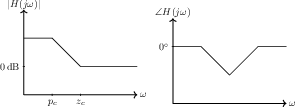
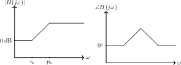

# Cascade Compensation

One easy way to control the plant is to cascade a controller before the
plant like in figure 9.

We can design the controller H(s) to alter the behavior of our system.

## Proportional Integral (PI) Control



### Definition 35

A proportional integral controller applies an input which is a linear combination of the scaled and integrated error signal.

$$ H(s) = K_p+\frac{K_i}{s} = K_p \frac{s + \frac{K_i}{K_p}}{s} $$



What a PI Controller effectively does is place a new pole at $$s=0$$ and
a new zero at $$s=-\frac{K_i}{K_p}$$. Because of the pole at zero,
adding a PI controller enables the system to track a step input
perfectly. However, because the pole is placed at zero, it can slow down
the time response unless the zero can cancel it out.

## Proportional Derivative (PD) Control



### Definition 36

A proportional derivative controller applies an input which is a linear combination of the scaled and differentiated error signal.

$$ H(s) = K_p + K_ds = K_d\left(s + \frac{K_p}{K_d}\right) $$



Adding a PD controller introduces a new zero into the system. By
carefully choosing where we place the zero, we can shape the
time-response of the system. If we want our dominant second order poles
to be at a particular location, then we can use the angle rule to find
the location of the zero $$s=-\frac{K_p}{K_d}$$. Since differentiation
is an unstable operations, sometimes we instead also place a pole very
far in the left half plane, and the transfer function becomes

$$H(s) =K_d \frac{s+\frac{K_p}{K_d}}{s+p}.$$

## Proportional Integral Derivative (PID) Control



### Definition 37

A proportional integral derivative controller applies an input which is a linear combination of the scaled, differentated, and integrated error signals.

$$ H(s) = K_p+K_ds + \frac{K_i}{s} = K_d \frac{s^2 + \frac{K_p}{K_d}s + \frac{K_i}{K_d}}{s} $$



A PID controller is used where we need to both eliminate steady-state
error and shape the time response. We need to choose two different zero
locations and set the total gain of the system.

## Lag Compensation



### Definition 38

A lag compensator is a controller with the transfer function

$$ H(s) = K \frac{s+z_c}{s+p_c},\quad p_c < z_c. $$



The purpose of a lag network is to reduce steady state error by
increasing the gains at low frequency and maintaining the gain at higher
frequencies. This keeps the phase margin the same. We can achieve this
because of the frequency response of the lag network (shown by its bode
plot in figure 10).

We can place the pole and zero carefully to control how much the phase
decreases by. The design procedure is as follows:

1.  Set gain $$K$$ to the value that satisfies the SSE specification and
    plot the Bode diagram at that gain.

2.  Find $$\omega_{PM}$$ such that $$\phi_M$$ is 5˚to 12˚larger than
    required.

3.  Let the high frequency asymptote be $$-20\log K_{PM}$$ db at
    $$\omega_{PM}$$ where $$K_{PM} = |G(j\omega_{PM})|$$.

4.  Choose the upper break frequency to be $$\frac{\omega_{PM}}{10}$$.

5.  Set the low frequency asymptote to be 0 db and locate the lower
    break frequency.

6.  Reset the system gain K to compensate for attenuation.

## Lead Controller



### Definition 39

A Lead Controller is a compensator with the transfer function

$$ H(s) = k\frac{s+z_c}{s+p_c} = \frac{k}{\beta}\frac{s+\frac{1}{T}}{s+\frac{1}{\beta T}} \quad z_c > p_c, \beta < 1. $$



A lead controller is used to change the phase margin and alter the time
perfomance metrics of the step response. It has a peak phase
$$\phi_{max}$$ which is related to the pole and zero by

$$\omega_{max} = \frac{1}{T\sqrt{\beta}}\quad, \phi_{max} = \sin^{-1}\frac{1-\beta}{1+\beta}, \quad |G_c(j\omega_{max})| = \frac{1}{\sqrt{\beta}}.$$

Its frequency response looks like in figure 11.

1.  Set gain $$K$$ of the uncompensated system to a value satisfying SSE
    requirement.

2.  Plot bode diagram for system with gain $$K$$ and determine
    $$\phi_M$$.

3.  Find $$\phi_{M}$$ needed to meet requirements and evaluate
    additional phase contribution from compenstor.

4.  Determine $$\beta$$.

5.  Determine $$|G_c(j\omega_{max})|$$.

6.  Determine $$\omega_{PM}$$ where
    $$|G(j\omega)| = -20\log|G_c(j\omega_{max})|$$.

7.  Find the break frequencies.

8.  Reset the gain.

9.  Simulate and tweak.

