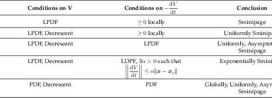

# Stability of Nonlinear Systems

The equilibria of a system can tell us a great deal about the stability
of the system. For nonlinear systems, stability is a property of the
equilibrium points, and to be stable is to converge to or stay
equilibrium.



### Definition 36

An equilibrium point $$\boldsymbol{x}_e\in \mathbb{R}$$ is a stable equilibrium point in the
sense of Lyapunov if and only if $$\forall \epsilon > 0,\exists \delta(t_0, \epsilon)$$ such that 

$$ \forall t \geq t_0,\ \|\boldsymbol{x}_0 - \boldsymbol{x}_e\| < \delta(t_0, \epsilon) \implies \|\boldsymbol{x}(t) - \boldsymbol{x}_e\| < \epsilon $$



Lyapunov Stability essentially says that a finite deviation in the
initial condition from equilibrium means the resulting trajectory of the
system stay close to equilibrium. Notice that this definition is nearly
identical to Theorem 10. That means stability of an equilibrium point is
the same as saying the function which returns the solution to a system
given its initial condition is continuous at the equilibrium point.



### Definition 37

An equilibrium point $$\boldsymbol{x}_e\in \mathbb{R}$$ is an uniformly stable equilibrium point in the
sense of Lyapunov if and only if $$\forall \epsilon > 0,\exists \delta( \epsilon)$$ such that 

$$ \forall t \geq t_0,\ \|\boldsymbol{x}_0 - \boldsymbol{x}_e\| < \delta(\epsilon) \implies \|\boldsymbol{x}(t) - \boldsymbol{x}_e\| < \epsilon $$



Uniform stability means that the $$\delta$$ can be chosen independently
of the time the system starts at. Both stability and uniform stability
do not imply convergence to the equilibrium point. They only guarantee
the solution stays within a particular norm ball. Stricter notions of
stabilty add this idea in.



### Definition 38

An equilibrium point $$\boldsymbol{x}_e$$ is attractive if $$\forall t_0 > 0,\ \exists c(t_0)$$ such that 

$$ \boldsymbol{x}(t_0) \in B_c(\boldsymbol{x}_e) \implies \lim_{t\to\infty} \|\boldsymbol{x}(t, t_0, \boldsymbol{x}_0) - \boldsymbol{x}_e\| = 0 $$



Attractive equilibria guarantee that trajectories beginning from initial
conditions inside of a ball will converge to the equilibrium. However,
attractivity does not imply stability since the trajectory could go
arbitarily far from the equilibrium so long as it eventually returns.



### Definition 39

An equilibrium point $$\boldsymbol{x}_e$$ is asymptotically stable if $$\boldsymbol{x}_e$$is
stable in the sense of Lyapunov and attractive.



Asymptotic stability fixes the problem of attractivity where
trajectories could go far from the equilibrium, and it fixes the problem
with stability where the trajectory may not converge to equilibrium. It
means that trajectories starting in a ball around equilibrium will
converge to equilibrium without leaving that ball. Because the constant
for attractivity may depend on time, defining uniform asymptotic
stability requires some modifications to the idea of attractivity.



### Definition 40

An equilibrium point is uniformly asympototically stable if $$\boldsymbol{x}_e$$ is
uniformly stable in the sense of Lyapunov, and $$\exists c$$ and
$$\gamma:\mathbb{R}_+\times\mathbb{R}^n\to\mathbb{R}_+$$ such that 

$$ \forall \boldsymbol{x}_0\in B_c(\boldsymbol{x}_e),\ \lim_{\tau\to\infty}\gamma(\tau, \boldsymbol{x}_0) = 0, \qquad \forall t\geq t_0,\ \|\boldsymbol{x}(t, t_0, \boldsymbol{x}_0) - \boldsymbol{x}_e\| \leq \gamma(t-t_0, \boldsymbol{x}_0) $$



The existence of the $$\gamma$$ function helps guarantee that the rate
of converges to equilibrium does not depend on $$t_0$$ since the
function $$\gamma$$ is independent of $$t_0$$. Suppose that the
$$\gamma$$ is an exponential function. Then solutions to the system will
converge to the equilibrium exponentially fast.



### Definition 41

An equilibrium point $$\boldsymbol{x}_e$$ is locally exponentially stable if $$\exists h,m,\alpha$$
such that 

$$ \forall \boldsymbol{x}_0\in B_h(\boldsymbol{x}_e),\ \|\boldsymbol{x}(t, t_0, \boldsymbol{x}_0) - \boldsymbol{x}_e\| \leq me^{-\alpha(t - t_0)}\|\boldsymbol{x}(t) - \boldsymbol{x}_e\| $$



are all local definitions because the only need to hold for
$$\boldsymbol{x}_0$$ inside a ball around the equilibrium. If they hold
$$\forall \boldsymbol{x}_0\in\mathbb{R}^n$$, then they become global
properties.

Just as we can define stability, we can also define instability.



### Definition 42

An equilibrium point $$\boldsymbol{x}_e$$ is unstable in the sense of Lyapunov if
$$\exists \epsilon > 0, \forall \delta > 0$$ such that 

$$ \exists \boldsymbol{x}_0\in B_\delta(\boldsymbol{x}_e) \implies \exists T\geq t_0, x(T, t_0, \boldsymbol{x}_0) \not\in B_\epsilon(\boldsymbol{x}_e) $$



Instability means that for any $$\delta-$$ball, we can find an
$$\epsilon-$$ball for which there is at least one initial condition
whose corresponding trajectory leaves the $$\epsilon-$$ball.

## Lyapunov Functions

In order to prove different types of stability, we will construct
functions which have particular properties around equilibrium points of
the system. The properties of these functions will help determine what
type of stable the equilibrium point is.



### Definition 43

A class $$\mathcal{K}$$ function is a function $$\alpha: \mathbb{R}_+ \to \mathbb{R}_+$$ such that
$$\alpha(0) = 0$$ and $$\alpha(s)$$ is strictly monotonically increasing in $$s$$.



A subset of the class $$\mathcal{K}$$ functions grow unbounded as the
argument approaches infinity.



### Definition 44

A class $$\mathcal{KR}$$ function is a class $$\mathcal{K}$$ function $$\alpha$$
where $$\lim_{s\to\infty}\alpha(s) = s$$.



Class $$\mathcal{KR}$$ functions are “radially unbounded”. We can use
class $$\mathcal{K}$$ and class $$\mathcal{KR}$$ to bound “energy-like”
functions called **Lyapunov Functions**.



### Definition 45

A function $$V(\boldsymbol{x}, t): \mathbb{R}^n \times \mathbb{R}_+ \to \mathbb{R}$$ is locally positive
definite (LPDF) on a set $$G\subset \mathbb{R}^n$$ containing $$\boldsymbol{x}_e$$ if $$\exists \alpha \in \mathcal{K}$$ such that 

$$ V(\boldsymbol{x}, t) \geq \alpha(\|\boldsymbol{x} - \boldsymbol{x}_e\|) $$



LPDF functions are locally “energy-like” in the sense that the
equilibrium point is assigned the lowest “energy” value, and the larger
the deviation from the equilibrium, the higher the value of the
“energy”.



### Definition 46

A function $$V(\boldsymbol{x}, t): \mathbb{R}^n \times \mathbb{R}_+ \to \mathbb{R}$$ is positive
definite (PDF) if $$\exists \alpha \in \mathcal{KR}$$ such that 

$$ \forall \boldsymbol{x}\in\mathbb{R}^n,\ V(\boldsymbol{x}, t) \geq \alpha(\|\boldsymbol{x} - \boldsymbol{x}_e\|) $$



Positive definite functions act like “energy functions” everywhere in
$$\mathbb{R}^n$$.



### Definition 47

A function $$V(\boldsymbol{x}, t): \mathbb{R}^n \times \mathbb{R}_+ \to \mathbb{R}$$ is decrescent
if $$\exists \alpha \in \mathcal{K}$$ such that 

$$ \forall \boldsymbol{x}\in B_h(\boldsymbol{x}_e),\ V(\boldsymbol{x}, t) \leq \beta(\|\boldsymbol{x} - \boldsymbol{x}_e\|) $$



Descresence means that for a ball around the equilibrium, we can upper
bound the the energy.

Note that we can assume $$\boldsymbol{x}_e = 0$$ without loss of
generality for Definition 45, Definition 46, Definition 47 since for a
given system, we can always define a linear change of variables that
shifts the equilibrium point to the origin.

### Quadratic Lyapunov Functions



### Definition 48

A Quadratic Lypunov function is of the form 

$$ V(\boldsymbol{x}) = \boldsymbol{x}^\top P \boldsymbol{x},\quad P \succ 0 $$



Quadratic Lyapunov Functions are one of the simplest types of Lyapunov
Functions. Their level sets are ellipses where the major axis is the
eigenvector corresponding to $$\lambda_{min}(P)$$, and the minor axis is
the eigenvecctor corresponding to $$\lambda_{max}(P)$$.



### Theorem 14

Consider the sublevel set $$\Omega_c = \{ \boldsymbol{x} | V(\boldsymbol{x}) \leq c \}$$. Then
$$r_*$$ is the radius of the largest circle contained inside $$\Omega_c$$, and $$r^*$$
is the radius of the largest circle containing $$\Omega_c$$.

$$ r_* = \sqrt{\frac{c}{\lambda_{max}(P)}} \qquad r^* = \sqrt{\frac{c}{\lambda_{min}(P)}} $$



### Sum-of-Squares Lyapunov Functions



### Definition 49

A polynomial $$p(\boldsymbol{x})$$ is sum-of-squares (SOS) if $$\exists g_1,\cdots,g_r$$
such that 

$$ p(\boldsymbol{x}) = \sum_{i=1}^r g_i^2(\boldsymbol{x}) $$



SOS polynomials have the nice property that they are always non-negative
due to being a sum of squared numbers. Since any polynomial can be
written in a quadratic form
$$P(\boldsymbol{x}) = z^\top(\boldsymbol{x}) Q z(\boldsymbol{x})$$ where
$$z$$ is a vector of monomials, the properties of $$Q$$ can tell us if
$$P$$ is SOS or not.



### Theorem 15

A polynomial is SOS if and only if it can be written as 

$$ p(\boldsymbol{x}) = z^\top(\boldsymbol{x}) Q z(\boldsymbol{x}), \quad Q \succeq 0 $$



Note that $$Q$$ is not necessarily unique, and if we construct a linear
operator which maps $$Q$$ to $$P$$, then this linear operator will have
a Null Space. Mathematically, consider

$$\mathcal{L}(Q)(\boldsymbol{x}) = z^\top(\boldsymbol{x})Qz(\boldsymbol{x}).$$

This linear operator has a null space spanned by the polynomials
$$N_j$$. Given a matrix $$Q_0 \succeq 0$$ such that
$$p(\boldsymbol{x}) = z^\top(\boldsymbol{x})Q_0z(\boldsymbol{x})$$ (i.e
$$p$$ is SOS), it is also true that

$$p(\boldsymbol{x}) = z^\top(\boldsymbol{x})\left( Q_0 + \sum_{j} \lambda_j N_j(\boldsymbol{x}) \right)     z(\boldsymbol{x}).$$

SOS polynomials are helpful in finding Lyapunov functions because we can
use SOS Programming to find SOS polynomials which satisfy desired
properties. For example, if we want $$V(\boldsymbol{x})$$ to be PDF,
then one constraint in our SOS program will be that

$$V(\boldsymbol{x}) - \epsilon \boldsymbol{x}^\top \boldsymbol{x}, \quad \epsilon > 0$$

is SOS.

## Proving Stability

To prove the stability of an equilibrium point for a given nonlinear
system, we will construct a Lyapunov function and determine stability
from the properties of the Lyapunov functions which we can find. Given
properties of $$V$$ and $$\frac{d^{}V}{dt^{}}$$, we can use the
**Lyapunov Stability Theorems** to prove the stability of equilibria.



### Theorem 16

If $$\exists V(\boldsymbol{x}, t)$$ such that $$V$$ is LPDF and
$$-\frac{d^{}V}{dt^{}} \geq 0$$ locally, then $$\boldsymbol{x}_e$$is stable in the sense of
Lyapunov.





### Theorem 17

If $$\exists V(\boldsymbol{x}, t)$$ such that $$V$$ is LPDF and decrescent, and
$$-\frac{d^{}V}{dt^{}} \geq 0$$ locally, then $$\boldsymbol{x}_e$$is uniformly stable in the sense of
Lyapunov.





### Theorem 18

If $$\exists V(\boldsymbol{x}, t)$$ such that $$V$$ is LPDF and decrescent, and
$$-\frac{d^{}V}{dt^{}}$$ is LPDF, then $$\boldsymbol{x}_e$$is uniformly asymptotically stable in the sense of
Lyapunov.





### Theorem 19

If $$\exists V(\boldsymbol{x}, t)$$ such that $$V$$ is PDF and decrescent, and
$$-\frac{d^{}V}{dt^{}}$$ is LPDF, then $$\boldsymbol{x}_e$$is globally uniformly asymptotically stable in the sense of
Lyapunov.





### Theorem 20

If $$\exists V(\boldsymbol{x}, t)$$ and $$h, \alpha > 0$$ such that V is LPDF is
decrescent, $$-\frac{d^{}V}{dt^{}}$$ is LDPF, and 

$$ \forall \boldsymbol{x}\in B_h(\boldsymbol{x}_e),\ \left\lvert\left\lvert\frac{d^{}V}{dt^{}}\right\rvert\right\rvert \leq \alpha \|\boldsymbol{x}-\boldsymbol{x}_e\| $$



The results of
Theorem 16, Theorem 17, Theorem 18, Theorem 19, Theorem 20 are
summarized in Table 1.

Going down the rows of Table 1 lead to increasingly stricter forms of
stability. Descresence appears to add uniformity to the stability, while
$$-\frac{d^{}V}{dt^{}}$$ being LPDF adds asymptotic convergence.
However, these conditions are only sufficient, meaning if we cannot find
a suitable $$V$$, that does not mean that an equilibrium point is not
stable.

One very common case where it can be difficult to find appropriate
Lyapunov functions is in proving asymptotic stability since it can be
hard to find $$V$$ such that $$-\frac{d^{}V}{dt^{}}$$ is LPDF. In the
case of autonomous systems, we can still prove asymptotic stability
without such a $$V$$.



### Theorem 21 (LaSalle's Invariance Principle) {#theorem-21}

Consider a smooth function $$V:\mathbb{R}^n\to\mathbb{R}$$ with bounded sub-level sets $$\Omega_c = \left\{\boldsymbol{x} | V(\boldsymbol{x}) \leq c \right\}$$ and $$\forall \boldsymbol{x}\in \Omega_c$$,
$$\frac{d^{}V}{dt^{}} \leq 0$$. Define $$S = \left\{\boldsymbol{x}\bigg\lvert\frac{d^{}V}{dt^{}} = 0\right\}$$ and let
$$M$$ be the largest invariant set in $$S$$, then 

$$ \forall \boldsymbol{x}_0\in \Omega_c,\ \boldsymbol{x}(t, t_0, x_0) \to M \text{ as } t\to \infty. $$



LaSalle’s theorem helps prove general convergence to an invariant set.
Since $$V$$ is always decreasing in the sub-level set $$\Omega_c$$,
trajectories starting in $$\Omega_c$$ must eventually reach $$S$$. At
some point, they will reach the set $$M$$ in $$S$$, and then they will
stay there. Thus if the set $$M$$ is only the equilibrium point, or a
set of equilibrium points, then we can show that the system trajectories
asymptotically converges to this equilibrium or set of equilibria.
Moreover, if $$V(\boldsymbol{x})$$ is PDF, and
$$\forall \boldsymbol{x}\in\mathbb{R}^n, \frac{d^{}V}{dt^{}} \leq 0$$,
then we can show global asymptotic stability as well.

LaSalle’s theorem can be generalized to non-autonomous systems as well,
but it is slightly more complicated since the set $$S$$ may change over
time.

### Indirect Method of Lyapunov

It turns out that we can also prove the stability of systems by looking
at the linearization around the equilibrium. Without loss of generality,
suppose $$\boldsymbol{x}_e = 0$$. The linearization at the equilibrium
is given by

$$\frac{d^{}\boldsymbol{x}}{dt^{}} = f(x,t) = f(0, t) + \frac{\partial f}{\partial     \boldsymbol{x}}\bigg\lvert_{\boldsymbol{x} = 0}\boldsymbol{x} + f_1(\boldsymbol{x},t) \approx A(t)\boldsymbol{x}.$$

The function $$f_1(\boldsymbol{x}, t)$$ is the higher-order terms of the
linearization. The linearization is a time-varying system. Consider the
time-varying linear system

$$\frac{d^{}\boldsymbol{x}}{dt^{}} = A(t)\boldsymbol{x},\ \boldsymbol{x}(t_0) = \boldsymbol{x}_0.$$



### Definition 50

The state transition matrix $$\Phi(t, t_0)$$ of a time-varying linear system is
a matrix satisfying 

$$ \boldsymbol{x}(t) = \Phi(t, t_0)\boldsymbol{x}_0,\ \frac{d^{}\Phi}{dt^{}} = A(t)\Phi(t, t_0),\ \Phi(t_0, t_0) = I $$



The state transition matrix is useful in determining properties of the
system.

1.  $$\sup_{t\geq t_0} \|\Phi(t, t_0)\| = m(t_0) < \infty \implies$$ the
    system is stable at the origin at $$t_0$$.

2.  $$\sup_{t_0\geq 0}\sup_{t\geq t_0} \|\Phi(t, t_0)\| = m < \infty \implies$$
    the system is uniformly stable at the origin at $$t_0$$.

3.  $$\lim_{t\to\infty}\|\Phi(t, t_0)\| = 0 \implies$$ the system is
    asymptotically stable.

4.  $$\forall t_0,\epsilon>0,\exists T$$ such that
    $$\forall t\geq t_0 + T,\ \|\Phi(t, t_0)\| <         \epsilon \implies$$
    the system is uniformly asymptotically stable.

5.  $$\|\Phi(t, t_0)\| \leq Me^{-\lambda(t-t_0)} \implies$$ exponential
    stability.

If the system was Time-Invariant, then the system would be stable so
long as the eigenvalues of $$A$$ were in the open left-half of the
complex plane. In fact, we could use $$A$$ to construct positive
definite matrices.



### Theorem 22 (Lyapunov Lemma) {#theorem-22}

For a matrix $$A\in \mathbb{R}^{n\times n}$$, its eigenvalues $$\lambda_i$$ satisfy
$$\mathbb{R}e(\lambda_i) < 0$$ if and only if $$\forall Q \succ 0$$, there exists
a solution $$P\succ 0$$ to the equation 

$$ A^TP + PA = -Q. $$



In general, we can use the **Lyapunov Equation** to count how many
eigenvalues of $$A$$ are stable.



### Theorem 23 (Tausskey Lemma) {#theorem-23}

For $$A\in\mathbb{R}^{n\times n}$$ and given $$Q \succ 0$$, if there are no eigenvalues on
the $$j\omega$$ axis, then the solution $$P$$ to $$A^TP + PA = -Q$$ has as many
positive eigenvalues as $$A$$has eigenvalues in the complex left half plane.



The Lyapunov Lemma has extensions to the time-varying case.



### Theorem 24 (Time-Varying Lyapunov Lemma) {#theorem-24}

If $$A(\cdot)$$ is bounded and for some $$Q(t) \succeq \alpha I$$, the solution
$$P(t)$$ to $$A(t)^TP(t) + P(t)A(t) = -Q(t)$$is bounded, then the origin is a
asymptotically stable equilibrium point.



It turns out that uniform asymptotic stability of the linearization of a
system corresponds to uniform, asymptotic stability of the nonlinear
system.



### Theorem 25 (Indirect Theorem of Lyapunov) {#theorem-25}

For a nonlinear system whose higher-order terms of the linearization are given
by $$f(\boldsymbol{x},t)$$, if 

$$ \lim_{\|\boldsymbol{x}\|\to 0}\sup_{t\geq 0} \frac{\|f_1(\boldsymbol{x},t)\|}{\|\boldsymbol{x}\|} = 0 $$

and if $$\boldsymbol{x}_e$$ is a uniformly asymptotic stable equilibrium point of
$$\frac{d^{}\boldsymbol{z}}{dt^{}}=A(t)\boldsymbol{z}$$ where $$A(t)$$ is the Jacobian at the $$\boldsymbol{x}_e$$,
then $$\boldsymbol{x}_e$$ is a uniformly asymptotic stable
equilibrium point of $$\frac{d^{}\boldsymbol{x}}{dt^{}} = f(\boldsymbol{x},t)$$



## Proving Instability



### Theorem 26

An equilibrium point $$\boldsymbol{x}_e$$ is unstable in the sense of Lyapunov if
$$\exists V(\boldsymbol{x},t)$$ which is decrescent, the Lie derivative $$\frac{d^{}V}{dt^{}}$$ is
LPDF, $$V(\boldsymbol{x}_e, t)$$, and $$\exists \boldsymbol{x}$$ in the neighborhood of $$\boldsymbol{x}_e$$
such that $$V(\boldsymbol{x}_0, t) > 0$$.



## Region of Attraction

For asymptotically stable and exponential stable equilibria, it makes
sense to wonder which initial conditions will cause trajectories to
converge to the equilibrium.



### Definition 51

If $$\boldsymbol{x}_e$$ is an equilibrium point of a time-invariant system $$\frac{d^{}\boldsymbol{x}}{dt^{}} = f(\boldsymbol{x})$$, then the Region of Attraction of $$\boldsymbol{x}_e$$ is 

$$ \mathcal{R}_A(\boldsymbol{x}_e) = \{ \boldsymbol{x}_0 \in \mathbb{R}^n | \lim_{t\to\infty} \boldsymbol{x}(t, t_0) = \boldsymbol{x}_e \} $$



Suppose that we have a Lyapunov function $$V(\boldsymbol{x})$$ and a
region $$D$$ such that $$V(\boldsymbol{x}) > 0$$ and
$$\frac{d^{}V}{dt^{}} < 0$$ in $$D$$. Define a sublevel set of the
Lypunov function $$\Omega_c$$ which is a subset of $$D$$. We know that
if $$\boldsymbol{x}_0\in\Omega_c$$, then the trajectory will stay inside
$$\Omega_c$$ and converge to the equilibrium point. Thus we can use the
largest $$\Omega_c$$ that is compact and contained in $$D$$ as an
estimate of the region of attraction.

When we have a Quadratic Lyapunov Function, we can set $$D$$ to be the
largest circle which satisfies the conditions on $$V$$, and the
corresponding $$\Omega_c$$ contained inside $$D$$ will be the estimate
of the Region of Attraction.

We can find even better approximations of the region of attraction using
SOS programming. Suppose we have a $$V$$ which we used to prove
asymptotic stability. Then if there exists an $$s$$ which satisfies the
following SOS program, then the sublevel set $$\Omega_c$$ is an estimate
of the Region of Attraction.

$$\begin{aligned}     \max_{c, s} &\quad c\\     \text{s.t} &\quad s(\boldsymbol{x}) \text{ is SOS,}\\     &\quad -\left(\frac{d^{}V}{dt^{}} + \epsilon \boldsymbol{x}^\top \boldsymbol{x}\right) + s(\boldsymbol{x})(c -     V(\boldsymbol{x})) \text{ is SOS.}\end{aligned}$$

