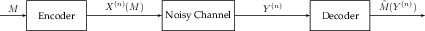

# Information Theory

Information Theory is a field which addresses two questions

1.  **Source Coding:** How many bits do I need to losslessly represent
    an observation.

2.  **Channel Coding:** How reliably and quickly can I communicate a
    message over a noisy channel.

## Quantifying Information

Intuitively, for a PMF of a disrete random variable, the surprise
associated with a particular realization is $$-\log p_X(x)$$ since less
probable realizations are more surprising. With this intuition, we can
try and quantify the “expected surprise” of a distribution.



### Definition 40

For a Discrete Random Variable $$X\sim p_X$$, the Entropy of $$X$$ is given by 

$$ H(x) = \mathbb{E}\left[-\log_2 p_X(x)\right]  = -\sum_{x\in\mathcal{X}} p_X(x)\log_2p_X(x). $$



Alternative interpretations of entropy are the average uncertainty and
how random $$X$$ is. Just like probabilites, we can define both joint
and conditional entropies.



### Definition 41

For Discrete Random Variables $$X$$ and $$Y$$, the joint entropy is given by 

$$ H(X,Y) = \mathbb{E}\left[-\log_2p_{XY}(x, y)\right]  = -\sum_{x,y\in\mathcal{X}\times\mathcal{Y}}p_{XY}(x, y)\log_2p_{XY}(x, y). $$





### Definition 42

For Discrete Random Variable $$X$$ and $$Y$$, the conditional entropy is given by 

$$ H(Y|X) = \mathbb{E}\left[-\log_2p_{Y|X}(y|x)\right]  = \sum_{x\in\mathcal{X}}p_X(x)H(Y|X=x). $$



Conditional entropy has a natural interpretation which is that it tells
us how surprised we are to see $$Y=y$$ given that we know $$X=x$$. If
$$X$$ and $$Y$$ are independent, then $$H(Y) = H(Y|X)$$ because
realizing $$X$$ gives no additional information about $$Y$$.



### Theorem 23 (Chain Rule of Entropy) {#theorem-23}

$$ H(X, Y) = H(X) + H(X|Y). $$



In addition to knowing how much our surprise changes for a random
variable when we observe a different random variable, we can also
quantify how much additional information observing a random variable
gives us about another.



### Definition 43

For random variables $$X$$ and $$Y$$, the mutual information is given by 

$$ I(X;Y) = H(X) - H(X|Y) = H(Y) - H(Y|X). $$



## Source Coding

Source coding deals with finding the minimal number of bits required to
represent data. This is essentially the idea of lossless compression. In
this case, our message is the sequence of realizations of independently
and identically distributed random variables
$$\left(X_i\right)_{i=1}^n \sim p_X$$. The probability of observing a
particular sequence is then

$$P(x_1, x_2, \cdots, x_n) = \prod_{i=1}^np_X(x_i).$$



### Theorem 24 (Asymptotic Equipartition Property) {#theorem-24}

If we have a sequence of independently and identically distributed random variables $$\left(X_i\right)_{i=1}^n \sim p_X$$, then $$-\frac{1}{n}\log P(x_1, x_2, \cdots, x_n)$$ converges to $$H(X)$$in probability.



Theorem 24 tells us that with overwhelming probability, we will observe
a sequence that is assigned probability $$2^{-nH(X)}$$. Using this idea,
we can define a subset of possible observed sequences that in the limit,
our observed sequence must belong to with overwhelming probability.



### Definition 44

For a fixed $$\epsilon > 0$$, for each $$n\geq 1$$, the typical set is given by 

$$ A_\epsilon^{(n)} = \left\{ (x_1, x_2, \cdots, x_n) : 2^{-n(H(X)+\epsilon)}\leq P(x_1, x_2, \cdots, x_n) \leq 2^{-n(H(X)-\epsilon)} \right\}. $$



Two important properties of the typical set are that

1.  $$\lim_{n\to\infty}P\left((x_1, x_2, \ldots, x_n) \in A_{\epsilon}^{(n)}\right) = 1$$

2.  $$|A_{\epsilon}^{(n)}| \leq 2^{n(H(X)+\epsilon)}$$

The typical set gives us an easy way to do source coding. If I have
$$N$$ total objects, then I only need $$\log N$$ bits to represent each
object, so I can define a simple protocol which is

1.  If $$(x_i)_{i=1}^{n} \in A^{(n)}_{\frac{\epsilon}{2}}$$, then
    describe them using the
    $$\log|A^{(n)}_{\frac{\epsilon}{2}}| \leq n\left(H(X)+\frac{\epsilon}{2}\right)$$
    bits

2.  If $$(x_i)_{i=1}^n \not \in A^{(n)}_{\frac{\epsilon}{2}}$$, then
    describe them naiively with $$n\log|\mathcal{X}|$$ bits.

This makes the average number of bits required to describe a message

$$\begin{aligned}     \mathbb{E}\left[\text{\# of Bits}\right]  &\leq n\left(H(X)+\frac{\epsilon}{2}\right)P\left((x_i)_{i=1}^n\in A_{\frac{\epsilon}{2}}^{(n)}\right) + n\log |\mathcal{X}|P\left((x_i)_{i=1}^n\in A_{\frac{\epsilon}{2}}^{(n)}\right) \\     &\leq n(H(X)+\frac{\epsilon}{2}) + n \frac{\epsilon}{2} \leq n(H(X)+\epsilon)\end{aligned}$$

This is the first half of a central result of source coding.



### Theorem 25 (Source Coding Theorem) {#theorem-25}

If $$(X_i)_{i=1}^n \sim p_X$$ are a sequence of independently and identically distributed random varibles, then for any $$\epsilon > 0$$ and $$n$$ sufficiently large, we can represent $$(X_i)_{i=1}^n$$ using fewer than $$n(H(X) + \epsilon)$$ bits. Conversely, we can not losslessly represent $$(X_i)_{i=1}^n$$ using fewer than $$nH(X)$$bits.



This lends a new interpretation of the entropy $$H(X)$$: it is the
average number of bits required to represent $$X$$.

## Channel Coding

Whereas source coding deals with encoding information, channel coding
deals with transmitting it over a noisy channel. In general, we have a
message $$M$$, and encoder, a channel, and a decoder as in Figure 1.

Each channel can be described by a conditional probability distribution
$$p_{Y|X}(y|x)$$ for each time the channel is used.



### Definition 45

For a channel described by $$p_{Y|X}$$, the capacity is given by 

$$ C = \max_{p_X} I(X; Y). $$



In words, the capacity describes the maximum mutual information between
the channel input and output.



### Definition 46

Suppose we use the channel $$n$$ times to send a message that takes on average $$H(m)$$ bits to encode, then the rate of the channel is 

$$ R = \frac{H(M)}{n} $$





### Theorem 26 (Channel Coding Theorem) {#theorem-26}

For a channel decsribed by $$p_{Y|X}$$ and $$\epsilon>0$$ and $$R < C$$, for all $$n$$ sufficiently large, there exists a rate $$R$$ communication scheme that achieves a probability of error less than $$\epsilon$$. If $$R > C$$, then the probability of error converges to 1 for any communication scheme.



