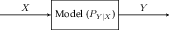

# Statistical Inference

Suppose we have a variable $$X$$ (may or may not be a random variable)
that represents the state of nature. We observe a variable $$Y$$ which
is obtained by some model of the world $$P_{Y|X}$$.

Suppose we know that $$X\sim \pi$$ where $$\pi$$ is a probability
distribution. If we observe $$Y=y$$, then the *a posteriori* estimate of
$$X$$ is given by Bayes Rule

$$\text{Pr}\left\{X=x | Y=y\right\}  = \frac{P_{Y|X}(y|x)\pi(x)}{\sum_{\tilde{x}}P_{Y|X}(y|\tilde{x})\pi(\tilde{x})} \propto P_{Y|X}(y|x)\pi(x).$$

Since the estimate is only dependent on the model and the prior, we
don’t actually need to compute the probabilities to figure out the most
likely $$X$$.



### Definition 77

The Maximum A Posteriori (MAP) estimate is given by 

$$ \hat{X}_{MAP}(y) = \text{argmax}_x P_{Y|X}(y|x)\pi(x) $$



If we have no prior information on $$X$$, then we can assume $$\pi$$ is
uniform, reducing definition 77 to only optimize over the model.



### Definition 78

The Maximum Likelihood (ML) estimate is given by

$$ \hat{X}_{ML}(y) = \text{argmax}_x P_{Y|X}(y|x) $$



## Binary Hypothesis Testing



### Definition 79

A Binary Hypothesis Test is a type of statistical inference where the unknown variable $$X\in\{ 0, 1 \}$$.



Since there are only two possible values of $$X$$ in a binary test,
there are two “hypotheses” that we have, and we want to accept the more
likely one.



### Definition 80

The Null Hypothesis $$H_0$$ says that $$Y\sim P_{Y|X=0}$$





### Definition 81

The Alternate Hypothesis $$H_1$$ says that $$Y\sim P_{Y|X=1}$$



With two possible hypotheses, there are two kinds of errors we can make.



### Definition 82

A Type I error (false positive) is when we incorrectly reject the null hypothesis. The Type I error probability is then

$$ \text{Pr}\left\{\hat{X}(Y) = 1 | X = 0\right\}  $$





### Definition 83

A Type II error (false negative) is when we incorrectly accept the null hypothesis. The Type II error probability is then

$$ \text{Pr}\left\{\hat{X}(Y) = 0 | X = 1\right\}  $$



Our goal is to create a decision rule
$$\hat{X}: \mathcal{Y} \to \{0, 1\}$$ that we can use to predict $$X$$.
Based on what the decision rule is used for, there will be requirements
on how large the probability of Type I and Type II errors can be. We can
formulate the search for a hypothesis test as an optimization. For some
$$\beta \in [0, 1]$$, we want to find

$$\hat{X}_\beta(Y) = \text{argmin} \text{Pr}\left\{\hat{X}(Y)=0 | X=1\right\}  \quad : \quad \text{Pr}\left\{\hat{X}(Y)=1|X=0\right\}  \leq \beta.     \qquad (1)$$

Intuitively, our test should depend on $$p_{Y|X}(y|1)$$ and
$$p_{Y|X}(y|0)$$ since these quantities give us how likely we are to get
our observations if we knew the ground truth. We can define a ratio that
formally compares these two quantities.



### Definition 84

The likelihood ratio is given by 

$$ L(y) = \frac{p_{Y|X}(y|1)}{p_{Y|X}(y|0)} $$



Notice that we can write MLE as a threshold on the likelihood ratio
since if $$L(y) \geq 1$$, then we say $$X=1$$, and vice versa. However,
there is no particular reason that $$1$$ must always be the number at
which we threshold our likelihood ratio, and so we can generalize this
idea to form different forms of tests.



### Definition 85

For some threshold $$c$$ and randomization probability $$\gamma$$, a threshold test is of the form

$$ \hat{X}(y) = \begin{cases} 1 & \text{ if } L(y) > c\\ 0 & \text{ if } L(y) < c\\ \text{ Bernoulli}(\gamma) & \text { if } L(y) = c. \end{cases} $$



MAP fits into the framework of a threshold test since we can write

$$\hat{X}_{MAP} = \begin{cases}         1 & \text{ if } L(y) \geq \frac{\pi_0}{\pi_1}\\         0 & \text{ if } L(y) < \frac{\pi_0}{\pi_1}     \end{cases}$$

It turns out that threshold tests are optimal with respect to solving
equation 1.



### Theorem 44 (Neyman Pearson Lemma) {#theorem-44}

Given $$\beta\in[0, 1]$$, the optimal decision rule to 

$$ \hat{X}_\beta(Y) = \text{argmin} \text{Pr}\left\{\hat{X}(Y)=0 | X=1\right\}  \quad : \quad \text{Pr}\left\{\hat{X}(Y)=1|X=0\right\}  \leq \beta $$

is a threshold test.



When $$L(y)$$ is monotonically increasing or decreasing, we can make the
decision rule even simpler since it can be turned into a threshold on
$$y$$. For example, if $$L(y)$$ is monotonically inreasing, then an
optimal decision rule might be

$$\hat{X}(y) = \begin{cases}         1 & \text{ if } y > c\\         0 & \text{ if } y < c\\         \text{Bernoulli}(\gamma) & \text{ if } y = c.     \end{cases}$$

