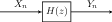
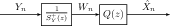
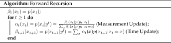
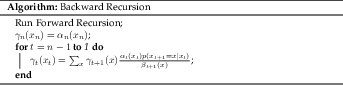
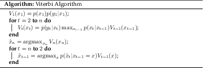

# Filtering

If we think of our signal as a discrete time random process, then like a
normal deterministic signal, we can try filtering our random process.

Filtering can either be accomplished with an LTI system or some other
non-linear/non-time-invariant system just like with deterministic
signals.

## LTI Filtering on WSS Processes

If we use an LTI filter on a WSS process, then we can easily compute how
the filter impacts the spectrum of the signal.



### Theorem 13

When $$Y(n)$$ is formed by passing a WSS process $$X_n$$ through a stable LTI system with impulse response $$h[n]$$ and transfer function $$H(z)$$, then $$S_Y(z) = H(z)S_X(z)H^*(z^{-*})$$ and $$S_{YX}(z) = H(z)S_X(z)$$.
If we have a third process $$Z_n$$ that is jointly WSS with $$(Y_n, X_n)$$, then $$S_{ZY}(z) = S_{ZX}(z)H^*(z^{-*})$$.



This gives us an interesting interpretation of the spectral
factorization (definition 14) since it essentially passing a WSS process
with auto-correlation $$R_W(k) = r_e\delta[n]$$ through a minimum-phase
filter with transfer function $$L(z)$$.

## Wiener Filter

Suppose we have a stochastic WSS process $$Y_n$$ that is jointly WSS
with $$X_n$$ and that we want to find the best linear estimator of
$$X_n$$ using $$Y_n$$. The best linear estimator of $$X_n$$ given the
observations $$Y_n$$ can be written as

$$\hat{X}_n = \sum_{m\in\mathbb{Z}}h(m)Y_{n-m} = h[n] * Y_n.$$

This is identical to passing $$Y_n$$ through an LTI filter. If we
restrict ourselves to using $$\{Y_i\}_{i=-\infty}^{n}$$ to estimate
$$X_n$$, then the best linear estimator can be written as

$$\hat{X}_n = \sum_{m=0}^\infty h(m)Y_{n-m} = h[n] * Y_n.$$

It is identical to passing $$Y_n$$ through a causal LTI filter. Since we
are trying to find a best linear estimator, it would be nice if each of
the random variables we are using for estimating were uncorrelated with
each other. In other words, instead of using $$Y$$ directly, we want to
transform $$Y$$ into a new process $$W$$ where $$R_W(k) = \delta[k]$$.
This transformation is known as whitening. From the spectral
factorization of $$Y$$, we know if we use the filter
$$G(z) =\frac{1}{S_Y^+(z)}$$ then

$$S_W(z) = \frac{S_Y(z)}{S_Y^+(z)S_Y^{+*}(z^{-*})} = \frac{S_Y(z)}{S_Y^+(z)S_Y^-(z)} = 1.$$

Now we want to find the best linear estimator of $$X$$ using our new
process $$W$$ by designing an LTI filter $$Q(z)$$.

### Non-Causal Case

Starting with noncausal case, we can apply the orthogonality principle,

$$\begin{aligned}     \mathbb{E}\left[(X_n-\hat{X}_n)W_{n-k}^*\right]  = 0 &\implies \mathbb{E}\left[X_nW^*_{n-k}\right]  = \sum_{m\in\mathbb{Z}}q(m)\mathbb{E}\left[W_{n-m}W^*_{n-k}\right] \\     \therefore R_{XW}(k) = \sum_{m\in\mathbb{Z}}q(m)R_W(k-m) &\implies S_{XW}(z) = Q(z)S_W(z)\\     \therefore Q(z) = \frac{S_{XW}(z)}{S_W(z)} = S_{XW}(z) &= S_{XY}(z)(S_Y^+(z^{-*}))^{-*} = \frac{S_{XY}(z)}{S_Y^-(z)}\end{aligned}$$

When we cascade these filters,

$$H(z) = Q(z)G(z) = \frac{S_{XY}(z)}{S_Y^-(z)} \frac{1}{S_Y^+(z)}= \frac{S_{XY}(z)}{S_Y(z)}.$$



### Definition 21

The best linear estimator of $$X_n$$ using $$Y_n$$ where $$(X_n, Y_n)$$ is jointly WSS is given by the non-causal Wiener filter.

$$ H(z) = \frac{S_{XY}(z)}{S_Y(z)} $$



If we interpret definition 21 in the frequency domain, for a specific
$$\omega$$, we can understand $$H(e^{j\omega})$$ as an optimal linear
estimator for $$F_X(\omega)$$ where $$F_X(\omega)$$ is the the
stochastic process given by the Cramer-Khinchin decomposition
(theorem 7). More specifically, we can use the Cramer-Khinchin
decomposition of $$Y_n$$.

$$\begin{aligned}     \hat{X}_n &= \sum_{i\in\mathbb{Z}}h[i]\int_{-\pi}^\pi e^{j\omega(n-i)}dF_Y(\omega)\\     &= \int_{-\pi}^{\pi}\left(\sum_{i\in\mathbb{Z}}h[i]e^{-j\omega i}\right)e^{j\omega n}dF_Y(\omega) \\     &= \int_{-\pi}^\pi H(e^{j\omega})e^{j\omega n}dF_Y(\omega)\\\end{aligned}$$

Since $$F_X$$ and $$F_Y$$ have jointly orthogonal increments, this tells
us that $$H(e^{j\omega})$$ is just the optimal linear estimator of
$$dF_X(\omega)$$ using $$dF_Y(\omega)$$. $$dF_X(\omega)$$ and
$$dF_Y(\omega)$$ exist on a Hilbert space, meaning we are essentially
projecting each frequency component of $$X_n$$ onto the corresponding
frequency component of $$Y_n$$.

### Causal Case

First, note that in the causal case, whitening doesn’t break causality
because $$\frac{1}{S_Y^+(z)}$$ is causal. When we apply the
orthogonality principle,

$$\begin{aligned}     \mathbb{E}\left[(X_n-\hat{X}_n)W_{n-k}^*\right]  = 0 &\implies \mathbb{E}\left[X_nW^*_{n-k}\right]  = \sum_{m=0}^\infty q(m)\mathbb{E}\left[W_{n-m}W^*_{n-k}\right] \\     \therefore R_{XW}(k) &= \sum_{m = 0}^\infty q[m]R_W(k-m) \qquad k \geq 0\end{aligned}$$

We can’t take the Z-transform of both sides because the equation is not
necessarily true for $$k < 0$$. Instead, we can look at the function

$$f(k) = R_{XW}(k) - \sum_{m=0}^\infty R_W(k-m)q[m] = \begin{cases} 0 & k\geq 0,\\ ? & \text{ else.}\end{cases}$$

Taking the unilateral Z-transform of both sides,

$$\begin{aligned}     \left[F(z)\right]_+ &= \left[S_{XW}(z) - S_W(z)Q(z)\right]_+ = \left[S_{XW}(z)\right]_+ - Q(z) = 0\\     Q(z) &= \left[S_{XW}(z)\right]_+ = \left[\frac{S_{XY}(z)}{S_Y^-(z)}\right]_+\end{aligned}$$

Thus the filter $$H$$ which gives the causal best linear estimator of
$$X$$ using $$Y$$ is

$$H(z) = Q(z) G(z)= \left[\frac{S_{XY}(z)}{S_Y^-(z)}\right]_+\frac{1}{S_Y^+(z)}.$$



### Definition 22

The best linear estimator of $$X_n$$ using $$\{Y_i\}_{i=-\infty}^{n}$$ is given by the causal Wiener filter. 

$$ H(z) = Q(z)G(z) = \left[\frac{S_{XY}(z)}{S_Y^-(z)}\right]_+\frac{1}{S_Y^+(z)}. $$



Intuitively, this should make sense because we are using the same $$W$$
process as in the non-causal case, but only the ones which we are
allowed to use, hence use the unilateral Z-transform of the non-causal
Wiener filter, which amounts to truncated the noncausal filter to make
it causal.



### Theorem 14

If $$\hat{X}_{NC}(n)$$ is the non-causal Wiener filter of $$X$$, then the causal wiener filter of $$X$$ given $$Y$$ is the same as the causal wiener filter of $$\hat{X}_{NC}$$ given $$Y$$, and if $$Y$$ is white noise, then 

$$ \hat{X}_C(n) = \sum_{i=0}^{\infty}h[i]Y_{n-i} $$



### Vector Case

Suppose that instead of a Wide-Sense Stationary process, we an $$N$$
length signal $$\boldsymbol{X}$$ which we want to estimate with another
$$N$$ length signal $$\boldsymbol{Y}$$. We can represent both
$$\boldsymbol{X}$$ and $$\boldsymbol{Y}$$ as vectors in
$$\mathbb{C}^N$$. If we are allowed to use all entries of
$$\boldsymbol{Y}$$ to estimate $$\boldsymbol{X}$$, this is identical to
linear estimation.



### Definition 23

The non-causal Wiener filter of a finite length $$N$$ signal $$\boldsymbol{Y}$$ is given by 

$$ K_s = R_{\boldsymbol{X}\boldsymbol{Y}}R_{\boldsymbol{Y}}^{-1}. $$



Note that this requires $$R_{\boldsymbol{Y}} \succ 0$$. Suppose that we
wanted to design a causal filter for the vector case, so $$\hat{X}_i$$
only depends on $$\{Y_j\}_{j=1}^i$$. By the orthogonality principle,

$$\forall 1 \leq l \leq i,\ \mathbb{E}\left[X_i - \sum_{j=1}^iK_{f, ij}Y_jY_l^*\right]  = 0 \implies R_{\boldsymbol{XY}}(i, l) = \sum_{j=1}^i K_{f, ij}R_{\boldsymbol{Y}}(j, l)$$

In matrix form, this means

$$R_{\boldsymbol{XY}} - K_fR_{\boldsymbol{Y}} = U^+$$

where $$U^+$$ is strictly upper triangular.



### Theorem 15

If matrix $$H \succ 0$$, then there exists a unique lower-diagonal upper triangular factorization of $$H=LDL^*$$ where $$L$$ is lower diagonal and invertible with unit diagonal entries and $$D$$is diagonal with positive entries.



Applying the LDL decomposition, we see that

$$\begin{aligned}     R_{\boldsymbol{XY}} - K_fLDL^* = U^+ \implies R_{\boldsymbol{XY}}L^{-*}D^{-1} -K_f L = U^+L^{-*}D^{-1}\\     \therefore [R_{\boldsymbol{XY}}L^{-*}D^{-1}]_L -K_f L = 0\end{aligned}$$

where $$[\cdot]_L$$ represent the lower triangular part of a matrix.



### Definition 24

The causal Wiener filter of a finite length $$N$$ signal $$\boldsymbol{Y}$$ is given by 

$$ K_f = [R_{\boldsymbol{XY}}L^{-*}D^{-1}]_LL^{-1} $$



## Hidden Markov Model State Estimation

Suppose we have a Hidden Markov Process $$\{Y_n\}_{n\geq1}$$. We can
think of determining the state $$\{X_n\}_{n\geq1}$$ as filtering
$$\{Y_n\}_{n\geq1}$$.

### Causal Distribution Estimation

Suppose we want to know the distribution of $$X_t$$ after we have
observered $$Y^t$$.

$$\begin{aligned}     p(x_t|y^t) &= \frac{p(x_t,y^t)}{p(y^t)} = \frac{p(x_t)p(y_t, y^{t-1}|x_t)}{\sum_{x}p(y_t,y^{t-1}|x_t=x)p(x_t=x)}\\     &= \frac{p(x_t)p(y_t|x_t)p(y^{t-1}|x_t)}{\sum_xp(y_t|x_t=x)p(y^{t-1}|x_t=x)p(x_t=x)} = \frac{p(y_t|x_t)p(y^{t-1})p(x_t|y^{t-1})}{\sum_{x}p(y_t|x_t=x)p(y^{t-1})p(x_t=x|y^{t-1})}\\     &=\frac{p(y_t|x_t)p(x_t|y^{t-1})}{\sum_{x}p(y_t|x_t=x)p(x_t=x|y^{t-1})}\end{aligned}$$

Now if we know $$p(x_t|y^{t-1})$$, then we are set.

$$\begin{aligned}     p(x_t|y^{t-1}) &= \sum_xp(x_t,x_{t-1}=x|y^{t-1}) = \sum_x p(x_{t-1}=x|y^{t-1})p(x_t|x_{t-1}=x,y^{t-1}) \\     &= \sum_x p(x_{t-1}=x|y^t)p(x_t|x_{t-1}=x)\end{aligned}$$

Now we have a recursive algorithm for computing the distribution of
$$x_t$$.

### Non-Causal Distribution Estimation

Suppose we are allowed to non-causally filter our signal and we care
about the distribution of $$X_t$$ after we have observed $$Y^n$$. In
other words, for $$t \geq n$$, we want to find
$$\gamma_t(x_t) = p(x_t|y^n)$$. When $$t=n$$,
$$\gamma_n(x_n) = \alpha_n(x_n)$$. If we continue expanding backwards,
then

$$\begin{aligned}     p(x_t|y^n) &= \sum_x p(x_t,x_{t+1}=x|y^n) = \sum_x p(x_{t+1}=x|y^n)p(x_t|x_{t+1}=x,y^t,y_{t+1}^n)\\     &= \sum_x p(x_{t+1}=x|y^n)p(x_t|x_{t+1},y^t) = \sum_x p(x_{t+1}=x|y^n)\frac{p(x_t|y^t)p(x_{t+1}=x|x_t,y^t)}{p(x_{t+1}=x|y^t)}\\     &= \sum_x \gamma_{t+1}(x)\frac{\alpha_t(x_t)p(x_{t+1}=x|x_t)}{\beta_{t+1}(x)}\end{aligned}$$

This gives us a clear algorithm for non-causally computing the
distribution of $$x_t$$.

### State Sequence Estimation

Suppose we want to find the most likely sequence of states given our
observations. This means we should compute

$$\hat{X}^n = \text{argmax}_{X^n}p(x^n|y^n)$$

$$\begin{aligned}     p(x^t, y^t) &= p(x^{t-1}, y^{t-1})p(x_t, y_t|x^{t-1},y^{t-1})\\     &= p(x^{t-1}, y^{t-1})p(x_t|x^{t-1},y^{t-1})p(y_t|x_t,x^{t-1},y^{t-1}) \\     &= p(x^{t-1},y^{t-1})p(x_t|x_{t-1})p(y_t|x_t)\end{aligned}$$

We see that there is a recursion in the joint distribution, so if we let
$$V_t(x_t) = \max_{x^{t-1}}p(x^t,y^t)$$, then

$$\begin{aligned}     V_t(x_t) &= \max_{x^{t-1}} p(x^t, y^t) = p(y_t|x_t)\max_{x^{t-1}}p(x^{t-1},y^{t-1})p(x_t|x_{t-1})\\     &= p(y_t|x_t)\max_{x^{t-1}}\left[p(x_t|x_{t-1}) \max_{x^{t-2}} p(x^{t-1},y^{t-1})\right]\\     &= p(y_t|x_t)\max_{x^{t-1}}p(x_t|x_{t-1}) V_{t-1}(x_{t-1})\end{aligned}$$

The base case is that $$V_1(x_1) = p(x_1)p(y_1|x_1)$$. $$V_t$$ is useful
because $$\hat{x}_n = \text{argmax}_{x_n}V_n(x_n)$$. This is because we
can first maximize over $$\hat{X}^{n-1}$$ and $$Y^n$$, so the only thing
left to maximize is $$\hat{x}_n$$. Once we have $$\hat{x}_t$$, then we
can comptue $$\hat{x}_{t-1}$$ by

$$\hat{x}_{t-1} = \text{argmax}_{x_{t-1}}p(\hat{x}_t|x_{t-1})V_{t-1}(x_{t-1}).$$

Putting these equations gives us the Viterbi algorithm.

## Kalman Filtering

In the Kalman Filter setup, we assume that the signal we would like to
filter can be represented by a state-space model. We want to predict the
state vectors $$\boldsymbol{\hat{X}}_i$$ using some linear combination
of the observations $$\boldsymbol{Y}_i$$.

### Kalman Prediction Filter

Suppose that we want to compute the one-step prediction. In other words,
given $$\boldsymbol{Y}^i$$, we want to predict
$$\boldsymbol{\hat{X}}_{i+1}$$. Our observations $$\boldsymbol{Y}$$ are
the only thing which give us information about the state, so it would be
nice if we could de-correlate all of the $$\boldsymbol{Y}$$. To do this,
we can define the innovation process

$$\boldsymbol{e}_i = \boldsymbol{Y}_i - \boldsymbol{\hat{Y}_{i|i-1}} = \boldsymbol{Y}_i - H_i\boldsymbol{\hat{X}}_{i|i-1}$$

The last equality follows from the state-space modela and that past
observation noises are uncorrelated with the current one. Now, to
compute the one-step prediction, we just need to project
$$\boldsymbol{\hat{X}}_i$$ onto the innovations.

$$\begin{aligned}     \boldsymbol{\hat{X}}_{i+1|i} &= \sum_{j=0}^i\langle \boldsymbol{X}_{i+1}, \boldsymbol{e}_j \rangle R_{\boldsymbol{e},j}^{-1}\boldsymbol{e}_j \\     &= \langle \boldsymbol{X}_{i+1}, \boldsymbol{e}_{i} \rangle R_{\boldsymbol{e},i}^{-1}\boldsymbol{e}_i + \sum_{j=0}^{i-1}\langle \boldsymbol{X}_{i+1}, \boldsymbol{e}_j \rangle R_{\boldsymbol{e},j}^{-1}\boldsymbol{e}_j\\     &= \langle \boldsymbol{X}_{i+1}, \boldsymbol{e}_{i} \rangle R_{\boldsymbol{e},i}^{-1}\boldsymbol{e}_i + \boldsymbol{\hat{X}}_{i+1|i-1} = \langle \boldsymbol{X}_{i+1}, \boldsymbol{e}_{i} \rangle R_{\boldsymbol{e},i}^{-1}\boldsymbol{e}_i + \boldsymbol{\hat{X}}_{i+1|i}\\     &= \langle \boldsymbol{X}_{i+1}, \boldsymbol{e}_{i} \rangle R_{\boldsymbol{e},i}^{-1}\boldsymbol{e}_i + F_i\boldsymbol{\hat{X}}_{i|i-1}\end{aligned}$$

The second to last equality follows from the Wide-Sense Markovity of
state space models, and the last equality is due to the state evolution
noises being uncorrelated. If we let
$$K_{p,i} = \langle \boldsymbol{X}_{i+1}, \boldsymbol{e}_i \rangle R_{\boldsymbol{e},i}^{-1}$$
(called the prediction gain), then we have a recursive estimate of the
optimal one-step predictor.

$$\boldsymbol{\hat{X}}_{i+1|i} = F_i\boldsymbol{\hat{X}}_{i|i-1} + K_{p,i}\boldsymbol{e}_i.$$

Now, we just need to find a recursive formulation for $$K_{p,i}$$ and
$$R_{\boldsymbol{e},i}$$. Starting with $$R_{\boldsymbol{e},i}$$, notice
that we can write
$$\boldsymbol{e}_i = \boldsymbol{Y}_i-H_i\boldsymbol{\hat{X}}_{i|i-1} = H_i(\boldsymbol{X}_i-\boldsymbol{\hat{X}}_{i|i-1})+\boldsymbol{V}_i$$.

$$\begin{aligned}     R_{\boldsymbol{e},i} &= \langle H_i(\boldsymbol{X}_i - \boldsymbol{\hat{X}}_{i|i-1})+ \boldsymbol{V_i}, H_i(\boldsymbol{X}_i - \boldsymbol{\hat{X}}_{i|i-1})+\boldsymbol{V_i} \rangle \\     &= H_i\langle \boldsymbol{X}_i - \boldsymbol{\hat{X}}_{i|i-1}, \boldsymbol{X}_i - \boldsymbol{\hat{X}}_{i|i-1} \rangle H_i^* + R_i\end{aligned}$$

To find $$K_{p,i}$$, we should first find
$$\langle \boldsymbol{X}_{i+1}, \boldsymbol{e}_i \rangle $$.

$$\begin{aligned}     \langle \boldsymbol{X}_{i+1}, \boldsymbol{e}_i \rangle  &= F_i\langle \boldsymbol{X}_i, \boldsymbol{e}_i \rangle  + G_i\langle \boldsymbol{U}_i, \boldsymbol{e}_i \rangle \\     &= F_i\langle \boldsymbol{X}_i, H_i(\boldsymbol{X}_i - \boldsymbol{\hat{X}}_{i|i-1})+\boldsymbol{V}_i \rangle  + \langle \boldsymbol{U}_i, H_i(\boldsymbol{X}_i - \boldsymbol{\hat{X}}_{i|i-1})+\boldsymbol{V}_i \rangle  \\     &= F_i\langle \boldsymbol{X}_i, \boldsymbol{X}_i - \boldsymbol{\hat{X}}_{i|i-1} \rangle H_i^* + G_iS_i\\     &= F_i\langle (\boldsymbol{X}_i - \boldsymbol{\hat{X}}_{i|i-1}) + \boldsymbol{\hat{X}}_{i|i-1}, \boldsymbol{X}_i - \boldsymbol{\hat{X}}_{i|i-1} \rangle H_i^* + G_iS_i\\     &= F_i\langle \boldsymbol{X}_i - \boldsymbol{\hat{X}}_{i|i-1}, \boldsymbol{X}_i - \boldsymbol{\hat{X}}_{i|i-1} \rangle H_i^* + G_iS_i\end{aligned}$$

Notice that the matrix
$$P_i = \langle \boldsymbol{X}_i - \boldsymbol{\hat{X}}_{i|i-1}, \boldsymbol{X}_i - \boldsymbol{\hat{X}}_{i|i-1} \rangle $$
is the auto-correlation of the estimation error, and it shows up in both
$$K_{p,i}$$ and $$R_{\boldsymbol{e}_i}$$. It would be useful to have a
recursive solution for this matrix as well.

$$\begin{aligned}     P_{i+1} &= \Pi_{i+1}-\langle \boldsymbol{\hat{X}}_{i+1|i}, \boldsymbol{\hat{X}}_{i+1|i} \rangle  \\     &= F_i\Pi_iF_i^* + G_iQ_iG_i^* - \langle F_i\boldsymbol{\hat{X}}_{i|i-1}+K_{p,i}\boldsymbol{e}_i, F_i\boldsymbol{\hat{X}}_{i|i-1}+K_{p,i}\boldsymbol{e}_i \rangle \\     &= F_i\Pi_iF_i^* + G_iQ_iG_i^* - F_i\langle \boldsymbol{\hat{X}}_{i|i-1}, \boldsymbol{\hat{X}}_{i|i-1} \rangle F^*+K_{p,i}R_{\boldsymbol{e},i}K_{p,i}^*\\     &= F_iP_iF_i^* + G_iQ_iG_i^* - K_{p,i}R_{\boldsymbol{e},j}K_{p,i}^*\end{aligned}$$

Putting this into a concrete algorithm, we get the Kalman Prediction
Filter.

### Schmidt’s Modification of the Kalman Filter

The predictive Kalman filter goes directly from
$$\boldsymbol{\hat{X}}_{i|i-1}$$ to $$\boldsymbol{\hat{X}}_{i+1|i}$$
without ever determining $$\boldsymbol{\hat{X}}_{i|i}$$. The Schmidt
Modification of the Kalman filter separates the predictive kalman filter
into two steps, allowing us to estimate the current state.

1.  Measurement Update: Find $$\boldsymbol{\hat{X}}_{i|i}$$ given the
    latest observation $$\boldsymbol{Y}_{i}$$ and
    $$\boldsymbol{\hat{X}}_{i|i-1}$$.

2.  State Evolution (Time) Update: Find $$\boldsymbol{\hat{X}}_{i+1|i}$$
    using what we know about the state evolution.

This mimics the approach of the forward algorithm for Hidden Markov
Models, which separated updates to the distribution using a time update
and a measurement update. Using our innovation process,

$$\begin{aligned}     \boldsymbol{\hat{X}}_{i|i} &= \sum_{j=0}^i \langle \boldsymbol{X}_i, \boldsymbol{e}_j \rangle R_{\boldsymbol{e},j}^{-1}\boldsymbol{e}_j \\     &= \boldsymbol{\hat{X}}_{i|i-1} + \langle \boldsymbol{X}_i, \boldsymbol{e}_j \rangle R_{\boldsymbol{e},i}^{-1}\boldsymbol{e}^j\\     &= \boldsymbol{\hat{X}}_{i|i-1} + \langle (\boldsymbol{X}_i - \boldsymbol{\hat{X}}_{i|i-1}) + \boldsymbol{\hat{X}}_{i|i-1}, H_i(\boldsymbol{X}_i - \boldsymbol{\hat{X}}_{i|i-1}) + \boldsymbol{V}_i \rangle R_{\boldsymbol{e},i}^{-1}\boldsymbol{e}^j\\     &= \boldsymbol{\hat{X}}_{i|i-1} + P_iH_i^*R_{\boldsymbol{e},i}^{-1}\boldsymbol{e}_i\end{aligned}$$

The gain on the coefficient of the innovation
$$K_{f,i}=P_iH_i^*R_{\boldsymbol{e},i}$$ is called the Kalman Filter
Gain. The error of our estimator
$$P_{i|i} = \langle \boldsymbol{\hat{X}}_{i|i}, \boldsymbol{\hat{X}}_{i|i} \rangle $$
is given by

$$P_{i|i} = P_i - P_iH_i^*R_{\boldsymbol{e},i}^{-1}H_iP_i.$$

For the time update,

$$\begin{aligned}     \boldsymbol{\hat{X}}_{i+1|i} &= F_i\boldsymbol{\hat{X}}_{i|i} + G_i\boldsymbol{\hat{U}}_{i|i} \\     &= F_i\boldsymbol{\hat{X}}_{i|i} + G_i\langle \boldsymbol{U}_i, \boldsymbol{e}_i \rangle R_{\boldsymbol{e},i}^{-1}\boldsymbol{e}_i = F_i\boldsymbol{\hat{X}}_{i|i} + G_i\langle \boldsymbol{U}_i, \boldsymbol{e}_i \rangle R_{\boldsymbol{e},i}^{-1}\boldsymbol{e}_i\\     &= F_i\boldsymbol{\hat{X}}_{i|i} + G_i\langle \boldsymbol{U}_i, H\boldsymbol{X}_i+\boldsymbol{V}_i - H_i\boldsymbol{\hat{X}}_{i|i-1} \rangle R_{\boldsymbol{e},i}^{-1}\boldsymbol{e}_i\\     &= F_i\boldsymbol{\hat{X}}_{i|i} + G_iS_iR_{\boldsymbol{e},i}^{-1}\boldsymbol{e}_i\end{aligned}$$

We can re-write the error if this estimator $$P_{i+1}$$ as

$$P_{i+1} = F_iP_{i|i}F_i^* + G_i(Q_i - S_iR_{\boldsymbol{e},i}^{-1}S_i^*)G_i^* - F_iK_{f,i}S_i^*G_i^* - G_iS_iK_{f,i}^*F_i^*$$

Writing this as an algorithm,

### Kalman Smoother

The Kalman Prediction Filter and Schmidt’s modification of the Kalman
filter are both causal filters. The Kalman Smoother provides a
non-causal estimate in the same way that the Backward Recursion
algorithm does for Hidden Markov Processes. In other words, the Kalman
Smoother predicts $$\hat{\boldsymbol{X}}_{i|n}$$, the best linear
estimator of $$\hat{\boldsymbol{X}}_i$$ from
$$\{\boldsymbol{Y}_0, \cdots, \boldsymbol{Y}_N\}$$. As before, we can
start with the innovation process
$$\boldsymbol{e}_j = \boldsymbol{Y}_j - H_j\hat{\boldsymbol{X}}_{j|j-1}$$.

$$\hat{\boldsymbol{X}}_{i|N} = \sum_{j=0}^N \langle \boldsymbol{X}_i, \boldsymbol{e}_j \rangle R_{e,j}^{-1}\boldsymbol{e}_j = \hat{\boldsymbol{X}}_{i|i-1} + \sum_{j=i}^N \langle X_i, \boldsymbol{e}_j \rangle R_{e,j}^{-1}\boldsymbol{e}_j.$$

We can compute $$\hat{\boldsymbol{X}}_{i|i-1}$$ using the Predictive
Kalman filter, so we just need to compute the
$$\langle \boldsymbol{X}_i, \boldsymbol{e}_j \rangle R_{e,j}^{-1}\boldsymbol{e}_j$$.

$$\begin{aligned}     \langle \boldsymbol{X}_i, \boldsymbol{e}_j \rangle  &= \langle \boldsymbol{X}_i, H_j(\boldsymbol{X}_i - \hat{\boldsymbol{X}}_{j|j-1}) + \boldsymbol{V}_j \rangle  = \langle \boldsymbol{X}_i, H_j(\boldsymbol{X}_j - \hat{\boldsymbol{X}}_{j|j-1}) \rangle  \\     &= \langle \hat{\boldsymbol{X}}_{i|i-1} + (\boldsymbol{X}_i - \hat{\boldsymbol{X}}_{i|i-1}), \boldsymbol{X}_j - \hat{\boldsymbol{X}}_{j|j-1} \rangle H_j^*\end{aligned}$$

$$\boldsymbol{X}_j - \hat{\boldsymbol{X}}_{j|j-1}$$ is orthgonal to any
linear function of
$$\{\boldsymbol{Y}_0, \cdots, \boldsymbol{Y}_{j-1}\}$$, so when
$$j \geq i$$, it must be orthgonal to $$\hat{\boldsymbol{X}}_{i|i-1}$$
since it is a function of $$\{\boldsymbol{Y}_k\}^{i-1}_0$$. Thus, for
$$j\geq i$$,

$$\langle \boldsymbol{X}_i, \boldsymbol{e}_j \rangle  = \langle \boldsymbol{X}_i - \hat{\boldsymbol{X}}_{i|i-1}, \boldsymbol{X}_j - \hat{\boldsymbol{X}}_{j|j-1} \rangle H_j^*$$

If we denote
$$P_{ij} = \langle \boldsymbol{X}_i - \hat{\boldsymbol{X}}_{i|i-1}, \boldsymbol{X}_j - \hat{\boldsymbol{X}}_{j|j-1} \rangle $$,
then

$$P_{ij} = P_{i}\Phi_{p}^*(j, i) = P_{i} \begin{cases} I & \text{ if } j =  i\\ \prod_{k=i}^{j-1} F_{p,k} & \text{ if } j > i \end{cases}$$

where $$F_{p,k} = (F_k - K_{p, k}H_k)$$. This gives us the expression

$$\hat{\boldsymbol{X}}_{i|N} = \hat{\boldsymbol{X}}_{i|i-1} + P_i \sum_{j=i}^N \Phi_p^*(j, i)H_i^*R_{e,j}^{-1}\boldsymbol{e}_j.$$

If we let
$$\lambda_{i|N} = \sum_{j=i}^N \Phi_p^*(j, i)H_i^*R_{e,j}^{-1}\boldsymbol{e}_j$$,
then we get the recursion

$$\lambda{i|N} = F_{p,i}^*\lambda_{i+1|N} + H_i^*R_{e, i}^{-1}\boldsymbol{e}_i.$$

If we want to look at the error of this estimator, we see that

$$P_{i|N} = P_i - P_i \Lambda_{i|N} P_i \text{ where } \Lambda_{i|N} = \langle \lambda_{i|N}, \lambda_{i|N} \rangle  = F_{p,i}^*\Lambda_{i+1|N}F_{p,i}+H_i^*R_{e, i}^{-1}H_i.$$

Writing all of this as an algorithm,
