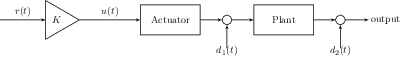
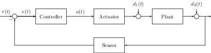
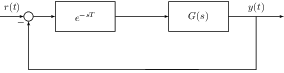
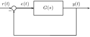
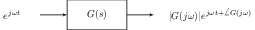
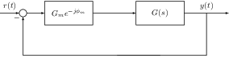
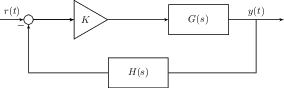
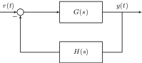
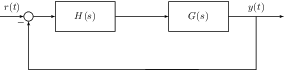
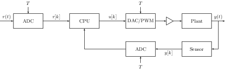

---
author:
- Anmol Parande
date: Fall 2020 - Professor Ronald Fearing
title: EE128 Course Notes
---

```{=latex}
\input{main/header.tex}
```
```{=latex}
\input{../../custom-tikz.tex}
```
```{=latex}
\DeclareSIUnit
```
```{=latex}
\decade{decade}
```
```{=latex}
\maketitle
```
**Disclaimer:** These notes reflect 128 when I took the course (Fall
2020). They may not accurately reflect current course content, so use at
your own risk. If you find any typos, errors, etc, please raise an issue
on the [GitHub
repository](https://github.com/parandea17/BerkeleyNotes).\
`\tableofcontents`{=latex} `\newpage`{=latex}

Introduction to Control
=======================

The general goal of control is to get some physical system to respond to
a reference input in the way we would like.

```{=latex}
\begin{definition}
  The plant is the physical system which we would like to control.
  \label{defn:plant}
\end{definition}
```
In general, there are two different types of control.

```{=latex}
\begin{definition}
  Open-Loop control is where we pass a reference directly to the actuator to control the plant (see \cref{fig:open-loop}).
  \label{defn:open-loop}
\end{definition}
```
```{=latex}
\centering
```


Open-Loop control is generally difficult because the disturbances make
it difficult to copy the reference exactly.

```{=latex}
\begin{definition}
  Closed loop control is using the output of our system and comparing it to the reference in order to generate the control signal (see \cref{fig:closed-loop}).
  \label{defn:closed-loop}
\end{definition}
```
```{=latex}
\centering 
```


Notice how the output signal is subtracted from a reference signal, and
we use the difference (a.k.a the error) to determine what input we pass
into the plant.

```{=latex}
\begin{definition}
  The control law $K(e)$ is a function of error applied by the controller to determine the inputs to the plant.
  \label{defn:control-law}
\end{definition}
```
Modeling Systems
================

Systems are most easily modeled using systems of linear constant
coefficient differential equations. They can be represented either as a
set of state-space equations or as a transfer function in the Laplace
domain.

Electrical and Mechanical Systems
---------------------------------

### Eletrical Systems

In electrical systems, there are three basic components: resistors,
capacitors, and inductors. See
`\cref{table:electro-mechanical-equivalence}`{=latex} for their Laplace
domain relationships. At an electrical node, $$\sum V = 0$$ by
Kirchoff's Voltage Law, and at an electrical junction,
$$\sum I_{in} = \sum I_{out}$$ by Kirchoff's Current Law.

### Mechanical Systems

In mechanical systems, there are also three basic components: dampers,
springs, and masses. There are also rotational counterparts. See
`\cref{table:electro-mechanical-equivalence}`{=latex} for their Laplace
domain relationships. At a massless node, $$\sum F=0$$ by Newton's 2nd
law. Because we consider dampers and springs are massless, the force at
two ends of a damper or spring must be equal. In rotational systems, we
can also have a gear train. Rotational impedances are reflected through
gear trains by multiplying by
$$\left(\frac{N^2_{dest}}{N^2_{source}}\right)$$.

### Electro-Mechanical Equivalence

It turns out that electrical and mechanical systems are analogous to
each other. In other words, given an electrical system, we can convert
it into a mechanical system and vice versa. Capacitors act like springs
as energy storage, resistors act like dampers which dissipate energy,
and inductors act like inertial masses which resist movement. These are
clear from their force/voltage differential equations (in the Laplace
domain) in `\cref{table:electro-mechanical-equivalence}`{=latex}. Under
these analogies, forces are like voltages, currents are like velocities,
and charge is like position.

```{=latex}
\centering
```
```{=latex}
\begin{tabularx}{\textwidth}{YYYY}
      \toprule
      Component & Translational Components & Rotational Components & Electrical Components \\
      \midrule
      Mass/Inductor & $Ms^2X(s)$ & $Js^2\Theta(s)$ & $LsI(s)$\\
      Resistor/Damper & $BsX(s)$ & $Bs\Theta(s)$ & $RI(s)$\\
      Spring/Capacitor & $KX(s)$ & $K\Theta(s)$ & $\frac{1}{Cs}I(s)$\\
      Gears/Transformer & - & $\frac{T_2(s)}{T_1(s)}=\frac{\Theta_1(s)}{\Theta_2(s)}=\frac{N_2}{N_1}$ & $\frac{N_p}{N_s}=\frac{V_p(s)}{V_s(s)}=\frac{I_s(s)}{I_p(s)}$\\
      \bottomrule
    \end{tabularx}
```
Linearization
-------------

Because non-linear systems often have dynamics which are complicated to
analyze, a standard trick to make them simpler is to linearize them.

```{=latex}
\begin{definition}
  Linearization is when a nonlinear system $f(\V{x})$ is approximated by the first two terms of its Taylor series about a particular operating point.
  \[
    f(\V{x}_0 + \delta \V{x}) \approx f(\V{x}_0) + \nabla_x|_{\V{x}_0+\delta\V{x}}\delta\V{x}
  \]
  \label{defn:linearization}
\end{definition}
```
Using `\cref{defn:linearization}`{=latex}, we can see that around our
operating point, we have
$$f(\V{x}) - f(\V{x}_0) = \delta f(\V{x}) \approx \nabla_x|_{\V{x}_0+\delta\V{x}} \delta\V{x}
  \label{eqn:linearization}$$ `\cref{eqn:linearization}`{=latex} will
hold so long as $$\delta\V{x}$$ is small enough to be within the linear
regime (i.e where the Taylor Series expansion is a good approximation).
If $$f$$ is a multi-variable equation, then
`\cref{eqn:linearization}`{=latex} becomes
$$\delta f(\V{x}, \V{u}, \dots) \approx \nabla_x|_{\V{x}_0+\delta\V{x}} \V{\delta x} + \nabla_u|_{\V{u}_0+\delta\V{u}} \V{\delta u} + \cdots$$

State-Space Equations
---------------------

```{=latex}
\begin{definition}
  System variables are variables which depend on either the input or the system's internal state.
  \label{defn:system-vars}
\end{definition}
```
```{=latex}
\begin{definition}
  The state variables of a system are the smallest set of linear independent system variables that can uniquely determine all the other system variables for all $t > 0$.
  \label{defn:state-vars}
\end{definition}
```
One can think of the state variables $$\V{x}$$ as capturing the internal
dynamics of the system. The dynamics are described by matrices $$A$$
(the state-evolution matrix) and $$B$$ (the input matrix)
$$\diff[]{\V{x}}{t} = A\V{x} + B\V{u}$$ where $$\V{u}$$ is the input to
the system. Sometimes the states are not directly observable, but
instead the sensor in `\cref{fig:closed-loop}`{=latex} only provides a
linear combination of the states determined by the output matrix $$C$$
and the feedforward matrix $$D$$. Together,
`\cref{eqn:state-space-1}`{=latex} and
`\cref{eqn:state-space-2}`{=latex} are the state-space equations of the
system. $$\begin{aligned}
  \diff[]{\V{x}}{t} &= A\V{x} + B\V{u} \label{eqn:state-space-1}\\
  \V{y} &= C\V{x} + D \V{u} \label{eqn:state-space-2}\end{aligned}$$ We
can easily go from State-Space Equations to a transfer function via the
Unilateral Laplace transform. After taking the Laplace Transform of both
sides of `\cref{eqn:state-space-1,eqn:state-space-2}`{=latex},
$$\begin{aligned}
  s\V{X}(s) - \V{x}(0^-) &= A\V{X}(s) + B\V{U}(s)\\
  &\implies \V{X}(s) = (sI-A)^{-1}B\V{U}(s) + \V{x}(0^{-})\\
  \V{Y}(s) &= C\V{X}(s) + D\V{U}(s)\\
  &\implies \V{Y}(s) = (C\left( sI-A \right)^{-1}B+D)\V{U}(s) + C(sI-A)^{-1}\V{x}(0^-).\end{aligned}$$
If the system is Single-Input, Single-Output (SISO) and the initial
condition is $$\V{x}(0^-) = \bs{0}$$, then
$$H(s) = \frac{Y(s)}{U(s)} = C(sI-A)^{-1}B+D.
  \label{eqn:ss-to-tf}$$ `\cref{eqn:ss-to-tf}`{=latex} makes it very
clear that the poles of the system are the same as the eigenvalues of
the $$A$$ matrix.

### Phase Variable Form

We can also derive state space equations from their transfer functions.
First, we assume that the transfer function comes from the LCCDE
$$\sum_{k=0}^N a_k \diff[k]{y}{t} = \sum_{k=0}^{N} b_k \diff[k]{u}{t},$$
meaning our transfer function will be of the form
$$H(s) = \frac{Y(s)}{U(s)} = \frac{\sum_{k=0}^N b_k s^k}{\sum_{k=0}^{N}a_k s^k} = \frac{\sum_{k=0}^{N} \frac{b_k}{a_N}s^k}{s^N + \sum_{k=0}^{N-1} \frac{a_k}{a_N}s^k}.$$
It is possible that $$\exists M < N$$ such that
$$\forall k \geq M, b_k=0$$. In other words, the numerator can have
fewer terms than the denominator. We now introduce an intermediary
variable $$X$$ so
$$\frac{Y(s)}{U(s)} = \frac{Y(s)}{X(s)}\frac{X(s)}{U(s)}.$$ Using this
intermediary variable, we can now let
$$Y(s) = \sum_{k=0}^{N} \frac{b_k}{a_N} s^k X(s) \qquad X(s) = \frac{U(s)}{s^N + \sum_{k=0}^{N-1}\frac{a_k}{a_N}s^k}.$$
Converting this back to the time-domain,
$$y(t) = \sum_{k=0}^{N} \frac{b_k}{a_N} \diff[k]{x}{t} \qquad  \diff[N]{x}{t} = u(t) - \sum_{k=0}^{N-1} \frac{a_k}{a_N} \diff[k]{x}{t}.$$
We can now choose our state-variables to be the derivatives
$$x, \diff[]{x}{t}, \cdots, \diff[N-1]{x}{t}$$, giving us the
state-evolution equation
$$\frac{d}{dt} \begin{bmatrix} x\\\diff[]{x}{t}\\ \vdots \\ \diff[N-2]{x}{t} \\\diff[N-1]{x}{t} \end{bmatrix} = 
  \begin{bmatrix}
    0 & 1 & 0 & 0 & \ldots\\
    0 & 0 & 1 & 0 & \ldots\\
    0 & 0 & \ddots & \ddots & \ddots\\
    0 & 0 & \ldots & 0 & 1\\
    -\frac{a_0}{a_N} & -\frac{a_1}{a_N} & \ldots & -\frac{a_{N-2}}{a_N} & -\frac{a_{N-1}}{a_N}
  \end{bmatrix}
  \begin{bmatrix} x\\\diff[]{x}{t}\\ \vdots \\ \diff[N-2]{x}{t} \\\diff[N-1]{x}{t} \end{bmatrix} 
  + \begin{bmatrix} 0 \\ 0 \\ \vdots \\ 0 \\ 1 \end{bmatrix} u(t).
  \label{eqn:phase-var-1}$$ Applying the state-variables to $$y(t)$$,
$$\begin{aligned}
  y(t) &= \frac{b_N}{a_N}\left( u(t) - \sum_{k=0}^{N-1}\frac{a_k}{a_N} \diff[k]{x}{t} \right) + \sum_{k=0}^{N-1} \frac{b_k}{a_N} \diff[k]{x}{t}\\
  y(t) &= \frac{b_N}{a_N}u(t) + \sum_{k=0}^{N-1} \left(\frac{b_k}{a_N} - \frac{b_Na_k}{a_N^2}\right) \diff[k]{x}{t}\\
  y(t) &= \frac{1}{a_N}\begin{bmatrix} b_0 - \frac{b_Na_0}{a_N} & b_1 - \frac{b_Na_1}{a_N} & \ldots & b_{N-1} - \frac{b_Na_{N-1}}{a_N} \end{bmatrix} \V{x} + \frac{b_N}{a_N}u(t). \eqnnumber
  \label{eqn:phase-var-2}\end{aligned}$$ Together,
`\cref{eqn:phase-var-1,eqn:phase-var-2}`{=latex} are known as **Phase
Variable Form**. Notice that the characteristic polynomial of the $$A$$
matrix when it is in phase variable form is
$$\Delta(s) = s^n + \sum_{i=0}^{N-1}\frac{a_i}{a_N}s^i.$$ When we do
control in `\cref{sec:ss-control}`{=latex}, this makes it easier to
place the system poles where we want them to be.

### Time Domain Solution

For transfer functions, the time domain solution for a particular input
is given by $$\mathcal{L}^{-1}\left\{ H(s) U(s) \right\}$$. How do we do
the same for state-space equations? `\cref{eqn:state-space-1}`{=latex}
is a inhomogenous, first-order vector ordinary differential equation. If
it was a scalar homogenous ODE, then we know the solution would be
$$x(t)=x(0)e^{at}$$, so for our vector case, let us first define
$$e^{At} = \sum_{k=0}^{\infty} \frac{1}{k!} A^k$$ using the Taylor
Series expansion. With this definition, we can solve
`\cref{eqn:state-space-1}`{=latex} using integrating factors. If we let
$$e^{-At}$$ be our integrating factor, then multiplying it to both sides
of `\cref{eqn:state-space-1}`{=latex} gives
$$e^{-At}\diff[]{\V{x}}{t} = e^{-At}A\V{x} + e^{-At}B\V{u}.$$ Notice
that
$$\frac{d}{dt}\left[ e^{-At}\V{x} \right] = e^{-At}\diff[]{\V{x}}{t} - A e^{-At}\V{x}.$$
Combining these two equations, we see that
$$\frac{d}{dt}\left[ e^{-At}\V{x} \right] = e^{-At}B\V{u}.$$ Integrating
both sides from 0 to $$t$$, $$\begin{aligned}
  e^{-At}\V{x}(t) - \V{x}(0) = \int_{0}^{t}e^{-A\tau}B\V{u}(\tau)d\tau\\
  \therefore \V{x}(t) = e^{At}\V{x}(0) + \int_{0}^{t}e^{A(t-\tau)}B\V{u}(\tau)d\tau \eqnnumber \label{eqn:ss-td-sol}\end{aligned}$$
Notice that `\cref{eqn:ss-td-sol}`{=latex} is broken into two pieces.

```{=latex}
\begin{definition}
  The zero-input response is how the system will behave when no input is supplied.
  \[
    \V{x}(t) = e^{At}\V{x}(0)
  \]
  \label{defn:zero-input-response}
\end{definition}
```
```{=latex}
\begin{definition}
  The zero-state response is how the system response to an input when its initial state is $\V{x}(0) = \bs{0}$. It is the convolution of the input with $e^{At}B\V{u}(t)u(t)$ where $u(t)$ is the unit step.
  \[
    \V{x}(t) = \int_{0}^{t}e^{A(t-\tau)}B\V{u}(\tau)d\tau
  \]
  \label{defn:zero-state-response}
\end{definition}
```
### Controllability

```{=latex}
\begin{definition}
  A system is controllable if for any initial state $\V{x}_0$, we can reach a new state $\V{x}_f$ in finite time with no constraints on the input $\V{u}$.
  \label{defn:controllability}
\end{definition}
```
Let us assume that we have a controllable system and we want to reach
the state $$\V{0}$$ from $$\V{x}_0$$, and we reach it at time $$t_f$$.
Then using `\cref{eqn:ss-td-sol}`{=latex},
$$-\V{x}_0 = \int_0^{t_f} e^{-A\tau}B\V{u}(\tau)d\tau.$$ By the
Cayley-Hamilton Theorem (`\cref{appendix:cayley}`{=latex}),
$$\begin{aligned}
  -\V{x}_0 = \sum_{j=0}^{n-1}A^jB\int_0^{t_f}\alpha_j(\tau)\V{u}(\tau)d\tau\\
  \therefore \begin{bmatrix} B & AB & A^2 B & \ldots & A^{n-1}B \end{bmatrix}
  \begin{bmatrix} c_0 \\ c_1 \\ \vdots \\ c_{n-1} \end{bmatrix}\\
  \text{where } c_i = \int_0^{t_f} \alpha_j(\tau)u(\tau)d\tau.\end{aligned}$$

```{=latex}
\begin{definition}
  The controllability matrix is
  \[
    \mathcal{C} = \begin{bmatrix} B & AB & A^2 B & \ldots & A^{n-1}B \end{bmatrix}.
  \]
  \label{defn:controllability-matrix}
\end{definition}
```
Notice that if $$\mathcal{C}$$ is invertible, then we can find the
$$\V{c}$$ which will recover $$-\V{x}_0$$, but if it is not invertible,
then we may not be able to do this.

```{=latex}
\begin{theorem}
  If $\mathcal{C}$ is invertible, then the system is controllable.
  \label{thm:controllability}
\end{theorem}
```
### Observability

```{=latex}
\begin{definition}
  A system is observable if for any initial state $\V{x}_0$, we can determine $\V{x}_0$ from $u(t)$ and $y(t)$ over a finite time interval.
  \label{defn:observability}
\end{definition}
```
```{=latex}
\begin{definition}
  The observability matrix is
  \[
    \mathcal{O} = \begin{bmatrix} C \\ CA \\ \\ \vdots \\ CA^{n-1} \end{bmatrix}.
  \]
  \label{defn:observability-matrix}
\end{definition}
```
A theorem analogous to `\cref{thm:controllability}`{=latex} exists for
observability.

```{=latex}
\begin{theorem}
  If $\mathcal{O}$ is invertible, then the system is observable.
  \label{thm:observability}
\end{theorem}
```
Time Delays
-----------

Sometimes systems have a time-delay in them. This is equivalent to
placing a system before the plant with impulse response $$\delta(t-T)$$
since $$x(t)*\delta(t-T) = x(t-T)$$. In the Laplace domain, this is the
same as the transfer function $$e^{-sT}$$ as shown in
`\cref{fig:time-delay}`{=latex}.

```{=latex}
\centering 
```


System Performance
==================

```{=latex}
\begin{definition}
  The step response of a system is how a system $H(s)$ responds to a step input.
  \[
    y(t) = \mathcal{L}^{-1}\left\{ \frac{H(s)}{s} \right\}
  \]
  \label{defn:step-response}
\end{definition}
```
First Order Systems
-------------------

```{=latex}
\begin{definition}
  A first order system is one with the transfer function of the form
  \[
    H(s) = \frac{s+\alpha}{s+\beta}.
  \]
  \label{defn:first-order}
\end{definition}
```
After applying partial fraction decomposition to them, their step
response is of the form $$Au(t) + Be^{-\beta t}u(t).$$ Thus, the larger
$$\beta$$ is (i.e the deeper in the left half plane it is), the faster
the system will "settle".

Second Order Systems
--------------------

```{=latex}
\begin{definition}
  Second order systems are those with the transfer function in the form
  \[
    H(s) = \frac{\omega_n^2}{s^2+2\zeta\omega_ns+\omega_n^2}.
  \]
  $\omega_n$ is known as the natural frequency, and $\zeta$ is known as the damping factor.
  \label{defn:second-order}
\end{definition}
```
Notice that the poles of the second order system are
$$s = \frac{-2\zeta\omega_n \pm \sqrt{4\zeta^2\omega^2_n-4\omega^2_n}}{2} = -\zeta\omega_n \pm \omega_n\sqrt{\zeta^2 - 1}.$$
There are four cases of interest based on $$\zeta$$.

1.  **Undamped**

    When $$\zeta=0$$, the poles are $$s = \pm \omega_n j$$. Because they
    are purely imaginary, the step response will be purely oscillatory.
    $$Y(s) = \frac{1}{s}\frac{\omega_n^2}{s^2+\omega_n^2} \leftrightarrow y(t) = u(t) - \cos(\omega_n t)u(t)$$

2.  **Underdamped**

    When $$\zeta\in(0, 1)$$, the poles are
    $$s = -\zeta\omega_n\pm j\omega_n\sqrt{1-\zeta^2}$$. They are
    complex and in the left-half plane, so the step response will be a
    exponentially decaying sinusoid. We define the damped frequency
    $$\omega_d = \omega_n\sqrt{1-\zeta^2}$$ so that the poles become
    $$s=-\zeta\omega_n \pm \omega_dj$$. Notice that
    $$\omega_d < \omega_n$$. If we compute the time-response of the
    system,
    $$y(t) = \left[ 1 - \frac{e^{-\zeta\omega_nt}}{\sqrt{1-\zeta^2}}\cos\left(\omega_d t - \arctan\left( \frac{\zeta}{\sqrt{1-\zeta^2}} \right)\right)\right]u(t)$$

3.  **Critically Damped**

    When $$\zeta=1$$, both poles are at $$s=-\omega_n$$. The poles are
    both real, so the time-response will respond without any overshoot.

4.  **Overdamped**

    When $$\zeta>1$$, the poles are
    $$-\zeta\omega_n\pm \omega_n\sqrt{\zeta^2-1}$$. Both of these will
    be real, so the time-response will look similar to a first-order
    system where it is slow and primarily governed by the slowest pole.

### The Underdamped Case

If we analyze the underdamped case further, we can first look at its
derivative. $$\begin{aligned}
  sY(s) &= \frac{\omega_n^2}{s^2+2\zeta\omega_ns+\omega_n^2} = \frac{\omega_n^2}{\omega_d} \frac{\omega_d}{(s+\zeta\omega_n)^2+\omega_d^2}\\
  \therefore \diff[]{y}{t} &= \frac{\omega_n^2}{\omega_d}e^{-\zeta\omega_nt}\sin(\omega_d t)u(t) \eqnnumber \label{eqn:2nd-order-deriv}\end{aligned}$$

```{=latex}
\begin{definition}
  The Time to Peak ($T_p$) of a system is how long it takes to reach is largest value in the step response.
  \label{defn:time-to-peak}
\end{definition}
```
Using `\cref{eqn:2nd-order-deriv}`{=latex}, we see that the derivative
is first equal to 0 when $$t = \frac{\pi}{\omega_d}$$.
$$\therefore T_p = \frac{\pi}{\omega_d}$$

```{=latex}
\begin{definition}
  The Percent Overshoot ($\% O.S$) of a system is by how much it will overshoot the step response.
  \label{defn:percent-os}
\end{definition}
```
The percent overshoot occurs at $$t = \frac{\pi}{\omega_d}$$, so
$$\% O.S = e^{-\zeta\omega_n \frac{\pi}{\omega_d}} = e^{\frac{-\zeta\pi}{\sqrt{1-\zeta^2}}}.$$

```{=latex}
\begin{definition}
  The Settling Time ($T_s$) of a system is how long it takes for the system to start oscillating within 2\% of its final value.
  \label{defn:settle-time}
\end{definition}
```
$$\begin{aligned}
  |y(T_s) - 1| < 0.02 \implies \frac{e^{-\zeta\omega_nT_s}}{\sqrt{1-\zeta^2}} = 0.02\\
  \therefore T_s = -\frac{1}{\zeta\omega_n} \ln(0.02 \sqrt{1-\zeta^2})\end{aligned}$$
Since our poles are complex, we can represent them in their polar form.
$$\begin{aligned}
  r = \omega_d^2 + \zeta^2 + \omega_n^2 = \omega_n^2(1-\zeta^2)+\zeta^2\omega_n^2 = \omega_n^2\\
  \cos(\pi-\theta) = \frac{-\zeta\omega_n}{\omega_n} = -\zeta\\\end{aligned}$$
What this tells us is that if we search along the vector at angle
$$\pi-\theta$$, we get a constant $$\zeta$$.

### Additional Poles and Zeros of a Second Order System

Suppose we added an additional pole to the second order system so its
transfer function was instead $$H(s) = \frac{bc}{(s+c)(s^2+2as+b)}.$$
Then its step response will be $$\begin{aligned}
  Y(s) &= \frac{1}{s}+\frac{D}{s+c}+\frac{Bs+C}{s^2+as+b}\\
  B &= \frac{c(a-c)}{c^2+b-ca}\quad C = \frac{c(a^2-ac-b)}{c^2+b-ca} \quad D = \frac{-b}{c^2-ac+b}.\end{aligned}$$
Notice that
$$\lim_{c\to\infty} D = 0 \quad \lim_{c\to\infty} B = -1 \lim_{c\to\infty} C = -a.$$
In other words, as the additional pole moves to infinity, the system
acts more and more like a second-order. As a rule of thumb, if
$$Re\{c\}\geq5Re\{a\}$$, then the system will approximate a second order
system. Because of this property, we can often decompose complex systems
into a series of first and second order systems.

If we instead add an additional zero to the second order system so its
transfer function looks like
$$H(s) = \frac{s+a}{s^2+2\zeta\omega_n+\omega_n^2}$$ and its step
response will look like $$sY(s) + aY(s).$$ Thus if $$a$$ is small, then
the effect of the zero is similar to introducing a derivative into the
system, whereas if $$a$$ is large, then the impact of the zero is
primarily to scale the step response. One useful property about zeros is
that if a zero occurs close enough to a pole, then they will "cancel"
each other out and that pole will have a much smaller effect on the step
response.

Stability
---------

Recall `\cref{eqn:ss-td-sol}`{=latex} which told us the time-domain
solution to state-space equations was
$$\V{x}(t) = e^{At}\V{x}(0) + \int_{0}^{t}e^{A(t-\tau)}B\V{u}(\tau)d\tau.$$

```{=latex}
\begin{definition}
  A system is bounded-input, bounded output(BIBO) stable if $\exists K_u, K_x < \infty$ such that $|\V{u}(t)| < K_{u} \implies |\V{x}(t)| < K_x$.
  \label{defn:bibo-stability}
\end{definition}
```
Following from `\cref{defn:bibo-stability,eqn:ss-td-sol}`{=latex}, this
means that $$\lim_{t\to\infty}\V{x}(t) = \bs{0}.$$ If instead
$$\lim_{t\to\infty}\V{x}(t) = \infty$$, then the system is unstable.

```{=latex}
\begin{theorem}
  If all poles are in the left half plane and the number of zeros is less than or equal to the number of poles, then the system is BIBO stable.
  \label{thm:bibo-stability}
\end{theorem}
```
```{=latex}
\begin{definition}
  A system is called marginally stable if the zero-input response does not converge to $\bs{0}$.
  \label{defn:marginal-stability}
\end{definition}
```
```{=latex}
\begin{theorem}
  A system is marginally stable if there is exactly one pole at $s=0$ or a pair of poles at $s=\pm j\omega_0$.
  \label{thm:marginal-stability}
\end{theorem}
```
In all other cases, the system will be unstable.

Steady State Error
------------------

Consider the unity feedback loop depicted in
`\cref{fig:unity-feedback-loop}`{=latex} where we put a system $$G(s)$$
in unity feedback to control it.

```{=latex}
\centering 
```


We want to understand what its steady state error will be in response to
different inputs.

```{=latex}
\begin{theorem}
  The final value theorem says that for a function whose unilateral laplace transform has all poles in the left half plane,
  \[
    \lim_{t\to\infty}x(t) = \lim_{s\to0} sX(s).
  \]
  \label{thm:final-value-theorem}
\end{theorem}
```
Using this fact, we see that for the unity feedback system,
$$E(s) = \frac{R(s)}{1+G(s)}.$$ Using these, we can define the static
error constants.

```{=latex}
\begin{definition}
  The position constant determines how well a system can track a unit step.
  \begin{equation}
    K_p = \lim_{s\to0}G(s)
    \label{eqn:position-constant}
  \end{equation}
  \[
    \lim_{t\to\infty} e(t) = \lim_{s\to0} s \frac{1}{s} \frac{1}{1+G(s)} = \frac{1}{1+K_p}
  \]
  \label{defn:position-constant}
\end{definition}
```
```{=latex}
\begin{definition}
  The velocity constant determines how well a system can track a ramp.
  \begin{equation}
    K_v = \lim_{s\to0}sG(s)
    \label{eqn:velocity-constant}
  \end{equation}
  \[
    \lim_{t\to\infty} e(t) = \lim_{s\to0} s \frac{1}{s^2} \frac{1}{1+G(s)} = \frac{1}{K_v}
  \]
  \label{defn:velocity-constant}
\end{definition}
```
```{=latex}
\begin{definition}
  The acceleration constant determines how well a system can track a parabola.
  \begin{equation}
    K_a = \lim_{s\to0}s^2G(s)
    \label{eqn:acceleration-constant}
  \end{equation}
  \[
    \lim_{t\to\infty} e(t) = \lim_{s\to0} s \frac{1}{s^3} \frac{1}{1+G(s)} = \frac{1}{K_a}
  \]
  \label{defn:acceleration-constant}
\end{definition}
```
Notice that large static error constants mean a smaller error. Another
observation we can make is that if a system has $$n$$ poles at $$s=0$$,
it can perfectly track an input whose laplace transform is
$$\frac{1}{s^{n-k}}$$ for $$k\in[0, n-1]$$. We give $$n$$ a formal name.

```{=latex}
\begin{definition}
  The system type is the number of poles at 0.
  \label{defn:system-type}
\end{definition}
```
This also brings another observation.

```{=latex}
\begin{definition}
  The internal model principle is that if the system in the feedback loop has a model of the input we want to track, then it can track it exactly.
  \label{defn:interal-model}
\end{definition}
```
If instead we have a state-space system, then assuming the system is
stable,
$$\lim_{t\to\infty}\diff[]{\V{x}}{t} = \bs{0} \implies \lim_{t\to\infty}\V{x} = \V{x}_{ss}.$$
Applying this to the state space equations for a step input,
$$\diff[]{\V{x}}{t} = \bs{0} = A\V{x}_{ss} + B\cdot I \implies \V{x}_{ss} = -A^{-1}B
  \label{eqn:ss-sse}$$ Looking at the error between the reference and
the output in the 1D input case,
$$\V{e}(t) = \V{r}(t) - \V{y}(t) = 1 - C\V{x}_{ss} = 1 + CA^{-1}B.$$

Margins
-------

```{=latex}
\centering 
```


If we take a complex exponential and pass it into a causal LTI system
with impulse response $$g(t)$$, then
$$y(t) = e^{j\omega t} * g(t) = \int_{-\infty}^{\infty}g(\tau)e^{j\omega(t-\tau)}d\tau = e^{j\omega t} \int_{0}^{\infty}g(\tau)e^{-j\omega \tau}d\tau.$$
This shows us that $$e^{j\omega t}$$ is an eigenfunction of the system.

```{=latex}
\begin{definition}
  The frequency response of the system determines how it scales pure frequencies. It is equivalent to the Laplace transform evaluated on the imaginary axis.
  \begin{equation}
    G(j\omega) = \int_0^{\infty}g(\tau)e^{-j\omega\tau}d\tau
    \label{eqn:frequency-response}
  \end{equation}
  \label{defn:frequency-response}
\end{definition}
```
Suppose we put a linear system $$G(s)$$ in negative feedback. We know
that if $$\angle G(j\omega) = (2k+1)\pi$$ for some $$k\in\mathbb{Z}$$,
then the output of the plant will be $$-|G(j\omega)|e^{j\omega t}$$. If
$$|G(j\omega)| \geq 1$$, then this will feed back into the error term
where it will be multiplied by $$|G(j\omega)|$$ repeatedly, and this
will cause the system to be unstable because $$|G(j\omega)|\geq1$$ and
thus will not decay.

```{=latex}
\begin{definition}
  The gain margin $G_m$ is the change in the open loop gain required to make the closed loop system unstable.
  \label{defn:gain-margin}
\end{definition}
```
```{=latex}
\begin{definition}
  The phase margin $\phi_m$ is the change in the open loop phase required to make the closed loop system unstable.
  \label{defn:phase-margin}
\end{definition}
```
We can imagine the gain and phase margin like placing a "virtual box"
before the plant as shown in `\cref{fig:margin-controller}`{=latex}.

```{=latex}
\centering 
```


The characteristic polynomial of the closed loop transfer function is
$$1 + G_me^{-j\phi_m}G(s) = 0.$$ At the gain margin frequency
$$\omega_{gm}$$,
$$|G_m||G(j\omega_{gm})| = 1 \implies |G_m| = \frac{1}{|G(j\omega_{gm})|}.$$
where the gain margin frequency is $$\angle G(j\omega_m) = (2k+1)\pi$$
for $$k\in\mathbb{Z}$$. Likewise, at the phase margin frequency
$$\omega_{pm}$$,
$$1 + G_me^{-j\omega_m}G(j\omega_{pm}) = 0 \implies -\phi_m + \angle G(j\omega_{pm}) = (2k+1)\pi.$$
where the phase margin frequency is $$|G(j\omega_{pm})| = 1$$.

Notice that if there is a time delay of $$T$$ in the system, the phase
margin will remain unchanged since the magnitude response will be the
same, but the gain margin will change because the new phase will be
$$\angle G(j\omega) - \omega T.$$

Design Tools
============

Root Locus
----------

```{=latex}
\centering 
```


Suppose we choose to control the plant by scaling our error signal by
$$K$$ and then put the controller on the feedback path like in
`\cref{fig:rl-feedback-controller}`{=latex}. It would be helpful for us
to understand how the closed loop poles of the feedback system change as
$$K$$ is varied over the range $$[0, \infty)$$. First, suppose
$$G(s) = \frac{N_G}{D_G} \qquad H(s) = \frac{N_H}{D_H}.$$ Then the
transfer function of the overall system is
$$\frac{Y(s)}{R(s)} = \frac{kG(s)}{1+kG(s)H(s)} = \frac{KN_GD_H}{D_GD_H+KN_GN_H}.$$
The closed loop poles are the roots of the denominator polynomial
(called the characteristic polynomial).
$$\Delta(s) = D_GD_H+KN_GN_H = 1 + K\frac{N_GN_H}{D_GD_H} = 0
  \label{eqn:rl-character-poly}$$ Clearly, no matter what $$K$$ is, the
poles must satisfy two criteria.
$$\left|k\frac{N_GN_H}{D_GD_H}\right| = 1 \qquad \angle K\frac{N_GN_H}{D_GD_H} = (2r+1)\pi,\quad r\in\mathbb{Z}
  \label{eqn:rl-criteria}$$

```{=latex}
\begin{definition}
  The root locus is the set of all $s\in\mathbb{C}$ such that $\exists K$ where $\Delta(s) = 0$.
  \label{defn:root-locus}
\end{definition}
```
All points on the root locus must satisfy
`\cref{eqn:rl-criteria}`{=latex}.

### Root Locus Rules

First, notice that the roots of $$\Delta(s)$$ are the closed loop poles
of the system.

```{=latex}
\begin{theorem}
  The number of branches in the root locus is equal to the number of closed loop poles where a branch is the path traveled by a single pole as $K$ is varied.
  \label{thm:rl-one}
\end{theorem}
```
Next, because we are dealing with real systems, complex poles must have
a corresponding conjugate pole.

```{=latex}
\begin{theorem}
  The root locus is symmetric about the real axis.
  \label{thm:rl-two}
\end{theorem}
```
Going back to `\cref{eqn:rl-criteria}`{=latex}, we can alternatively
express the angle criteria as
$$\angle K \frac{\prod_{i=1}^m (s-z_i)}{\prod_{i=1}^n (s-p_i)} = \sum_{i=1}^m \angle (s-z_i) - \sum_{i=1}^n \angle (s-p_i)$$
where $$z_i$$ are open loop zeros and $$p_i$$ are open loop poles. If we
restrict ourselves to the real axis, then given a closed loop pole
$$s$$, each $$z_i > s$$ will contribute
$$-180$$`\textdegree `{=latex}and each $$p_i > s$$ will contribute
$$180$$`\textdegree `{=latex}while the $$z_i, p_i < s$$ will contribute
$$0$$`\textdegree`{=latex}.

```{=latex}
\begin{theorem}
  The real axis segments of the root locus are to the left of an odd number of open loop poles and zeros.
  \label{thm:rl-three}
\end{theorem}
```
When $$K$$ is small, then the poles look like the open loop poles. As
$$K$$ grows very large, then the poles look like the open loop zeros.

```{=latex}
\begin{theorem}
  The root locus begins at the open loop poles and ends at the open loop zeros
  \label{eqn:rl-four}
\end{theorem}
```
If there are more poles ($$n$$) then zeros ($$m$$), then not all of the
poles will end up at a zero in the limit. This means that $$n-m$$ poles
must branch off to infinity.
$$\lim_{|s|\to\infty} kH(s)G(s) \approx \lim_{|s|\to\infty}k\frac{s^m}{s^n} = (2l+1)\pi \implies s^{n-m} = re^{j\theta(n-m)} \implies \theta = \frac{(2l+1)\pi}{n-m}$$

```{=latex}
\begin{theorem}
  In the limit, poles will asymptotically approach
  \[
    \theta = \frac{-(2l+1)\pi}{n-m},
  \]
  and the real axis intercept of these asymptotes is
  \[
    \sigma = \frac{\sum_{i=1}^m p_i - \sum_{i=1}^n z_i}{n-m}.
  \]
  \label{eqn:rl-five}
\end{theorem}
```
If there is a gap between real-axis segments, in order to end at an open
loop zero, poles must sometimes break away from the real axis and then
re-enter.

```{=latex}
\begin{theorem}
  The break-in and break-away points satisfy the equation
  \[
    \sum_{i=1}^n \frac{1}{\sigma + p_i} = \sum_{i=1}^m \frac{1}{\sigma+z_i}.
  \]
  \label{thm:rl-six}
\end{theorem}
```
Since the angles can travel asymptotically, they sometimes cross the
imaginary axis.

```{=latex}
\begin{theorem}
  The root locus intersects the imaginary axis at points where \[
    \sum_{i=1}^m \angle (j\omega + z_i) - \sum_{i=1}^n \angle (j\omega + p_i) = (2l+1)\pi.
  \]
  \label{thm:rl-seven}
\end{theorem}
```
Similarly, if the poles begin at complex locations, then we can find
their angle of departure.

```{=latex}
\begin{theorem}
  Poles beginning at complex locations will depart at an angle $\theta$ where \[
    \sum_{i=1}^m (p + z_i) - \sum_{i=1}^n (p + p_i) = (2l+1)\pi
  \]

  \label{thm:rl-eight}
\end{theorem}
```
Finally, since $$|KG(s)H(s)|=1$$, we can determine $$K$$ if we know a
particular pole location.

```{=latex}
\begin{theorem}
  Given a pole location $p$,
  \[
    K = \left|\frac{1}{G(p)H(p)}\right|.
  \]
  \label{thm:rl-nine}
\end{theorem}
```
### Generalized Root Locus

Because the Root Locus rules are derived from the characteristic
polynomial $$\Delta(s)$$ of the closed-loop system, they can be used not
just to find how the closed loop poles vary with a gain, but also to
find how the closed loop poles vary with an open loop pole. Suppose that
$$G(s) = \frac{N_G}{(s+k)\prod_i(s+p_i)}$$ and $$H(s) = 1$$. Then
$$\Delta(s) = (s+k)\prod_i(s+p_i) + N_G = 1 + k\frac{\prod_i (s+p_i) }{N_G + s\prod_i(s+p_i)} = 0$$
Thus if we apply the root locus rules to the open loop system
$$Y(s) = \frac{\prod_i (s+p_i) }{N_G + s\prod_i(s+p_i)}$$ then we can
capture the behavior of the closed loop poles of the original system as
we vary the location of the open loop pole we control.

Bode Plots
----------

```{=latex}
\begin{definition}
  A Bode plot is a plot of the magnitude and phase of the frequency response with the magnitude on a log-log scale and the phase on a semi-log scale.
  \label{defn:bode-plot}
\end{definition}
```
If we write the frequency response in polar form,
$$G(j\omega) = K \frac{(j\omega)^{N_{z0}}}{(j\omega)^{N_{p0}}}\frac{\prod_{i=0}^{n}{(1+\frac{j\omega}{\omega_{zi}})}}{\prod_{k=0}^{m}{(1+\frac{j\omega}{\omega_{pk}})}} = Ke^{j\frac{\pi}{2}(N_{z0}-N_{p0})} \frac{\prod_{i=0}^{n}{r_{zi}}}{\prod_{k=0}^{m}{r_{pk}}} e^{j(\sum_{i=0}^{n}{z_i} - \sum_{k=0}^{m}{p_k})}.$$
Each $$r$$ is the magnitude of a factor $$1 + \frac{j\omega}{\omega_n}$$
where $$\omega_n$$ is either a zero or a pole, $$z_i, p_k$$ are the
phases of each factor, and $$N_{z0}, N_{p0}$$ are the number of zeros
and poles at 0. By writing $$G(\omega)$$ this way, it is clear that
$$|G(\omega)| = K \frac{\prod_{i=0}^{n}{r_{zi}}}{\prod_{k=0}^{m}{r_{pk}}}.$$
If we take the convert this to decibels, we get
$$20\log(|G(\omega)|) = 20\log(K) + 20\sum_{i=0}^{n}{\log(r_{zi})} - 20\sum_{k=0}^{m}{\log(r_{pk})}$$
Likewise, the exponential form of $$G(\omega)$$ tells us that
$$\angle G(\omega) = \frac{\pi}{2}(N_{z0}-N_{p0})+ (\sum_{i=0}^{n}{z_i} - \sum_{k=0}^{m}{p_k}).$$
Each $$p_k$$ and $$z_i$$ are of the form
$$1 + \frac{j\omega}{\omega_n}$$. If $$\omega > 10\omega_n$$, then
$$p_k, z_i \approx \omega_n$$. Likewise, if
$$\omega < \frac{\omega_n}{10}$$, $$p_k, z_i \approx 1$$. This means we
can approximate bode plots using piece-wise linear segments using the
following rules.

1.  Each zero $$\omega_z$$ contributes
    $$\SI[per-mode=symbol]{20}{\decibel\per\decade}$$ to magnitude
    starting at $$\omega_z$$.

2.  Each pole $$\omega_p$$ contributes
    $$\SI[per-mode=symbol]{-20}{\decibel\per\decade}$$ to magnitude
    starting at $$\omega_p$$.

3.  Each zero $$\omega_z$$ contributes
    $$\SI[per-mode=symbol]{45}{\degree\per\decade}$$ to phase starting
    at $$\frac{\omega_z}{10}$$ and ending at $$10\omega_z$$.

4.  Each pole $$\omega_p$$ contributes
    $$\SI[per-mode=symbol]{-45}{\degree\per\decade}$$ to phase starting
    at $$\frac{\omega_p}{10}$$ and ending at $$10\omega_p$$.

One useful way to use bode plots is to approximate the gain and phase
margin because they can easily be seen visually from the plots
themselves.

Nyquist Criteria
----------------

```{=latex}
\centering 
```


Consider the basic feedback system in
`\cref{fig:nyquist-feedback-controller}`{=latex} and suppose that
$$G(s) = \frac{N_G}{D_G} \qquad H(s) = \frac{N_H}{D_H}.$$ Then the
feedback transfer function is
$$\frac{Y(s)}{R(s)} = \frac{G}{1+G(s)H(s)} = \frac{N_GD_H}{D_GD_H + N_GN_H}.$$
If we focus specifically on the poles of the system, then we see
$$1+GH = 1 + \frac{N_GN_H}{D_GD_H} = \frac{N_GN_H+D_GD_H}{D_GD_H}$$ From
here, we can see that the poles of $$1+GH$$ are the poles of the open
loop system whereas the zeros of $$1+GH$$ are the poles of the closed
loop system.

```{=latex}
\begin{definition}
  A contour is a closed loop set of points in the complex plane.
  \label{defn:contour}
\end{definition}
```
```{=latex}
\begin{definition}
  A mapping is a function that takes a point in the complex plane and transforms it into another point in the complex plane.
  \label{defn:mapping}
\end{definition}
```
```{=latex}
\begin{definition}
  The Nyquist Criterion says that if $N$ is the number of counter-clockwise encirclements of zero of a contour mapped by a transfer function $F(s)$, $P$ is the number of poles in the contour, and $Z$ is the number of zeros in the contour, then
  \begin{equation}
    N = P - Z.
    \label{eqn:nyquist-criteria}
  \end{equation}
  \label{defn:nyquist-criteria}
\end{definition}
```
Thus, given an open loop transfer function $$GH$$, we can determine its
stability. We already know $$P$$ from the poles of the open loop system,
and we can find $$N$$ by defining a contour which encapsulates the right
half plane and use `\cref{eqn:nyquist-criteria}`{=latex} to find $$Z$$.
However, remember that we need to find the RHP poles of $$1+GH$$. This
shifts our mapping to the right by $$1$$, so we can instead just let
$$N$$ be the number of encirclements of $$-1$$. Once we have $$Z$$, we
know how many RHP poles the closed loop transfer function will have
because they are the same as the RHP zeros of the $$1+GH$$. We can
extend the Nyquist Criterion to finding a range of gains that would make
the open-loop system $$kG(s)H(s)$$ stable by looking for the
encirclements of $$\frac{-1}{K}$$.

The contour which is easiest to find the mapping for is the one which
starts at the origin, travels up the imaginary axis, encapsulates the
right half plane, and then travels back up the imaginary axis back to
the origin in a counter-clockwise fasion. This is the easiest because
while the contour is on the imaginary axis, the mapping is just the
frequency response of the system, and we can use the Bode plot of the
system in order to draw the contour because each point on the mapping is
a complex vector, and the bode plot can give us both the magnitude and
angle of that vector.

Cascade Compensation
====================

One easy way to control the plant is to cascade a controller before the
plant like in `\cref{fig:cascade-comp}`{=latex}.

```{=latex}
\centering 
```


We can design the controller H(s) to alter the behavior of our system.

Proportional Integral (PI) Control
----------------------------------

```{=latex}
\begin{definition}
  A proportional integral controller applies an input which is a linear combination of the scaled and integrated error signal.
  \[
    H(s) = K_p+\frac{K_i}{s} = K_p \frac{s + \frac{K_i}{K_p}}{s}
  \]
  \label{defn:pi-controller}
\end{definition}
```
What a PI Controller effectively does is place a new pole at $$s=0$$ and
a new zero at $$s=-\frac{K_i}{K_p}$$. Because of the pole at zero,
adding a PI controller enables the system to track a step input
perfectly. However, because the pole is placed at zero, it can slow down
the time response unless the zero can cancel it out.

Proportional Derivative (PD) Control
------------------------------------

```{=latex}
\begin{definition}
  A proportional derivative controller applies an input which is a linear combination of the scaled and differentiated error signal.
  \[
    H(s) = K_p + K_ds = K_d\left(s + \frac{K_p}{K_d}\right)
  \]
  \label{defn:pd-controller}
\end{definition}
```
Adding a PD controller introduces a new zero into the system. By
carefully choosing where we place the zero, we can shape the
time-response of the system. If we want our dominant second order poles
to be at a particular location, then we can use the angle rule to find
the location of the zero $$s=-\frac{K_p}{K_d}$$. Since differentiation
is an unstable operations, sometimes we instead also place a pole very
far in the left half plane, and the transfer function becomes
$$H(s) =K_d \frac{s+\frac{K_p}{K_d}}{s+p}.$$

Proportional Integral Derivative (PID) Control
----------------------------------------------

```{=latex}
\begin{definition}
  A proportional integral derivative controller applies an input which is a linear combination of the scaled, differentated, and integrated error signals.
  \[
    H(s) = K_p+K_ds + \frac{K_i}{s} = K_d \frac{s^2 + \frac{K_p}{K_d}s + \frac{K_i}{K_d}}{s}
  \]
  \label{defn:pid-controller}
\end{definition}
```
A PID controller is used where we need to both eliminate steady-state
error and shape the time response. We need to choose two different zero
locations and set the total gain of the system.

Lag Compensation
----------------

```{=latex}
\begin{definition}
  A lag compensator is a controller with the transfer function
  \[
    H(s) = K \frac{s+z_c}{s+p_c},\quad p_c < z_c.
  \]
  \label{defn:lag-network}
\end{definition}
```
The purpose of a lag network is to reduce steady state error by
increasing the gains at low frequency and maintaining the gain at higher
frequencies. This keeps the phase margin the same. We can achieve this
because of the frequency response of the lag network (shown by its bode
plot in `\cref{fig:lag-network}`{=latex}).

```{=latex}
\centering
```


We can place the pole and zero carefully to control how much the phase
decreases by. The design procedure is as follows:

1.  Set gain $$K$$ to the value that satisfies the SSE specification and
    plot the Bode diagram at that gain.

2.  Find $$\omega_{PM}$$ such that $$\phi_M$$ is
    5`\textdegree  `{=latex}to 12`\textdegree  `{=latex}larger than
    required.

3.  Let the high frequency asymptote be $$-20\log K_{PM}$$ db at
    $$\omega_{PM}$$ where $$K_{PM} = |G(j\omega_{PM})|$$.

4.  Choose the upper break frequency to be $$\frac{\omega_{PM}}{10}$$.

5.  Set the low frequency asymptote to be 0 db and locate the lower
    break frequency.

6.  Reset the system gain K to compensate for attenuation.

Lead Controller
---------------

```{=latex}
\begin{definition}
  A Lead Controller is a compensator with the transfer function
  \[
    H(s) = k\frac{s+z_c}{s+p_c} = \frac{k}{\beta}\frac{s+\frac{1}{T}}{s+\frac{1}{\beta T}} \quad z_c > p_c, \beta < 1.
  \]
  \label{defn:lead-controller}
\end{definition}
```
A lead controller is used to change the phase margin and alter the time
perfomance metrics of the step response. It has a peak phase
$$\phi_{max}$$ which is related to the pole and zero by
$$\omega_{max} = \frac{1}{T\sqrt{\beta}}\quad, \phi_{max} = \sin^{-1}\frac{1-\beta}{1+\beta}, \quad |G_c(j\omega_{max})| = \frac{1}{\sqrt{\beta}}.$$
Its frequency response looks like in `\cref{fig:lead-network}`{=latex}.

1.  Set gain $$K$$ of the uncompensated system to a value satisfying SSE
    requirement.

2.  Plot bode diagram for system with gain $$K$$ and determine
    $$\phi_M$$.

3.  Find $$\phi_{M}$$ needed to meet requirements and evaluate
    additional phase contribution from compenstor.

4.  Determine $$\beta$$.

5.  Determine $$|G_c(j\omega_{max})|$$.

6.  Determine $$\omega_{PM}$$ where
    $$|G(j\omega)| = -20\log|G_c(j\omega_{max})|$$.

7.  Find the break frequencies.

8.  Reset the gain.

9.  Simulate and tweak.

```{=latex}
\centering
```


State-Space Control {#sec:ss-control}
===================

The basic idea behind state space control is to use the state of the
system in order to set the input. Namely, if we are given
$$\diff[]{\V{x}}{t} = A\V{x}+B\V{u},$$ then we can let
$$\V{u} = \V{r} - K\V{x}$$. If we do this, then the equivalent
state-evolution equation becomes
$$\diff[]{\V{x}}{t} = (A-BK)\V{x}+B\V{r}.$$ Notice that if our system is
in phase variable form, then the controlled state-evolution equation is
$$\diff[]{\V{x}}{t} = \begin{bmatrix}
    0 & 1 & 0 & 0 & \cdots\\
    0 & 0 & 1 & 0 & \cdots\\
    0 & 0 & \ddots & \ddots & \ddots\\
    0 & 0 & \cdots & 0 & 1\\
    -a_0-k_0 & -a_1-k_1 & \cdots & -a_{n-2}-k_{n-2} & -a_{n-1}k_{n-1}
  \end{bmatrix}\V{x} + B\V{r}.$$ This makes it very convenient to place
our poles where we want since the last row of the $$A$$ matrix is also
the coefficients of the characteristic polynomial.

Design by Transformation
------------------------

Suppose we have a system
$$\diff[]{\V{z}}{t} = A\V{z}+B\V{u} \qquad \V{y} = C\V{z}$$ which is not
in phase variable form. To place it into phase variable form, first
assume that $$\V{z} = P\V{x}$$ for some invertible matrix $$P$$.
$$P\diff[]{\V{x}}{t} = AP\V{x}+B\V{u} \implies \diff[]{\V{x}}{t} + P^{-1}B\V{u} \qquad \V{y} = CP\V{x}.$$
Since our transformation is invertible, the controllability of the
system is unchanged, so
$$\mathcal{C}_x = \begin{bmatrix} P^{-1}B & P^{-1} AB \cdots P^{-1}A^{n-1}B \end{bmatrix} = P^{-1}\mathcal{C}_z.$$
Assuming the system is controllable,
$$P = \mathcal{C}_z\mathcal{C}_x^{-1}$$. Now we can apply state feedback
to the phase variable system.
$$\diff[]{\V{x}}{t} = P^{-1}AP\V{x}+P^{-1}B(-K\V{x}+\V{r}) = P^{-1}(AP-BK)P^{-1}\mathbb z + Br \implies K_z = K_zP^{-1}.$$

Observers/State Estimators
--------------------------

When doing state feedback, we often don't have access to the states
themselves because we only have access to $$\V{y}$$. In that case, we
can't use $$\V{u}=\V{r}-K\V{x}$$ because we don't know $$\V{x}$$. One
idea is to keep track of an estimated state $$\hat{\V{x}}$$ and
estimated output $$\hat{\V{y}}$$ which follow the same system dynamics
as the actual state and the actual output and receive the same input. If
$$A$$ is a stable matrix, then $$\lim_{t\to\infty}e^{At}\V{x}_0=0$$
where $$\V{x}_0$$ is the initial state of the system. This means that
even if there is a discrepancy between the estimated state and the true
state in the beginning, the estimate will match the true state after
some time.

Suppose now that we want to control the error between the true state and
the estimated state $$\V{e} = \V{x} - \hat{\V{x}}$$, so we add a gain
$$L$$ to the error in the outputs $$\V{y}-\hat{\V{y}}$$.
$$\begin{aligned}
  \diff[]{\hat{\V{x}}}{t} &= A\hat{\V{x}} + B\V{u} + L(\V{y}-\hat{\V{y}}) = A\hat{\V{x}}+B\V{u}+LC(\V{x}-\hat{\V{x}})\\
  \diff[]{\V{e}}{t} &= \diff[]{(\V{x}-\hat{\V{x}})}{t} = A\V{x}+B\V{u} - \left[A\hat{\V{x}}+B\V{u}+LC(\V{x}-\hat{\V{x}})\right]\\
  \therefore \diff[]{\V{e}}{t} &= (A-LC)\V{e}\end{aligned}$$ Thus we can
design $$L$$ to get quick error convergence. Notice that if our system
is not observable, then we will not be able to place the poles of the
observer system where we want them to be.

Now, if we we do state feedback using the estimated state, then
$$\diff[]{\V{x}}{t} = A\V{x}+B(\V{r}-K\hat{\V{x}}) = (A-BK)\V{x}+B(\V{r}-K\V{e}).$$
Looking at the combined system,
$$\begin{bmatrix} \diff[]{\V{x}}{t} \\ \diff[]{\V{e}}{t} \end{bmatrix}
  = \begin{bmatrix} A-BK & -BK \\ 0 & A-LC \end{bmatrix} \begin{bmatrix} \V{x} \\ \V{e} \end{bmatrix}
  + \begin{bmatrix} B \\ \bs{0} \end{bmatrix}\V{r}.$$ Notice that the
poles of this system are just the poles of the original system and the
poles of the observer system, so we can choose $$K$$ and $$L$$
independently.

```{=latex}
\centering 
```


Integrators in State Feedback
-----------------------------

Suppose we wanted to get rid of the steady state error using state-space
control. We would do this using an integrator over the error in the
observed outputs. $$\V{x}_N = \int_{0}^{t}(\vec{r}-\vec{y})dt.$$ If we
treat this as a new state, its evolution will be
$$\diff[]{\V{x}_N}{t} = r - C\V{x}.$$ If our new control law is
$$\V{u} = -K\V{x}+K_e\V{x}_N$$, then our new state-space equations are
$$\begin{aligned}
  \begin{bmatrix} \diff[]{\V{x}}{t} \\ \diff[]{\V{x}_N}{t} \end{bmatrix}
  = \begin{bmatrix} A & 0 \\ -C & 0 \end{bmatrix} \begin{bmatrix} \V{x} \\ \V{x}_N \end{bmatrix}
  + \begin{bmatrix} B \\ \bs{0} \end{bmatrix} + \begin{bmatrix} \bs{0} \\ \bs{I} \end{bmatrix}\V{r}.\end{aligned}$$
When we apply our feedback rule, we get $$\begin{aligned}
  \begin{bmatrix} \diff[]{\V{x}}{t} \\ \diff[]{\V{x}_N}{t} \end{bmatrix}
  = \begin{bmatrix} A-BK & BK_e \\ -C & 0 \end{bmatrix} \begin{bmatrix} \V{x} \\ \V{x}_N \end{bmatrix}
  + \begin{bmatrix} \bs{0} \\ \bs{I} \end{bmatrix}\V{r}.\end{aligned}$$

Linear Quadratic Regulator
--------------------------

Suppose we want to control our system to send the state to $$\bs{0}$$
over an infinite time horizon using the input $$-K\V{x}$$. We want to do
this by optimizing a cost function that penalizes control effort and the
state error. In particular, we want to minimize the cost function
$$J = \int_{0}^{\infty}\V{y}^TQ\V{y} + \V{u}^TR\V{u} dt.$$ where $$R$$
and $$Q$$ are positve-semi-definite matrices (typically diagonal) and
determine how much we penalize the error and the control effort.

Digital Control Systems
=======================

```{=latex}
\centering 
```


When using a digital system to control a CT system, the inputs $$u(t)$$
must be held constant for a particular amount of time. This is
equivalent to using a zero-order hold for sampling period $$T$$. At an
multiple of the sampling period $$kT$$
$$\V{x}(kT) = e^{AkT}\V{x}(0) + \int_{0}^{kT}e^{A(kT-\tau)}B\V{u}(\tau)d\tau.$$
If we look only at the output at times which are multiples of $$kT$$
(i.e what our CPU would see if we sampled the output), then we can find
a relationship between the current sample and the next sample.
$$\begin{aligned}
  -e^{At}\V{x}(kT) + \V{x}((k+1)T) &= -e^{A(k+1)\tau}\V{x}(0) - \int_{0}^{kT} e^{A((k+1)T-\tau)}B\V{u}(\tau) d\tau \\
  &+ e^{A(k+1)\tau}\V{x}(0) + \int_{0}^{(k+1)T} e^{A((k+1)T-\tau)}B\V{u}(\tau) d\tau\\
  &= \int_{kT}^{(k+1)T} e^{A((k+1)T-\tau)}B\V{u}(\tau)d\tau = e^{A(k+1)T}B\V{u}(kT)\int_{kT}^{(k+1)T}e^{-A\tau}d\tau\\
  &= B\V{u}(kT)\int_0^{T}e^{A\lambda}d\lambda \qquad (\lambda = (k+1)T-\tau)\\
  \therefore \V{x}((k+1)T) &= e^{At}\V{x}(kT) + \V{u}(kT)\int_{0}^{T}Be^{A\lambda}d\lambda.\end{aligned}$$
Looking only at the samples, the discrete system is
$$\V{x}[k+1] = G\V{x}[k]+H\V{u}[k] \qquad G = e^{AT} \quad H = \int_0^Te^{A\lambda}Bd\lambda.
  \label{eqn:ss-discrete}$$ If we solve this recursive equation for a
particular $$\V{x}[0]$$, then we get
$$\V{x}[n] = G^n\V{x}[0] + \sum_{i=0}^{n-1}G^iH\V{u}[i].
  \label{eqn:ss-dt-sol}$$ Notice that the stability of this system
depends on the eigenvales of $$G$$ and that $$|\lambda_G|<1$$ in order
for it to be stable. If we want to find a transfer function of the
system, then we can use the unilateral Z-transform. $$\begin{aligned}
  zX(z) - zx[0] = GX(z) + HU(z)\\
  X(Z) = (zI-G)^{-1}(HU(z)+x[0]z) \eqnnumber \label{eqn:ss-dt-tf}\end{aligned}$$
Notice that the poles of the system are still the eigenvalues of the
$$G$$ matrix. Thus any techniques for placing the poles of the $$G$$
matrix are still valid, except we need to make sure the poles stay
within the unit circle for stability instead of the left half plane. If
we want to figure out how a system will respond to an input, we can use
the final value theorem like we do in CT.

```{=latex}
\begin{theorem}
  For a transfer function $G(z)$ which has all poles in the unit circle, the final value of $g[n]$ is given by
  \[
    \lim_{n=\to\infty}g[n] = \lim_{z\to1}(z-1)G(z).
  \]
  \label{thm:dt-final-val}
\end{theorem}
```
The other primary difference from CT is that in DT, a pole which is
closer to the origin means a faster transient response.
`\appendix`{=latex}

Cayley-Hamilton {#appendix:cayley}
===============

```{=latex}
\begin{theorem}
  Every square matrix $A$ satisfies its own characteristic polynomial if there are no repeated eigenvalues.
  \[
    \Delta(A) = 0
  \]
  \label{thm:cayley-hamilton}
\end{theorem}
```
$$\Delta(\lambda) = |\lambda I - A| = \lambda^n + \sum_{i=0}^{n-1} c_i \lambda^i$$
In the case where $$A$$ is diagonalizable (i.e $$A = P\Lambda P^{-1}$$),
$$\Delta(A) = P\left[ \Lambda^n + \sum_{i=0}^{n-1}c_i \Lambda^i \right]P^{-1}.$$
$$\Lambda^n + \sum_{i=0}^{n-1}c_i \Lambda^i$$ is itself a diagonal
matrix where the jth entry on the diagonal is
$$\lambda_j^n + \sum_{i=0}^{n-1}c_i\lambda_j = 0$$ since $$\lambda_j$$
is a root of the characteristic polynomial. Thus
$$\Delta(A) = P \cdot 0 \cdot P^{-1} = 0$$, and
$$-A^n = \sum_{i=0}^{n-1}c_iA^i.
  \label{eqn:an-exponential}$$ This also gives us a new way to find
$$e^{At}$$ because by its Taylor series expansion,
$$e^{At} = \sum_{k=0}^{\infty} \frac{1}{k!}A^k.$$ By
`\cref{eqn:an-exponential}`{=latex}, all $$A^k = A^{n}A^{k-n}$$ for
$$k>n$$ can be expressed in terms of the lower powers $$A^i$$ for
$$i\in[0, n)$$.

```{=latex}
\begin{theorem}
  \[
    e^{At} = \sum_{i=0}^{n-1}\alpha_i(t)A^i
  \] for some $\alpha_i$ which are solutions to the equations
  \[
    e^{\lambda_jt} = \sum_{i=0}^{n-1}\alpha_i(t)\lambda_j^i.
  \]
  \label{thm:matrix-exponential}
\end{theorem}
```
