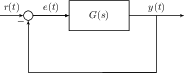
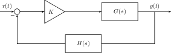
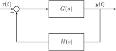
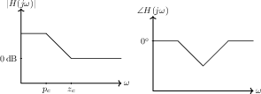
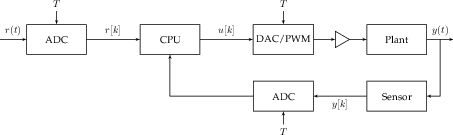

---
author:
  - Anmol Parande
date: Fall 2020 - Professor Ronald Fearing
title: EE128 Course Notes
---

# ee128

**Disclaimer:** These notes reflect 128 when I took the course \(Fall 2020\). They may not accurately reflect current course content, so use at your own risk. If you find any typos, errors, etc, please raise an issue on the [GitHub repository](https://github.com/parandea17/BerkeleyNotes).\

## Introduction to Control

The general goal of control is to get some physical system to respond to a reference input in the way we would like.


#### Definition 1

The plant is the physical system which we would like to control.


In general, there are two different types of control.


#### Definition 2

Open-Loop control is where we pass a reference directly to the actuator to control the plant \(see figure 1\).


Open-Loop control is generally difficult because the disturbances make it difficult to copy the reference exactly.


#### Definition 3

Closed loop control is using the output of our system and comparing it to the reference in order to generate the control signal \(see figure 2\).


Notice how the output signal is subtracted from a reference signal, and we use the difference \(a.k.a the error\) to determine what input we pass into the plant.


#### Definition 4

The control law $$K(e)$$ is a function of error applied by the controller to determine the inputs to the plant.


## Modeling Systems

Systems are most easily modeled using systems of linear constant coefficient differential equations. They can be represented either as a set of state-space equations or as a transfer function in the Laplace domain.

### Electrical and Mechanical Systems

#### Eletrical Systems

In electrical systems, there are three basic components: resistors, capacitors, and inductors. See table 1 for their Laplace domain relationships. At an electrical node, $$\sum V = 0$$ by Kirchoff's Voltage Law, and at an electrical junction, $$\sum I_{in} = \sum I_{out}$$ by Kirchoff's Current Law.

#### Mechanical Systems

In mechanical systems, there are also three basic components: dampers, springs, and masses. There are also rotational counterparts. See table 1 for their Laplace domain relationships. At a massless node, $$\sum F=0$$ by Newton's 2nd law. Because we consider dampers and springs are massless, the force at two ends of a damper or spring must be equal. In rotational systems, we can also have a gear train. Rotational impedances are reflected through gear trains by multiplying by $$\left(\frac{N^2_{dest}}{N^2_{source}}\right)$$.

#### Electro-Mechanical Equivalence

It turns out that electrical and mechanical systems are analogous to each other. In other words, given an electrical system, we can convert it into a mechanical system and vice versa. Capacitors act like springs as energy storage, resistors act like dampers which dissipate energy, and inductors act like inertial masses which resist movement. These are clear from their force/voltage differential equations \(in the Laplace domain\) in table 1. Under these analogies, forces are like voltages, currents are like velocities, and charge is like position.

### Linearization

Because non-linear systems often have dynamics which are complicated to analyze, a standard trick to make them simpler is to linearize them.


#### Definition 5

Linearization is when a nonlinear system $$f(\mathbf{x})$$ is approximated by the first two terms of its Taylor series about a particular operating point.

$$f(\mathbf{x}_0 + \delta \mathbf{x}) \approx f(\mathbf{x}_0) + \nabla_x|_{\mathbf{x}_0+\delta\mathbf{x}}\delta\mathbf{x}$$


Using definition 5, we can see that around our operating point, we have

$$f(\mathbf{x}) - f(\mathbf{x}_0) = \delta f(\mathbf{x}) \approx \nabla_x|_{\mathbf{x}_0+\delta\mathbf{x}} \delta\mathbf{x} \qquad (1)$$

equation 1 will hold so long as $$\delta\mathbf{x}$$ is small enough to be within the linear regime \(i.e where the Taylor Series expansion is a good approximation\). If $$f$$ is a multi-variable equation, then equation 1 becomes

$$\delta f(\mathbf{x}, \mathbf{u}, \dots) \approx \nabla_x|_{\mathbf{x}_0+\delta\mathbf{x}} \mathbf{\delta x} + \nabla_u|_{\mathbf{u}_0+\delta\mathbf{u}} \mathbf{\delta u} + \cdots$$

### State-Space Equations


#### Definition 6

System variables are variables which depend on either the input or the system\'s internal state.



#### Definition 7

The state variables of a system are the smallest set of linear independent system variables that can uniquely determine all the other system variables for all $$t > 0$$.


One can think of the state variables $$\mathbf{x}$$ as capturing the internal dynamics of the system. The dynamics are described by matrices $$A$$ \(the state-evolution matrix\) and $$B$$ \(the input matrix\)

$$\frac{d^{}\mathbf{x}}{dt^{}} = A\mathbf{x} + B\mathbf{u}$$

where $$\mathbf{u}$$ is the input to the system. Sometimes the states are not directly observable, but instead the sensor in figure 2 only provides a linear combination of the states determined by the output matrix $$C$$ and the feedforward matrix $$D$$. Together, equation 2 and equation 3 are the state-space equations of the system.

$$\begin{aligned} \frac{d^{}\mathbf{x}}{dt^{}} &= A\mathbf{x} + B\mathbf{u} \qquad (2)\\ \mathbf{y} &= C\mathbf{x} + D \mathbf{u} \qquad (3)\end{aligned}$$

We can easily go from State-Space Equations to a transfer function via the Unilateral Laplace transform. After taking the Laplace Transform of both sides of equation 2, equation 3,

$$\begin{aligned} s\mathbf{X}(s) - \mathbf{x}(0^-) &= A\mathbf{X}(s) + B\mathbf{U}(s)\\ &\implies \mathbf{X}(s) = (sI-A)^{-1}B\mathbf{U}(s) + \mathbf{x}(0^{-})\\ \mathbf{Y}(s) &= C\mathbf{X}(s) + D\mathbf{U}(s)\\ &\implies \mathbf{Y}(s) = (C\left( sI-A \right)^{-1}B+D)\mathbf{U}(s) + C(sI-A)^{-1}\mathbf{x}(0^-).\end{aligned}$$

If the system is Single-Input, Single-Output \(SISO\) and the initial condition is $$\mathbf{x}(0^-) = \boldsymbol{0}$$, then

$$H(s) = \frac{Y(s)}{U(s)} = C(sI-A)^{-1}B+D. \qquad (4)$$

equation 4 makes it very clear that the poles of the system are the same as the eigenvalues of the $$A$$ matrix.

#### Phase Variable Form

We can also derive state space equations from their transfer functions. First, we assume that the transfer function comes from the LCCDE

$$\sum_{k=0}^N a_k \frac{d^{k}y}{dt^{k}} = \sum_{k=0}^{N} b_k \frac{d^{k}u}{dt^{k}},$$

meaning our transfer function will be of the form

$$H(s) = \frac{Y(s)}{U(s)} = \frac{\sum_{k=0}^N b_k s^k}{\sum_{k=0}^{N}a_k s^k} = \frac{\sum_{k=0}^{N} \frac{b_k}{a_N}s^k}{s^N + \sum_{k=0}^{N-1} \frac{a_k}{a_N}s^k}.$$

It is possible that $$\exists M < N$$ such that $$\forall k \geq M, b_k=0$$. In other words, the numerator can have fewer terms than the denominator. We now introduce an intermediary variable $$X$$ so

$$\frac{Y(s)}{U(s)} = \frac{Y(s)}{X(s)}\frac{X(s)}{U(s)}.$$

Using this intermediary variable, we can now let

$$Y(s) = \sum_{k=0}^{N} \frac{b_k}{a_N} s^k X(s) \qquad X(s) = \frac{U(s)}{s^N + \sum_{k=0}^{N-1}\frac{a_k}{a_N}s^k}.$$

Converting this back to the time-domain,

$$y(t) = \sum_{k=0}^{N} \frac{b_k}{a_N} \frac{d^{k}x}{dt^{k}} \qquad \frac{d^{N}x}{dt^{N}} = u(t) - \sum_{k=0}^{N-1} \frac{a_k}{a_N} \frac{d^{k}x}{dt^{k}}.$$

We can now choose our state-variables to be the derivatives $$x, \frac{d^{}x}{dt^{}}, \cdots, \frac{d^{N-1}x}{dt^{N-1}}$$, giving us the state-evolution equation

$$\frac{d}{dt} \begin{bmatrix} x\\\frac{d^{}x}{dt^{}}\\ \vdots \\ \frac{d^{N-2}x}{dt^{N-2}} \\\frac{d^{N-1}x}{dt^{N-1}} \end{bmatrix} = \begin{bmatrix} 0 & 1 & 0 & 0 & \ldots\\ 0 & 0 & 1 & 0 & \ldots\\ 0 & 0 & \ddots & \ddots & \ddots\\ 0 & 0 & \ldots & 0 & 1\\ -\frac{a_0}{a_N} & -\frac{a_1}{a_N} & \ldots & -\frac{a_{N-2}}{a_N} & -\frac{a_{N-1}}{a_N} \end{bmatrix} \begin{bmatrix} x\\\frac{d^{}x}{dt^{}}\\ \vdots \\ \frac{d^{N-2}x}{dt^{N-2}} \\\frac{d^{N-1}x}{dt^{N-1}} \end{bmatrix} + \begin{bmatrix} 0 \\ 0 \\ \vdots \\ 0 \\ 1 \end{bmatrix} u(t). \qquad (5)$$

Applying the state-variables to $$y(t)$$,

$$\begin{aligned} y(t) &= \frac{b_N}{a_N}\left( u(t) - \sum_{k=0}^{N-1}\frac{a_k}{a_N} \frac{d^{k}x}{dt^{k}} \right) + \sum_{k=0}^{N-1} \frac{b_k}{a_N} \frac{d^{k}x}{dt^{k}}\\ y(t) &= \frac{b_N}{a_N}u(t) + \sum_{k=0}^{N-1} \left(\frac{b_k}{a_N} - \frac{b_Na_k}{a_N^2}\right) \frac{d^{k}x}{dt^{k}}\\ y(t) &= \frac{1}{a_N}\begin{bmatrix} b_0 - \frac{b_Na_0}{a_N} & b_1 - \frac{b_Na_1}{a_N} & \ldots & b_{N-1} - \frac{b_Na_{N-1}}{a_N} \end{bmatrix} \mathbf{x} + \frac{b_N}{a_N}u(t). \qquad (6)\end{aligned}$$

Together, equation 5, equation 6 are known as **Phase Variable Form**. Notice that the characteristic polynomial of the $$A$$ matrix when it is in phase variable form is

$$\Delta(s) = s^n + \sum_{i=0}^{N-1}\frac{a_i}{a_N}s^i.$$

When we do control in State-Space Control, this makes it easier to place the system poles where we want them to be.

#### Time Domain Solution

For transfer functions, the time domain solution for a particular input is given by $$\mathcal{L}^{-1}\left\{ H(s) U(s) \right\}$$. How do we do the same for state-space equations? equation 2 is a inhomogenous, first-order vector ordinary differential equation. If it was a scalar homogenous ODE, then we know the solution would be $$x(t)=x(0)e^{at}$$, so for our vector case, let us first define

$$e^{At} = \sum_{k=0}^{\infty} \frac{1}{k!} A^k$$

using the Taylor Series expansion. With this definition, we can solve equation 2 using integrating factors. If we let $$e^{-At}$$ be our integrating factor, then multiplying it to both sides of equation 2 gives

$$e^{-At}\frac{d^{}\mathbf{x}}{dt^{}} = e^{-At}A\mathbf{x} + e^{-At}B\mathbf{u}.$$

Notice that

$$\frac{d}{dt}\left[ e^{-At}\mathbf{x} \right] = e^{-At}\frac{d^{}\mathbf{x}}{dt^{}} - A e^{-At}\mathbf{x}.$$

Combining these two equations, we see that

$$\frac{d}{dt}\left[ e^{-At}\mathbf{x} \right] = e^{-At}B\mathbf{u}.$$

Integrating both sides from 0 to $$t$$,

$$\begin{aligned} e^{-At}\mathbf{x}(t) - \mathbf{x}(0) = \int_{0}^{t}e^{-A\tau}B\mathbf{u}(\tau)d\tau\\ \therefore \mathbf{x}(t) = e^{At}\mathbf{x}(0) + \int_{0}^{t}e^{A(t-\tau)}B\mathbf{u}(\tau)d\tau \qquad (7)\end{aligned}$$

Notice that equation 7 is broken into two pieces.


#### Definition 8

The zero-input response is how the system will behave when no input is supplied.

$$\mathbf{x}(t) = e^{At}\mathbf{x}(0)$$



#### Definition 9

The zero-state response is how the system response to an input when its initial state is $$\mathbf{x}(0) = \boldsymbol{0}$$. It is the convolution of the input with $$e^{At}B\mathbf{u}(t)u(t)$$ where $$u(t)$$ is the unit step.

$$\mathbf{x}(t) = \int_{0}^{t}e^{A(t-\tau)}B\mathbf{u}(\tau)d\tau$$


#### Controllability


#### Definition 10

A system is controllable if for any initial state $$\mathbf{x}_0$$, we can reach a new state $$\mathbf{x}_f$$ in finite time with no constraints on the input $$\mathbf{u}$$.


Let us assume that we have a controllable system and we want to reach the state $$\mathbf{0}$$ from $$\mathbf{x}_0$$, and we reach it at time $$t_f$$. Then using equation 7,

$$-\mathbf{x}_0 = \int_0^{t_f} e^{-A\tau}B\mathbf{u}(\tau)d\tau.$$

By the Cayley-Hamilton Theorem \(see Cayley-Hamilton\),

$$\begin{aligned} -\mathbf{x}_0 = \sum_{j=0}^{n-1}A^jB\int_0^{t_f}\alpha_j(\tau)\mathbf{u}(\tau)d\tau\\ \therefore \begin{bmatrix} B & AB & A^2 B & \ldots & A^{n-1}B \end{bmatrix} \begin{bmatrix} c_0 \\ c_1 \\ \vdots \\ c_{n-1} \end{bmatrix}\\ \text{where } c_i = \int_0^{t_f} \alpha_j(\tau)u(\tau)d\tau.\end{aligned}$$


#### Definition 11

The controllability matrix is

$$\mathcal{C} = \begin{bmatrix} B & AB & A^2 B & \ldots & A^{n-1}B \end{bmatrix}.$$


Notice that if $$\mathcal{C}$$ is invertible, then we can find the $$\mathbf{c}$$ which will recover $$-\mathbf{x}_0$$, but if it is not invertible, then we may not be able to do this.


#### Theorem 1

If $$\mathcal{C}$$ is invertible, then the system is controllable.


#### Observability


#### Definition 12

A system is observable if for any initial state $$\mathbf{x}_0$$, we can determine $$\mathbf{x}_0$$ from $$u(t)$$ and $$y(t)$$ over a finite time interval.



#### Definition 13

The observability matrix is

$$\mathcal{O} = \begin{bmatrix} C \\ CA \\ \\ \vdots \\ CA^{n-1} \end{bmatrix}.$$


A theorem analogous to theorem 1 exists for observability.


#### Theorem 2

If $$\mathcal{O}$$ is invertible, then the system is observable.


### Time Delays

Sometimes systems have a time-delay in them. This is equivalent to placing a system before the plant with impulse response $$\delta(t-T)$$ since $$x(t)*\delta(t-T) = x(t-T)$$. In the Laplace domain, this is the same as the transfer function $$e^{-sT}$$ as shown in figure 3.

## System Performance


#### Definition 14

The step response of a system is how a system $$H(s)$$ responds to a step input.

$$y(t) = \mathcal{L}^{-1}\left\{ \frac{H(s)}{s} \right\}$$


### First Order Systems


#### Definition 15

A first order system is one with the transfer function of the form

$$H(s) = \frac{s+\alpha}{s+\beta}.$$


After applying partial fraction decomposition to them, their step response is of the form

$$Au(t) + Be^{-\beta t}u(t).$$

Thus, the larger $$\beta$$ is \(i.e the deeper in the left half plane it is\), the faster the system will "settle".

### Second Order Systems


#### Definition 16

Second order systems are those with the transfer function in the form

$$H(s) = \frac{\omega_n^2}{s^2+2\zeta\omega_ns+\omega_n^2}.$$

$$\omega_n$$ is known as the natural frequency, and $$\zeta$$ is known as the damping factor.


Notice that the poles of the second order system are

$$s = \frac{-2\zeta\omega_n \pm \sqrt{4\zeta^2\omega^2_n-4\omega^2_n}}{2} = -\zeta\omega_n \pm \omega_n\sqrt{\zeta^2 - 1}.$$

There are four cases of interest based on $$\zeta$$.

1. **Undamped**

   When $$\zeta=0$$, the poles are $$s = \pm \omega_n j$$. Because they are purely imaginary, the step response will be purely oscillatory.

   $$Y(s) = \frac{1}{s}\frac{\omega_n^2}{s^2+\omega_n^2} \leftrightarrow y(t) = u(t) - \cos(\omega_n t)u(t)$$

2. **Underdamped**

   When $$\zeta\in(0, 1)$$, the poles are $$s = -\zeta\omega_n\pm j\omega_n\sqrt{1-\zeta^2}$$. They are complex and in the left-half plane, so the step response will be a exponentially decaying sinusoid. We define the damped frequency $$\omega_d = \omega_n\sqrt{1-\zeta^2}$$ so that the poles become $$s=-\zeta\omega_n \pm \omega_dj$$. Notice that $$\omega_d < \omega_n$$. If we compute the time-response of the system,

   $$y(t) = \left[ 1 - \frac{e^{-\zeta\omega_nt}}{\sqrt{1-\zeta^2}}\cos\left(\omega_d t - \arctan\left( \frac{\zeta}{\sqrt{1-\zeta^2}} \right)\right)\right]u(t)$$

3. **Critically Damped**

   When $$\zeta=1$$, both poles are at $$s=-\omega_n$$. The poles are both real, so the time-response will respond without any overshoot.

4. **Overdamped**

   When $$\zeta>1$$, the poles are $$-\zeta\omega_n\pm \omega_n\sqrt{\zeta^2-1}$$. Both of these will be real, so the time-response will look similar to a first-order system where it is slow and primarily governed by the slowest pole.

#### The Underdamped Case

If we analyze the underdamped case further, we can first look at its derivative.

$$\begin{aligned} sY(s) &= \frac{\omega_n^2}{s^2+2\zeta\omega_ns+\omega_n^2} = \frac{\omega_n^2}{\omega_d} \frac{\omega_d}{(s+\zeta\omega_n)^2+\omega_d^2}\\ \therefore \frac{d^{}y}{dt^{}} &= \frac{\omega_n^2}{\omega_d}e^{-\zeta\omega_nt}\sin(\omega_d t)u(t) \qquad (8)\end{aligned}$$


#### Definition 17

The Time to Peak \($$T_p$$\) of a system is how long it takes to reach is largest value in the step response.


Using equation 8, we see that the derivative is first equal to 0 when $$t = \frac{\pi}{\omega_d}$$.

$$\therefore T_p = \frac{\pi}{\omega_d}$$


#### Definition 18

The Percent Overshoot \($$\% O.S$$\) of a system is by how much it will overshoot the step response.


The percent overshoot occurs at $$t = \frac{\pi}{\omega_d}$$, so

$$\% O.S = e^{-\zeta\omega_n \frac{\pi}{\omega_d}} = e^{\frac{-\zeta\pi}{\sqrt{1-\zeta^2}}}.$$


#### Definition 19

The Settling Time \($$T_s$$\) of a system is how long it takes for the system to start oscillating within 2\% of its final value.


$$\begin{aligned} |y(T_s) - 1| < 0.02 \implies \frac{e^{-\zeta\omega_nT_s}}{\sqrt{1-\zeta^2}} = 0.02\\ \therefore T_s = -\frac{1}{\zeta\omega_n} \ln(0.02 \sqrt{1-\zeta^2})\end{aligned}$$

Since our poles are complex, we can represent them in their polar form.

$$\begin{aligned} r = \omega_d^2 + \zeta^2 + \omega_n^2 = \omega_n^2(1-\zeta^2)+\zeta^2\omega_n^2 = \omega_n^2\\ \cos(\pi-\theta) = \frac{-\zeta\omega_n}{\omega_n} = -\zeta\\\end{aligned}$$

What this tells us is that if we search along the vector at angle $$\pi-\theta$$, we get a constant $$\zeta$$.

#### Additional Poles and Zeros of a Second Order System

Suppose we added an additional pole to the second order system so its transfer function was instead

$$H(s) = \frac{bc}{(s+c)(s^2+2as+b)}.$$

Then its step response will be

$$\begin{aligned} Y(s) &= \frac{1}{s}+\frac{D}{s+c}+\frac{Bs+C}{s^2+as+b}\\ B &= \frac{c(a-c)}{c^2+b-ca}\quad C = \frac{c(a^2-ac-b)}{c^2+b-ca} \quad D = \frac{-b}{c^2-ac+b}.\end{aligned}$$

Notice that

$$\lim_{c\to\infty} D = 0 \quad \lim_{c\to\infty} B = -1 \lim_{c\to\infty} C = -a.$$

In other words, as the additional pole moves to infinity, the system acts more and more like a second-order. As a rule of thumb, if $$Re\{c\}\geq5Re\{a\}$$, then the system will approximate a second order system. Because of this property, we can often decompose complex systems into a series of first and second order systems.

If we instead add an additional zero to the second order system so its transfer function looks like

$$H(s) = \frac{s+a}{s^2+2\zeta\omega_n+\omega_n^2}$$

and its step response will look like

$$sY(s) + aY(s).$$

Thus if $$a$$ is small, then the effect of the zero is similar to introducing a derivative into the system, whereas if $$a$$ is large, then the impact of the zero is primarily to scale the step response. One useful property about zeros is that if a zero occurs close enough to a pole, then they will "cancel" each other out and that pole will have a much smaller effect on the step response.

### Stability

Recall equation 7 which told us the time-domain solution to state-space equations was

$$\mathbf{x}(t) = e^{At}\mathbf{x}(0) + \int_{0}^{t}e^{A(t-\tau)}B\mathbf{u}(\tau)d\tau.$$


#### Definition 20

A system is bounded-input, bounded output\(BIBO\) stable if $$\exists K_u, K_x < \infty$$ such that $$|\mathbf{u}(t)| < K_{u} \implies |\mathbf{x}(t)| < K_x$$.


Following from definition 20, equation 7, this means that

$$\lim_{t\to\infty}\mathbf{x}(t) = \boldsymbol{0}.$$

If instead $$\lim_{t\to\infty}\mathbf{x}(t) = \infty$$, then the system is unstable.


#### Theorem 3

If all poles are in the left half plane and the number of zeros is less than or equal to the number of poles, then the system is BIBO stable.



#### Definition 21

A system is called marginally stable if the zero-input response does not converge to $$\boldsymbol{0}$$.



#### Theorem 4

A system is marginally stable if there is exactly one pole at $$s=0$$ or a pair of poles at $$s=\pm j\omega_0$$.


In all other cases, the system will be unstable.

### Steady State Error

Consider the unity feedback loop depicted in figure 4 where we put a system $$G(s)$$ in unity feedback to control it.

We want to understand what its steady state error will be in response to different inputs.


#### Theorem 5

The final value theorem says that for a function whose unilateral laplace transform has all poles in the left half plane,

$$\lim_{t\to\infty}x(t) = \lim_{s\to0} sX(s).$$


Using this fact, we see that for the unity feedback system,

$$E(s) = \frac{R(s)}{1+G(s)}.$$

Using these, we can define the static error constants.


#### Definition 22

The position constant determines how well a system can track a unit step.

$$K_p = \lim_{s\to0}G(s) \qquad (9)$$

$$\lim_{t\to\infty} e(t) = \lim_{s\to0} s \frac{1}{s} \frac{1}{1+G(s)} = \frac{1}{1+K_p}$$



#### Definition 23

The velocity constant determines how well a system can track a ramp.

$$K_v = \lim_{s\to0}sG(s) \qquad (10)$$

$$\lim_{t\to\infty} e(t) = \lim_{s\to0} s \frac{1}{s^2} \frac{1}{1+G(s)} = \frac{1}{K_v}$$



#### Definition 24

The acceleration constant determines how well a system can track a parabola.

$$K_a = \lim_{s\to0}s^2G(s) \qquad (11)$$

$$\lim_{t\to\infty} e(t) = \lim_{s\to0} s \frac{1}{s^3} \frac{1}{1+G(s)} = \frac{1}{K_a}$$


Notice that large static error constants mean a smaller error. Another observation we can make is that if a system has $$n$$ poles at $$s=0$$, it can perfectly track an input whose laplace transform is $$\frac{1}{s^{n-k}}$$ for $$k\in[0, n-1]$$. We give $$n$$ a formal name.


#### Definition 25

The system type is the number of poles at 0.


This also brings another observation.


#### Definition 26

The internal model principle is that if the system in the feedback loop has a model of the input we want to track, then it can track it exactly.


If instead we have a state-space system, then assuming the system is stable,

$$\lim_{t\to\infty}\frac{d^{}\mathbf{x}}{dt^{}} = \boldsymbol{0} \implies \lim_{t\to\infty}\mathbf{x} = \mathbf{x}_{ss}.$$

Applying this to the state space equations for a step input,

$$\frac{d^{}\mathbf{x}}{dt^{}} = \boldsymbol{0} = A\mathbf{x}_{ss} + B\cdot I \implies \mathbf{x}_{ss} = -A^{-1}B \qquad (12)$$

Looking at the error between the reference and the output in the 1D input case,

$$\mathbf{e}(t) = \mathbf{r}(t) - \mathbf{y}(t) = 1 - C\mathbf{x}_{ss} = 1 + CA^{-1}B.$$

### Margins

If we take a complex exponential and pass it into a causal LTI system with impulse response $$g(t)$$, then

$$y(t) = e^{j\omega t} * g(t) = \int_{-\infty}^{\infty}g(\tau)e^{j\omega(t-\tau)}d\tau = e^{j\omega t} \int_{0}^{\infty}g(\tau)e^{-j\omega \tau}d\tau.$$

This shows us that $$e^{j\omega t}$$ is an eigenfunction of the system.


#### Definition 27

The frequency response of the system determines how it scales pure frequencies. It is equivalent to the Laplace transform evaluated on the imaginary axis.

$$G(j\omega) = \int_0^{\infty}g(\tau)e^{-j\omega\tau}d\tau \qquad (13)$$


Suppose we put a linear system $$G(s)$$ in negative feedback. We know that if $$\angle G(j\omega) = (2k+1)\pi$$ for some $$k\in\mathbb{Z}$$, then the output of the plant will be $$-|G(j\omega)|e^{j\omega t}$$. If $$|G(j\omega)| \geq 1$$, then this will feed back into the error term where it will be multiplied by $$|G(j\omega)|$$ repeatedly, and this will cause the system to be unstable because $$|G(j\omega)|\geq1$$ and thus will not decay.


#### Definition 28

The gain margin $$G_m$$ is the change in the open loop gain required to make the closed loop system unstable.



#### Definition 29

The phase margin $$\phi_m$$ is the change in the open loop phase required to make the closed loop system unstable.


We can imagine the gain and phase margin like placing a "virtual box" before the plant as shown in figure 6.

The characteristic polynomial of the closed loop transfer function is

$$1 + G_me^{-j\phi_m}G(s) = 0.$$

At the gain margin frequency $$\omega_{gm}$$,

$$|G_m||G(j\omega_{gm})| = 1 \implies |G_m| = \frac{1}{|G(j\omega_{gm})|}.$$

where the gain margin frequency is $$\angle G(j\omega_m) = (2k+1)\pi$$ for $$k\in\mathbb{Z}$$. Likewise, at the phase margin frequency $$\omega_{pm}$$,

$$1 + G_me^{-j\omega_m}G(j\omega_{pm}) = 0 \implies -\phi_m + \angle G(j\omega_{pm}) = (2k+1)\pi.$$

where the phase margin frequency is $$|G(j\omega_{pm})| = 1$$.

Notice that if there is a time delay of $$T$$ in the system, the phase margin will remain unchanged since the magnitude response will be the same, but the gain margin will change because the new phase will be

$$\angle G(j\omega) - \omega T.$$

## Design Tools

### Root Locus

Suppose we choose to control the plant by scaling our error signal by $$K$$ and then put the controller on the feedback path like in figure 7. It would be helpful for us to understand how the closed loop poles of the feedback system change as $$K$$ is varied over the range $$[0, \infty)$$. First, suppose

$$G(s) = \frac{N_G}{D_G} \qquad H(s) = \frac{N_H}{D_H}.$$

Then the transfer function of the overall system is

$$\frac{Y(s)}{R(s)} = \frac{kG(s)}{1+kG(s)H(s)} = \frac{KN_GD_H}{D_GD_H+KN_GN_H}.$$

The closed loop poles are the roots of the denominator polynomial \(called the characteristic polynomial\).

$$\Delta(s) = D_GD_H+KN_GN_H = 1 + K\frac{N_GN_H}{D_GD_H} = 0 \qquad (14)$$

Clearly, no matter what $$K$$ is, the poles must satisfy two criteria.

$$\left|k\frac{N_GN_H}{D_GD_H}\right| = 1 \qquad \angle K\frac{N_GN_H}{D_GD_H} = (2r+1)\pi,\quad r\in\mathbb{Z} \qquad (15)$$


#### Definition 30

The root locus is the set of all $$s\in\mathbb{C}$$ such that $$\exists K$$ where $$\Delta(s) = 0$$.


All points on the root locus must satisfy equation 15.

#### Root Locus Rules

First, notice that the roots of $$\Delta(s)$$ are the closed loop poles of the system.


#### Theorem 6

The number of branches in the root locus is equal to the number of closed loop poles where a branch is the path traveled by a single pole as $$K$$ is varied.


Next, because we are dealing with real systems, complex poles must have a corresponding conjugate pole.


#### Theorem 7

The root locus is symmetric about the real axis.


Going back to equation 15, we can alternatively express the angle criteria as

$$\angle K \frac{\prod_{i=1}^m (s-z_i)}{\prod_{i=1}^n (s-p_i)} = \sum_{i=1}^m \angle (s-z_i) - \sum_{i=1}^n \angle (s-p_i)$$

where $$z_i$$ are open loop zeros and $$p_i$$ are open loop poles. If we restrict ourselves to the real axis, then given a closed loop pole $$s$$, each $$z_i > s$$ will contribute $$-180$$˚and each $$p_i > s$$ will contribute $$180$$˚while the $$z_i, p_i < s$$ will contribute $$0$$˚.


#### Theorem 8

The real axis segments of the root locus are to the left of an odd number of open loop poles and zeros.


When $$K$$ is small, then the poles look like the open loop poles. As $$K$$ grows very large, then the poles look like the open loop zeros.


#### Theorem 9

The root locus begins at the open loop poles and ends at the open loop zeros


If there are more poles \($$n$$\) then zeros \($$m$$\), then not all of the poles will end up at a zero in the limit. This means that $$n-m$$ poles must branch off to infinity.

$$\lim_{|s|\to\infty} kH(s)G(s) \approx \lim_{|s|\to\infty}k\frac{s^m}{s^n} = (2l+1)\pi \implies s^{n-m} = re^{j\theta(n-m)} \implies \theta = \frac{(2l+1)\pi}{n-m}$$


#### Theorem 10

In the limit, poles will asymptotically approach

$$\theta = \frac{-(2l+1)\pi}{n-m},$$

and the real axis intercept of these asymptotes is

$$\sigma = \frac{\sum_{i=1}^m p_i - \sum_{i=1}^n z_i}{n-m}.$$


If there is a gap between real-axis segments, in order to end at an open loop zero, poles must sometimes break away from the real axis and then re-enter.


#### Theorem 11

The break-in and break-away points satisfy the equation

$$\sum_{i=1}^n \frac{1}{\sigma + p_i} = \sum_{i=1}^m \frac{1}{\sigma+z_i}.$$


Since the angles can travel asymptotically, they sometimes cross the imaginary axis.


#### Theorem 12

The root locus intersects the imaginary axis at points where

$$\sum_{i=1}^m \angle (j\omega + z_i) - \sum_{i=1}^n \angle (j\omega + p_i) = (2l+1)\pi.$$


Similarly, if the poles begin at complex locations, then we can find their angle of departure.


#### Theorem 13

Poles beginning at complex locations will depart at an angle $$\theta$$ where

$$\sum_{i=1}^m (p + z_i) - \sum_{i=1}^n (p + p_i) = (2l+1)\pi$$


Finally, since $$|KG(s)H(s)|=1$$, we can determine $$K$$ if we know a particular pole location.


#### Theorem 14

Given a pole location $$p$$,

$$K = \left|\frac{1}{G(p)H(p)}\right|.$$


#### Generalized Root Locus

Because the Root Locus rules are derived from the characteristic polynomial $$\Delta(s)$$ of the closed-loop system, they can be used not just to find how the closed loop poles vary with a gain, but also to find how the closed loop poles vary with an open loop pole. Suppose that $$G(s) = \frac{N_G}{(s+k)\prod_i(s+p_i)}$$ and $$H(s) = 1$$. Then

$$\Delta(s) = (s+k)\prod_i(s+p_i) + N_G = 1 + k\frac{\prod_i (s+p_i) }{N_G + s\prod_i(s+p_i)} = 0$$

Thus if we apply the root locus rules to the open loop system

$$Y(s) = \frac{\prod_i (s+p_i) }{N_G + s\prod_i(s+p_i)}$$

then we can capture the behavior of the closed loop poles of the original system as we vary the location of the open loop pole we control.

### Bode Plots


#### Definition 31

A Bode plot is a plot of the magnitude and phase of the frequency response with the magnitude on a log-log scale and the phase on a semi-log scale.


If we write the frequency response in polar form,

$$G(j\omega) = K \frac{(j\omega)^{N_{z0}}}{(j\omega)^{N_{p0}}}\frac{\prod_{i=0}^{n}{(1+\frac{j\omega}{\omega_{zi}})}}{\prod_{k=0}^{m}{(1+\frac{j\omega}{\omega_{pk}})}} = Ke^{j\frac{\pi}{2}(N_{z0}-N_{p0})} \frac{\prod_{i=0}^{n}{r_{zi}}}{\prod_{k=0}^{m}{r_{pk}}} e^{j(\sum_{i=0}^{n}{z_i} - \sum_{k=0}^{m}{p_k})}.$$

Each $$r$$ is the magnitude of a factor $$1 + \frac{j\omega}{\omega_n}$$ where $$\omega_n$$ is either a zero or a pole, $$z_i, p_k$$ are the phases of each factor, and $$N_{z0}, N_{p0}$$ are the number of zeros and poles at 0. By writing $$G(\omega)$$ this way, it is clear that

$$|G(\omega)| = K \frac{\prod_{i=0}^{n}{r_{zi}}}{\prod_{k=0}^{m}{r_{pk}}}.$$

If we take the convert this to decibels, we get

$$20\log(|G(\omega)|) = 20\log(K) + 20\sum_{i=0}^{n}{\log(r_{zi})} - 20\sum_{k=0}^{m}{\log(r_{pk})}$$

Likewise, the exponential form of $$G(\omega)$$ tells us that

$$\angle G(\omega) = \frac{\pi}{2}(N_{z0}-N_{p0})+ (\sum_{i=0}^{n}{z_i} - \sum_{k=0}^{m}{p_k}).$$

Each $$p_k$$ and $$z_i$$ are of the form $$1 + \frac{j\omega}{\omega_n}$$. If $$\omega > 10\omega_n$$, then $$p_k, z_i \approx \omega_n$$. Likewise, if $$\omega < \frac{\omega_n}{10}$$, $$p_k, z_i \approx 1$$. This means we can approximate bode plots using piece-wise linear segments using the following rules.

1. Each zero $$\omega_z$$ contributes $$20\text{/dec}$$ to magnitude starting at $$\omega_z$$.
2. Each pole $$\omega_p$$ contributes $$-20\text{/dec}$$ to magnitude starting at $$\omega_p$$.
3. Each zero $$\omega_z$$ contributes $$45\text{˚/dec}$$ to phase starting at $$\frac{\omega_z}{10}$$ and ending at $$10\omega_z$$.
4. Each pole $$\omega_p$$ contributes $$-45\text{˚/dec}$$ to phase starting at $$\frac{\omega_p}{10}$$ and ending at $$10\omega_p$$.

One useful way to use bode plots is to approximate the gain and phase margin because they can easily be seen visually from the plots themselves.

### Nyquist Criteria

Consider the basic feedback system in figure 8 and suppose that

$$G(s) = \frac{N_G}{D_G} \qquad H(s) = \frac{N_H}{D_H}.$$

Then the feedback transfer function is

$$\frac{Y(s)}{R(s)} = \frac{G}{1+G(s)H(s)} = \frac{N_GD_H}{D_GD_H + N_GN_H}.$$

If we focus specifically on the poles of the system, then we see

$$1+GH = 1 + \frac{N_GN_H}{D_GD_H} = \frac{N_GN_H+D_GD_H}{D_GD_H}$$

From here, we can see that the poles of $$1+GH$$ are the poles of the open loop system whereas the zeros of $$1+GH$$ are the poles of the closed loop system.


#### Definition 32

A contour is a closed loop set of points in the complex plane.



#### Definition 33

A mapping is a function that takes a point in the complex plane and transforms it into another point in the complex plane.



#### Definition 34

The Nyquist Criterion says that if $$N$$ is the number of counter-clockwise encirclements of zero of a contour mapped by a transfer function $$F(s)$$, $$P$$ is the number of poles in the contour, and $$Z$$ is the number of zeros in the contour, then

$$N = P - Z. \qquad (16)$$


Thus, given an open loop transfer function $$GH$$, we can determine its stability. We already know $$P$$ from the poles of the open loop system, and we can find $$N$$ by defining a contour which encapsulates the right half plane and use equation 16 to find $$Z$$. However, remember that we need to find the RHP poles of $$1+GH$$. This shifts our mapping to the right by $$1$$, so we can instead just let $$N$$ be the number of encirclements of $$-1$$. Once we have $$Z$$, we know how many RHP poles the closed loop transfer function will have because they are the same as the RHP zeros of the $$1+GH$$. We can extend the Nyquist Criterion to finding a range of gains that would make the open-loop system $$kG(s)H(s)$$ stable by looking for the encirclements of $$\frac{-1}{K}$$.

The contour which is easiest to find the mapping for is the one which starts at the origin, travels up the imaginary axis, encapsulates the right half plane, and then travels back up the imaginary axis back to the origin in a counter-clockwise fasion. This is the easiest because while the contour is on the imaginary axis, the mapping is just the frequency response of the system, and we can use the Bode plot of the system in order to draw the contour because each point on the mapping is a complex vector, and the bode plot can give us both the magnitude and angle of that vector.

## Cascade Compensation

One easy way to control the plant is to cascade a controller before the plant like in figure 9.

We can design the controller H\(s\) to alter the behavior of our system.

### Proportional Integral \(PI\) Control


#### Definition 35

A proportional integral controller applies an input which is a linear combination of the scaled and integrated error signal.

$$H(s) = K_p+\frac{K_i}{s} = K_p \frac{s + \frac{K_i}{K_p}}{s}$$


What a PI Controller effectively does is place a new pole at $$s=0$$ and a new zero at $$s=-\frac{K_i}{K_p}$$. Because of the pole at zero, adding a PI controller enables the system to track a step input perfectly. However, because the pole is placed at zero, it can slow down the time response unless the zero can cancel it out.

### Proportional Derivative \(PD\) Control


#### Definition 36

A proportional derivative controller applies an input which is a linear combination of the scaled and differentiated error signal.

$$H(s) = K_p + K_ds = K_d\left(s + \frac{K_p}{K_d}\right)$$


Adding a PD controller introduces a new zero into the system. By carefully choosing where we place the zero, we can shape the time-response of the system. If we want our dominant second order poles to be at a particular location, then we can use the angle rule to find the location of the zero $$s=-\frac{K_p}{K_d}$$. Since differentiation is an unstable operations, sometimes we instead also place a pole very far in the left half plane, and the transfer function becomes

$$H(s) =K_d \frac{s+\frac{K_p}{K_d}}{s+p}.$$

### Proportional Integral Derivative \(PID\) Control


#### Definition 37

A proportional integral derivative controller applies an input which is a linear combination of the scaled, differentated, and integrated error signals.

$$H(s) = K_p+K_ds + \frac{K_i}{s} = K_d \frac{s^2 + \frac{K_p}{K_d}s + \frac{K_i}{K_d}}{s}$$


A PID controller is used where we need to both eliminate steady-state error and shape the time response. We need to choose two different zero locations and set the total gain of the system.

### Lag Compensation


#### Definition 38

A lag compensator is a controller with the transfer function

$$H(s) = K \frac{s+z_c}{s+p_c},\quad p_c < z_c.$$


The purpose of a lag network is to reduce steady state error by increasing the gains at low frequency and maintaining the gain at higher frequencies. This keeps the phase margin the same. We can achieve this because of the frequency response of the lag network \(shown by its bode plot in figure 10\).

We can place the pole and zero carefully to control how much the phase decreases by. The design procedure is as follows:

1. Set gain $$K$$ to the value that satisfies the SSE specification and plot the Bode diagram at that gain.
2. Find $$\omega_{PM}$$ such that $$\phi_M$$ is 5˚to 12˚larger than required.
3. Let the high frequency asymptote be $$-20\log K_{PM}$$ db at $$\omega_{PM}$$ where $$K_{PM} = |G(j\omega_{PM})|$$.
4. Choose the upper break frequency to be $$\frac{\omega_{PM}}{10}$$.
5. Set the low frequency asymptote to be 0 db and locate the lower break frequency.
6. Reset the system gain K to compensate for attenuation.

### Lead Controller


#### Definition 39

A Lead Controller is a compensator with the transfer function

$$H(s) = k\frac{s+z_c}{s+p_c} = \frac{k}{\beta}\frac{s+\frac{1}{T}}{s+\frac{1}{\beta T}} \quad z_c > p_c, \beta < 1.$$


A lead controller is used to change the phase margin and alter the time perfomance metrics of the step response. It has a peak phase $$\phi_{max}$$ which is related to the pole and zero by

$$\omega_{max} = \frac{1}{T\sqrt{\beta}}\quad, \phi_{max} = \sin^{-1}\frac{1-\beta}{1+\beta}, \quad |G_c(j\omega_{max})| = \frac{1}{\sqrt{\beta}}.$$

Its frequency response looks like in figure 11.

1. Set gain $$K$$ of the uncompensated system to a value satisfying SSE requirement.
2. Plot bode diagram for system with gain $$K$$ and determine $$\phi_M$$.
3. Find $$\phi_{M}$$ needed to meet requirements and evaluate additional phase contribution from compenstor.
4. Determine $$\beta$$.
5. Determine $$|G_c(j\omega_{max})|$$.
6. Determine $$\omega_{PM}$$ where $$|G(j\omega)| = -20\log|G_c(j\omega_{max})|$$.
7. Find the break frequencies.
8. Reset the gain.
9. Simulate and tweak.

## State-Space Control 

The basic idea behind state space control is to use the state of the system in order to set the input. Namely, if we are given

$$\frac{d^{}\mathbf{x}}{dt^{}} = A\mathbf{x}+B\mathbf{u},$$

then we can let $$\mathbf{u} = \mathbf{r} - K\mathbf{x}$$. If we do this, then the equivalent state-evolution equation becomes

$$\frac{d^{}\mathbf{x}}{dt^{}} = (A-BK)\mathbf{x}+B\mathbf{r}.$$

Notice that if our system is in phase variable form, then the controlled state-evolution equation is

$$\frac{d^{}\mathbf{x}}{dt^{}} = \begin{bmatrix} 0 & 1 & 0 & 0 & \cdots\\ 0 & 0 & 1 & 0 & \cdots\\ 0 & 0 & \ddots & \ddots & \ddots\\ 0 & 0 & \cdots & 0 & 1\\ -a_0-k_0 & -a_1-k_1 & \cdots & -a_{n-2}-k_{n-2} & -a_{n-1}k_{n-1} \end{bmatrix}\mathbf{x} + B\mathbf{r}.$$

This makes it very convenient to place our poles where we want since the last row of the $$A$$ matrix is also the coefficients of the characteristic polynomial.

### Design by Transformation

Suppose we have a system

$$\frac{d^{}\mathbf{z}}{dt^{}} = A\mathbf{z}+B\mathbf{u} \qquad \mathbf{y} = C\mathbf{z}$$

which is not in phase variable form. To place it into phase variable form, first assume that $$\mathbf{z} = P\mathbf{x}$$ for some invertible matrix $$P$$.

$$P\frac{d^{}\mathbf{x}}{dt^{}} = AP\mathbf{x}+B\mathbf{u} \implies \frac{d^{}\mathbf{x}}{dt^{}} + P^{-1}B\mathbf{u} \qquad \mathbf{y} = CP\mathbf{x}.$$

Since our transformation is invertible, the controllability of the system is unchanged, so

$$\mathcal{C}_x = \begin{bmatrix} P^{-1}B & P^{-1} AB \cdots P^{-1}A^{n-1}B \end{bmatrix} = P^{-1}\mathcal{C}_z.$$

Assuming the system is controllable, $$P = \mathcal{C}_z\mathcal{C}_x^{-1}$$. Now we can apply state feedback to the phase variable system.

$$\frac{d^{}\mathbf{x}}{dt^{}} = P^{-1}AP\mathbf{x}+P^{-1}B(-K\mathbf{x}+\mathbf{r}) = P^{-1}(AP-BK)P^{-1}\mathbb z + Br \implies K_z = K_zP^{-1}.$$

### Observers/State Estimators

When doing state feedback, we often don't have access to the states themselves because we only have access to $$\mathbf{y}$$. In that case, we can't use $$\mathbf{u}=\mathbf{r}-K\mathbf{x}$$ because we don't know $$\mathbf{x}$$. One idea is to keep track of an estimated state $$\hat{\mathbf{x}}$$ and estimated output $$\hat{\mathbf{y}}$$ which follow the same system dynamics as the actual state and the actual output and receive the same input. If $$A$$ is a stable matrix, then $$\lim_{t\to\infty}e^{At}\mathbf{x}_0=0$$ where $$\mathbf{x}_0$$ is the initial state of the system. This means that even if there is a discrepancy between the estimated state and the true state in the beginning, the estimate will match the true state after some time.

Suppose now that we want to control the error between the true state and the estimated state $$\mathbf{e} = \mathbf{x} - \hat{\mathbf{x}}$$, so we add a gain $$L$$ to the error in the outputs $$\mathbf{y}-\hat{\mathbf{y}}$$.

$$\begin{aligned} \frac{d^{}\hat{\mathbf{x}}}{dt^{}} &= A\hat{\mathbf{x}} + B\mathbf{u} + L(\mathbf{y}-\hat{\mathbf{y}}) = A\hat{\mathbf{x}}+B\mathbf{u}+LC(\mathbf{x}-\hat{\mathbf{x}})\\ \frac{d^{}\mathbf{e}}{dt^{}} &= \frac{d^{}(\mathbf{x}-\hat{\mathbf{x}})}{dt^{}} = A\mathbf{x}+B\mathbf{u} - \left[A\hat{\mathbf{x}}+B\mathbf{u}+LC(\mathbf{x}-\hat{\mathbf{x}})\right]\\ \therefore \frac{d^{}\mathbf{e}}{dt^{}} &= (A-LC)\mathbf{e}\end{aligned}$$

Thus we can design $$L$$ to get quick error convergence. Notice that if our system is not observable, then we will not be able to place the poles of the observer system where we want them to be.

Now, if we we do state feedback using the estimated state, then

$$\frac{d^{}\mathbf{x}}{dt^{}} = A\mathbf{x}+B(\mathbf{r}-K\hat{\mathbf{x}}) = (A-BK)\mathbf{x}+B(\mathbf{r}-K\mathbf{e}).$$

Looking at the combined system,

$$\begin{bmatrix} \frac{d^{}\mathbf{x}}{dt^{}} \\ \frac{d^{}\mathbf{e}}{dt^{}} \end{bmatrix} = \begin{bmatrix} A-BK & -BK \\ 0 & A-LC \end{bmatrix} \begin{bmatrix} \mathbf{x} \\ \mathbf{e} \end{bmatrix} + \begin{bmatrix} B \\ \boldsymbol{0} \end{bmatrix}\mathbf{r}.$$

Notice that the poles of this system are just the poles of the original system and the poles of the observer system, so we can choose $$K$$ and $$L$$ independently.

### Integrators in State Feedback

Suppose we wanted to get rid of the steady state error using state-space control. We would do this using an integrator over the error in the observed outputs.

$$\mathbf{x}_N = \int_{0}^{t}(\vec{r}-\vec{y})dt.$$

If we treat this as a new state, its evolution will be

$$\frac{d^{}\mathbf{x}_N}{dt^{}} = r - C\mathbf{x}.$$

If our new control law is $$\mathbf{u} = -K\mathbf{x}+K_e\mathbf{x}_N$$, then our new state-space equations are

$$\begin{aligned} \begin{bmatrix} \frac{d^{}\mathbf{x}}{dt^{}} \\ \frac{d^{}\mathbf{x}_N}{dt^{}} \end{bmatrix} = \begin{bmatrix} A & 0 \\ -C & 0 \end{bmatrix} \begin{bmatrix} \mathbf{x} \\ \mathbf{x}_N \end{bmatrix} + \begin{bmatrix} B \\ \boldsymbol{0} \end{bmatrix} + \begin{bmatrix} \boldsymbol{0} \\ \boldsymbol{I} \end{bmatrix}\mathbf{r}.\end{aligned}$$

When we apply our feedback rule, we get

$$\begin{aligned} \begin{bmatrix} \frac{d^{}\mathbf{x}}{dt^{}} \\ \frac{d^{}\mathbf{x}_N}{dt^{}} \end{bmatrix} = \begin{bmatrix} A-BK & BK_e \\ -C & 0 \end{bmatrix} \begin{bmatrix} \mathbf{x} \\ \mathbf{x}_N \end{bmatrix} + \begin{bmatrix} \boldsymbol{0} \\ \boldsymbol{I} \end{bmatrix}\mathbf{r}.\end{aligned}$$

### Linear Quadratic Regulator

Suppose we want to control our system to send the state to $$\boldsymbol{0}$$ over an infinite time horizon using the input $$-K\mathbf{x}$$. We want to do this by optimizing a cost function that penalizes control effort and the state error. In particular, we want to minimize the cost function

$$J = \int_{0}^{\infty}\mathbf{y}^TQ\mathbf{y} + \mathbf{u}^TR\mathbf{u} dt.$$

where $$R$$ and $$Q$$ are positve-semi-definite matrices \(typically diagonal\) and determine how much we penalize the error and the control effort.

## Digital Control Systems

When using a digital system to control a CT system, the inputs $$u(t)$$ must be held constant for a particular amount of time. This is equivalent to using a zero-order hold for sampling period $$T$$. At an multiple of the sampling period $$kT$$

$$\mathbf{x}(kT) = e^{AkT}\mathbf{x}(0) + \int_{0}^{kT}e^{A(kT-\tau)}B\mathbf{u}(\tau)d\tau.$$

If we look only at the output at times which are multiples of $$kT$$ \(i.e what our CPU would see if we sampled the output\), then we can find a relationship between the current sample and the next sample.

$$\begin{aligned} -e^{At}\mathbf{x}(kT) + \mathbf{x}((k+1)T) &= -e^{A(k+1)\tau}\mathbf{x}(0) - \int_{0}^{kT} e^{A((k+1)T-\tau)}B\mathbf{u}(\tau) d\tau \\ &+ e^{A(k+1)\tau}\mathbf{x}(0) + \int_{0}^{(k+1)T} e^{A((k+1)T-\tau)}B\mathbf{u}(\tau) d\tau\\ &= \int_{kT}^{(k+1)T} e^{A((k+1)T-\tau)}B\mathbf{u}(\tau)d\tau = e^{A(k+1)T}B\mathbf{u}(kT)\int_{kT}^{(k+1)T}e^{-A\tau}d\tau\\ &= B\mathbf{u}(kT)\int_0^{T}e^{A\lambda}d\lambda \qquad (\lambda = (k+1)T-\tau)\\ \therefore \mathbf{x}((k+1)T) &= e^{At}\mathbf{x}(kT) + \mathbf{u}(kT)\int_{0}^{T}Be^{A\lambda}d\lambda.\end{aligned}$$

Looking only at the samples, the discrete system is

$$\mathbf{x}[k+1] = G\mathbf{x}[k]+H\mathbf{u}[k] \qquad G = e^{AT} \quad H = \int_0^Te^{A\lambda}Bd\lambda. \qquad (17)$$

If we solve this recursive equation for a particular $$\mathbf{x}[0]$$, then we get

$$\mathbf{x}[n] = G^n\mathbf{x}[0] + \sum_{i=0}^{n-1}G^iH\mathbf{u}[i]. \qquad (18)$$

Notice that the stability of this system depends on the eigenvales of $$G$$ and that $$|\lambda_G|<1$$ in order for it to be stable. If we want to find a transfer function of the system, then we can use the unilateral Z-transform.

$$\begin{aligned} zX(z) - zx[0] = GX(z) + HU(z)\\ X(Z) = (zI-G)^{-1}(HU(z)+x[0]z) \qquad (19)\end{aligned}$$

Notice that the poles of the system are still the eigenvalues of the $$G$$ matrix. Thus any techniques for placing the poles of the $$G$$ matrix are still valid, except we need to make sure the poles stay within the unit circle for stability instead of the left half plane. If we want to figure out how a system will respond to an input, we can use the final value theorem like we do in CT.


#### Theorem 15

For a transfer function $$G(z)$$ which has all poles in the unit circle, the final value of $$g[n]$$ is given by

$$\lim_{n=\to\infty}g[n] = \lim_{z\to1}(z-1)G(z).$$


The other primary difference from CT is that in DT, a pole which is closer to the origin means a faster transient response.

## Cayley-Hamilton 


#### Theorem 16

Every square matrix $$A$$ satisfies its own characteristic polynomial if there are no repeated eigenvalues.

$$\Delta(A) = 0$$


$$\Delta(\lambda) = |\lambda I - A| = \lambda^n + \sum_{i=0}^{n-1} c_i \lambda^i$$

In the case where $$A$$ is diagonalizable \(i.e $$A = P\Lambda P^{-1}$$\),

$$\Delta(A) = P\left[ \Lambda^n + \sum_{i=0}^{n-1}c_i \Lambda^i \right]P^{-1}.$$

$$\Lambda^n + \sum_{i=0}^{n-1}c_i \Lambda^i$$ is itself a diagonal matrix where the jth entry on the diagonal is

$$\lambda_j^n + \sum_{i=0}^{n-1}c_i\lambda_j = 0$$

since $$\lambda_j$$ is a root of the characteristic polynomial. Thus $$\Delta(A) = P \cdot 0 \cdot P^{-1} = 0$$, and

$$-A^n = \sum_{i=0}^{n-1}c_iA^i. \qquad (20)$$

This also gives us a new way to find $$e^{At}$$ because by its Taylor series expansion,

$$e^{At} = \sum_{k=0}^{\infty} \frac{1}{k!}A^k.$$

By equation 20, all $$A^k = A^{n}A^{k-n}$$ for $$k>n$$ can be expressed in terms of the lower powers $$A^i$$ for $$i\in[0, n)$$.


#### Theorem 17

$$e^{At} = \sum_{i=0}^{n-1}\alpha_i(t)A^i$$

for some $$\alpha_i$$ which are solutions to the equations

$$e^{\lambda_jt} = \sum_{i=0}^{n-1}\alpha_i(t)\lambda_j^i.$$


