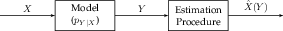

# Estimation

Whereas hypothesis testing is about discriminating between two or more hypotheses, estimation is about guessing the numerical value of or ground truth of a random variable.

In order to measure the quality of our estimation, we need a metric to measure error. One commonly used error is the mean squared error

$$\mathbb{E}\left[(X - \hat{X}(Y))^2\right] .$$


### Theorem 45

The minimum mean square estimate \(MMSE\) of a random variable $$X$$ is given by the conditional expectation.

$$\hat{X}(Y) = \mathbb{E}\left[X|Y\right] = \text{argmin}_{\hat{X}} \mathbb{E}\left[(X - \hat{X}(Y))^2\right] .$$


This essentially follows from the definition of conditional expectation since it is orthogonal to all other functions of $$Y$$, and so by the Hilbert Projection Theorem, it must be the projection of $$X$$ onto the space of all functions of $$Y$$. There are two problems with using MMSE all the time.

1. We often don’t know $$p_{Y|X}$$ explicitly and only have a good model for it.
2. Even if we knew the model $$p_{Y|X}$$, conditional expectations are difficult to compute.

## Linear Estimation

Since finding the MMSE is difficult, we can restrict ourselves to funtions of a particular type.


### Definition 86

The Linear Least Squares Estimator \(LLSE\) $$\mathbb{L}\left[\boldsymbol{X}|\boldsymbol{Y}\right]$$ is the projection of a vector of random variables $$\boldsymbol{X}$$ onto the subspace of linear functions of observations $$Y_i,\ \mathcal{U} = \left\{ \boldsymbol{a} + B\boldsymbol{Y} \right\}$$ where $$\boldsymbol{Y}$$is a vector of observations.


By the orthogonality principle,

1. $$\mathbb{E}\left[(\boldsymbol{X} - \mathbb{L}\left[\boldsymbol{X}|\boldsymbol{Y}\right])1\right] = 0 \implies \mathbb{E}\left[\mathbb{L}\left[\boldsymbol{X}|\boldsymbol{Y}\right]\right] = \mathbb{E}\left[\boldsymbol{X}\right]$$
2. $$\mathbb{E}\left[(\boldsymbol{X} - \mathbb{L}\left[\boldsymbol{X}|\boldsymbol{Y}\right])Y_i\right] = 0$$

From here, we can derive a closed form expression for the LLSE. Let $$\boldsymbol{\mu_{Y}} = \mathbb{E}\left[\boldsymbol{Y}\right] , \boldsymbol{\mu_{X}} = \mathbb{E}\left[\boldsymbol{X}\right] , \Sigma_{\boldsymbol{Y}} = \mathbb{E}\left[(\boldsymbol{Y}-\boldsymbol{\mu_Y})(\boldsymbol{Y}-\boldsymbol{\mu_Y})^T\right] , \Sigma_{\boldsymbol{XY}} = \mathbb{E}\left[(\boldsymbol{X}-\boldsymbol{\mu_X})(\boldsymbol{Y}-\boldsymbol{\mu_Y})^T\right]$$. By substituting $$\mathbb{L}\left[\boldsymbol{X}|\boldsymbol{Y}\right] = \boldsymbol{a}+B\boldsymbol{Y}$$ into the equations we found from the orthogonality principle,

$$\begin{aligned} \boldsymbol{a}+B\boldsymbol{\mu_Y} &= \boldsymbol{\mu_X} \\ a(\boldsymbol{\mu_Y})_i + B \mathbb{E}\left[\boldsymbol{Y}Y_i\right] = \mathbb{E}\left[\boldsymbol{X}Y_i\right] &\implies \boldsymbol{a}(\boldsymbol{\mu_{Y}})_i + B(\Sigma_{\boldsymbol{Y}})_i + B(\boldsymbol{\mu_{Y}})_i\boldsymbol{\mu_Y} = (\Sigma_{\boldsymbol{XY}})_i + (\boldsymbol{\mu_{Y}})_i\boldsymbol{\mu_x}\\ &\implies \boldsymbol{a}\boldsymbol{\mu_Y}^T + B\Sigma_{\boldsymbol{Y}}+B\boldsymbol{\mu_Y\mu_Y}^T = \Sigma_{\boldsymbol{XY}}+\boldsymbol{\mu_X\mu_Y}^T\end{aligned}$$

Solving this system yields

$$B = \Sigma_{\boldsymbol{XY}}\Sigma_{\boldsymbol{Y}}^{-1} \qquad \boldsymbol{a} = \boldsymbol{\mu_X} - \Sigma_{\boldsymbol{XY}}\Sigma_{\boldsymbol{Y}}^{-1}\boldsymbol{\mu_Y}.$$


### Theorem 46

The Linear Least Squares Estimator for vector of random variables $$\boldsymbol{X}$$ given a vector of random variables $$\boldsymbol{Y}$$ is

$$\mathbb{L}\left[\boldsymbol{X}|\boldsymbol{Y}\right] = \boldsymbol{\mu_X} + \Sigma_{\boldsymbol{XY}}\Sigma_{\boldsymbol{Y}}^{-1}(\boldsymbol{Y}-\boldsymbol{\mu_Y})$$


If $$X$$ and $$Y$$ are both a single random variable, this reduces to

$$\mathbb{L}\left[X|Y\right] = \mu_X + \frac{\text{Cov}\left(X, Y\right) }{\text{Var}\left(Y\right) }(Y - \mu_Y)$$

Since LLSE is essentially projection onto a Linear Subspace, if we have an orthogonal basis for the subspace, then we can do the projection onto the subspace one component at a time. The Gram-Schmidt Process turns vectors $$Y_1,\cdots,Y_n$$ into an orthonormal set $$\tilde{Y}_1, \cdots, \tilde{Y}_n$$. If we define $$Y^{(n)}=(Y_1, \cdots, Y_n)$$,

1. $$\tilde{Y}_1 = \frac{Y_1}{\|Y_1\|}$$
2. $$\tilde{Y}_{i+1} = Y_{i+1} - \sum_{k=1}^{i}\langle Y_{i+1}, \tilde{Y}_k \rangle \tilde{Y}_k = Y_{i+1} - \mathbb{L}\left[Y_{i+1}|Y^{(i)}\right]$$


### Definition 87

The linear innovation sequence of random variables $$Y_1,\cdots,Y_n$$ is the orthogonal set $$\tilde{Y_1}, \cdots, \tilde{Y_n}$$produced by Gram Schmidt


Since $$\tilde{Y}_{n}$$ is orthogonal to $$\mathbb{L}\left[Y_n|\tilde{Y}^{(n-1)}\right]$$, they belong to different parts of the subspace formed by $$Y_1,\cdots,Y_n$$.


### Theorem 47

$$\mathbb{L}\left[X|Y^{(n)}\right] = \mathbb{L}\left[X|\tilde{Y}_n\right] + \mathbb{L}\left[X|\tilde{Y}^{(n-1)}\right]$$


Note that in general, the LLSE is not the same as the MMSE. However, if $$X$$ and $$Y$$ are Jointly Gaussian, then the LLSE does, in fact, equal the MMSE.

## Kalman Filtering


### Definition 88

A system evolves according to a state space model if the state $$\boldsymbol{X}_n$$ at time $$n$$ and observations $$\boldsymbol{Y}_n$$ at time $$n$$ are related by

$$\forall n\geq 0,\ \boldsymbol{X}_{n+1} = A\boldsymbol{X}_n + \boldsymbol{V}_n \qquad \forall n\geq 1,\ \boldsymbol{Y}_n=C\boldsymbol{X}_n+\boldsymbol{W}_n$$

where $$V_n$$ and $$W_n$$are noise terms.


State space models are flexible and describe a variety of processes. Suppose we want to linearly estimate $$\boldsymbol{X}_n$$ from the $$\boldsymbol{Y}_n$$ we have seen so far.


### Theorem 48

The linear estimate $$\hat{\boldsymbol{X}}_{n|n} = \mathbb{L}\left[\boldsymbol{X}_n|\boldsymbol{Y}_1,\cdots,\boldsymbol{Y}_n\right]$$ can be computed recursively via the Kalman Filter.

1. $$\hat{\boldsymbol{X}}_{0|0} = 0, \Sigma_{0|0} = \text{Cov}\left(\boldsymbol{X}_0\right)$$.
2. For $$n\geq 1$$, update

$$\hat{\boldsymbol{X}}_{n|n} = A\hat{\boldsymbol{X}}_{n-1|n-1} + K_n\tilde{\boldsymbol{Y}}_n \qquad \tilde{\boldsymbol{Y}}_n = Y_n - C\hat{\boldsymbol{X}}_{n|n-1} \qquad \Sigma_{n|n-1} = A\Sigma_{n-1|n-1}A^T+\Sigma_{\boldsymbol{V}}$$

$$K_n = \Sigma_{n|n-1}C^T(C\Sigma_{n|n-1}C^T+\Sigma_{\boldsymbol{W}})^{-1} \qquad \Sigma_{n|n}=(I - K_nC)\Sigma_{n|n-1}$$


Kalman filtering is a simple algorithm which lets us do online, optimal estimation. Variants of it can do things such as prediction or smoothing.

